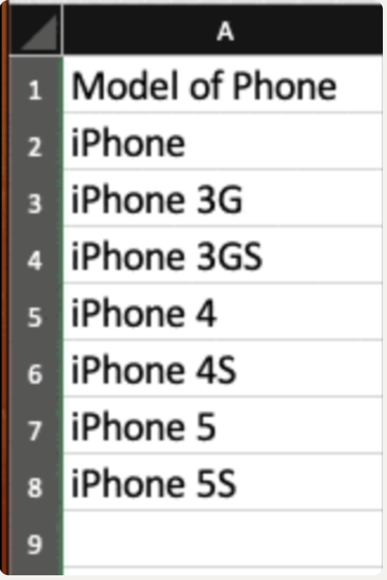
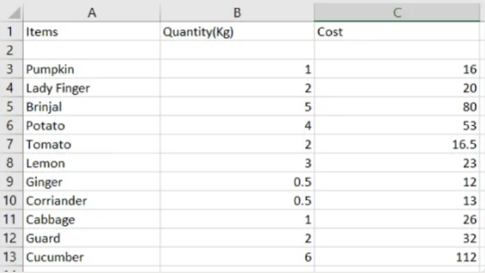

# **Python**

## Chapter 1: Introduction

To check python version do `python3 --version`.

All python files end with the **.py** function.

There are two ways to run python code:

1. Using the *python interactive shell*. To do this just type `python` on the CLI, then just type python code and hit enter.
2. Using the python interpeter to run a file with `python3`, then follow it by the python file.

To print text to the screen, use the function `print()`.

Python is like Java where no manual memory needs to be done. Instead, it uses the *garbage collection* to do the memory clean up.

## Chapter 2: Types and Variables

### Declaring Variable

To create a variable, do `VariableName = Value`. However, unlike other languages, the way python stores the data values is different. Other languages have a pointer thing that points directly at the memory address of the data *(statically typed*). However, python is a *dynamically typed* language, meaning it keeps track of data differently. It treats the variable as just a name and stores the data like id, data type, value, reference count, etc in memory on the heap. Because of this, python can reassign a variable to ANY data type at any time unlike a statically types language.

Exploring the different parts of the way data is stored:

- **variable name**: This is just the name that data is called in memory and is called the *label* or *reference*.
- **id**: Each object in memory will have a unique ID number. This helps to identify each variable in memory differently. The ID value of a **variable name** can be see by using the `id(VariableName)` function. This will just return that variables ID value.
- **types**: This tracks the type of data that it is storing.
- **value**: This stores the actual bits and bytes to represent the data being stored.
- **reference count**: This tracks how many different variables are referencing this same memory data. Once the reference count hits 0, no variables can reference the data any more. This means python marks it for garbage clean up.

> [!NOTE]
>
> When reassigning ANY, be it the same or different, variable data; this creates a whole new object in memory.

> [!IMPORTANT]
>
> For optomiation, python actually creates objects for values -5 to 255. This means

```python
x = 50 # This is a variable and creates an object
x = 60 # This creates a new object to point and hold the data 60 with a new ID value
x = "Yes" # This now holds string data and has a whole new ID value in memory again
```

Unlike java, python does have a manual way to get rid of a variable in memory manually using the **del** keyword. It is not a function call and use it like `del VariableName`. This will delete that variable reference and deincrement that objects reference count.

###  Python Keywords

Pythons reservered keywords are:

- False
- None
- True
- and
- as
- assert
- async
- await
- break
- class
- continue
- def
- del
- elif
- else
- excpet
- finally
- for
- from
- global
- if
- import
- in
- is
- lambda
- nonlocal
- not
- or
- pass
- raise
- return
- try
- while
- with
- yield

When it comes to naming variables, python using the *snake casing* convention (disgusting). Python using *pascal casing* when defining custom classes. When making a variable name, it follows the standard naming rules: can have letters A-Z,a-z, and underscore. 

> [!WARNING]
>
> Python does not have a way to make constant variables. However, it uses the convention of having the word all upper caps with the snake casing like `MAX_AGE`. This symbolizes that variables data should never be reassigned.

> [!NOTE]
>
> Python for OOP, python does not have a private keyword, so to indicate a variable is representing a private variable, put a single underscore when naming the variable like `_name`. Anything that starts with a double underscore has a special usage when creating object classes. Names that start AND end with a double underscore are called **dunder methods** that are also used for object classes.

### Data Types

When it comes to the data types python can have are:

- **bool**: values *True* and *False*. This is not mutable.

- **int**: values 47, -2, 4999494, etc. This is not mutable.
- **float**: values 3.2, 2.7e5, -1.0, etc. This is not mutable.
- **complex**: 3j, 5 + 9j, etc. This is not mutable.
- **str**: "yes", 'no', "Live, Like, Love", \`\`\`TextHere\`\`\`(only need the triple back ticks, but typora quirk) etc. This is not mutable.
- **list**: This is used to store an array style of data. This is mutable.
- **tuple**: This is another way to store data like an array. This is not mutable.
- **bytes**:  Hard to describe the values for this; look it up later. This is not mutable.
- **Bytearray**: Hard to describe the values for this; look it up later. This is mutable.
- **set**: Kind of like an array, but for making sets. This is mutable.
- **frozenset**: This is like a set except it is not mutable.
- **dict**: This is a way to make key value pairs. This is mutable.


## Chapter 3: Numbers

### boolean

Python has a way to convert a value to a **bool** type by using the type casting `bool(VariabeName, ...)`. This turns the variable(s) inside to be a *True* or *False* value.  Anything is considered *True* if the value is anything besides 0 or a non-empty string and *False* otherwise.

###  Integer

An integer can start with 0b, 0o, or 0x and this will make an binary, octal, or hexadecimal number respectfully. 

To make negative number do - in front of number.

Python allows putting _ between number to improve readability like 5_000_000 for 5 million which is the same as 5000000.

#### Integer Operations

This has the normal: + (addition), - (subtraction), * (multiplication), / (floating point division), and % (module remainder). 

There are two special things that can be done:

1. `**`: For doing a number reaised to the power; syntax is x**y where x is the base and y is the exponent.
2. `//`: For division as well, except this will round the number down to the nearest whole number. Unlike the normal version that keeps it inflating point form.

> [!NOTE]
>
> When dividing with /, this will always return a floating point number even if the two numbers being divided are whole numbers.

Can also do the short had opertaions like *= , +=, etc.

There is a special function called `divmod()` that takes two arguments. The first is the number to be divided and the second it the number that it is going to be divided by. This willl return two values with the first being the number of times divided into and the second will be the remaineder. However, the numbers are returned as a **tuple**.

There is a function called `chr()` that takes a number and returns a single UTF-8 encoded character. There is a function called `ord()` that takes a single charctar and returns the integer value for it.

To convert something to an integer use the `int()` function that takes a single argument. The return values are:

- **bool**: *True* and *False* will return 1 or 0,
- **float**: Returns a whole number rounded down.
- **string**: If the string is a number then it will return the numeric value for it. Anything else will cause an error. Even trying a float string number to convert will not work as well

### Floats

A float type can use and handles operations the same as integers.

To convert something to a float use the `float()` function that only takes one value. This works exactly like the `int()` version except it can convert decimal string values into a float number.

There is a function called `round()` that takes a single float value and optional second value. This will round the number number all the way up to the nearest whole number or if a second parameter was specified then it will remove that many decimal point numbers from the right most side. One important thing to note this does not affect the original value and instead just returns a new copy of the value.

There is a special **module** called "fractions". This is a different way to handle divinig floating point numbers.

## Chapter 4: Strings

Strings are an example of squenced ordered data which is just a squence of characters. Some information you can get are:

- If a particular element is in the string
- Index of element and its value
- Element at particulat index
- Slice of element in given range
- Length of squence
- Min and max element values

In python, string are *immutable*. Meaning once assigned to a variable it cannot changes its value, but it can return a new copy subset of the original.

A string made by double or single quotes is treated the same way unlike in C where the difference matters.

There are a few special ways to make a string in python:

- **f-string**: This string type will start with the letter "f" BEFORE the quotation marks and not inside. This is used to get string formatting. 
- **r-string**: This is a raw string. This will not intepert ANYTHING in the string and will keep it in its raw form. This prevents things like escape characters from being converted. This is made the same way as an **f-string** except stats with an "r".
- **unicode string**: This is the same thing as making a normal string and really no need to put this. However, this does start with a "u"
- **byte string**: This is used to make a string of bytes.

The reason single or double quotes can be used to make a string is they can both do small different things. If a double quote is used, it can use single quotes inside without having to escape it and vice versa with single quotes.

A string can also be made with three single/double quotes. This are really used to create multi-line strings since it will keep the formatting of text spaning multiple lines.

With strings, there is a special value called **EOL** and this means the end of line was reached.

Something can be type casted into a string with the `str()` function that takes a single argument. This can take an integer, number, and boolean (return the string version True or False).

Can use the \ to escape the special characters in a string to be able to use them like \t, \n, \\`, \\", \\\, etc.

To combine two stirngs, the use of the addition operator is used and this concats the strings. The first stirng will have the second added to the back of it.

```python
x = "Yes"
y = "No"

concat = x + y 
print(concat)
# OUTPUT --> YesNo
```

A special syntax for strings is using the multiplication symbol. This will take the string and append that thing to itself n - 1 times. For example:

To access individual characters in a string, use the bracket notation and use the index starting from 0 to n - 1.

```python
x = 4 * "Yes"
print(x)
print(x[2])
# OUTPUT
# ----------
# YesYesYesYes
# s
```

> [!WARNING]
>
> Unlike other languages, indexes can be accessed using negative numbers inside it. Except, this just starts in the opposite direction going from right to left. For example
>
> ```python
> letters = "abcdefg"
> print(letters[0])
> print(letters[-1])
> print(letters[-2])
> # OUTPUT
> # ----------
> # a
> # g
> # f
> ```

Going past the available index length will raise the appropriate exception.

There is a method that the **str** class has that all string types have access to called `replace()`. This will take two arguments with a third optional one. The first is the substring to be placed. The second is the substring that it will be replaced by. The optional third will be the maximum times the substring will be replaced. This does not affect the original copy since it returns a new copy of the made string.

### String Slicing

Another way to get a substring is using *string slicing*. This also uses the square bracket notation, but it a different index notation. The syntax of it is `start:end:skip`.

1) start: this will be the starting index where the letters will be copied from.
2) end: this will be the last index the character will copy from. This is non-inclusive so this really would copy from start to (end - 1).
3) skip: this will be how many indexes to skip before copying the next letter. This is the only optional parameter and if nothing is specified then it will skip nothing.

> [!NOTE]
>
> Because the third parameter is optional, this means the slice specification can also just be `start:end`. Also, if the entire is to be copied, then all that needs to be done is put `:` for the string slice. Any of these parts can be omitted, 

To get the total size of a string, use the `len()` function. This is a function that will return an integer value of the number of characters in the string.

A specific string only function is called the `split()`. This means anything that is considered part of the str class has access to this method. This function will return 0 or more sub strings of the split content by a certain separator; an example is csv data. This takes one argument only and that is the thing to split the string by. If nothing is specified then it will split by then it uses all whitespace characters (spaces,newline, and tabs).

```python
x = "Jack, 32, Linux 123 st"
print(len(x)) # outputs --> 22
print(x.split(",")) # outputs --> ['Jack', ' 32', ' Linux 123 st']
print(x[1:12]) # outputs --> ack, 32, L
```

Another class **str** specific method is `join()`. This is the opposite of `split()` since this joins strings together based on the specified separator. This takes only one value, that being the list of strings to join together. However, the actual string this method is called on is the thing that it will join based on.

> [!NOTE]
>
> A string does not have to be assigned to a variable to use the methods of the respected type. A good example of this is when called the `join()`, this used that particular method.
>
> ```python
> x = ["Yes", "No", "Maybe"]
> print("\n".join(x))
> 
> # OUTPUT
> # ---------
> # Yes
> # No
> # Maybe
> 
> # The returned string will all be one single string
> ```

There are ways to check certain things in a string to see if a certain pattern is there like for a prefix and suffix. The other **str** specific methods are:

1.  `startswith()`: This takes a single string argument and checks if the string starts with that specific string in the argument.
2.  `endswith()`: This takes a single string argument and checks if the string ends with that specific string in the argument.
3.  `removeprefix()`: This takes a single string argument and remove that string from the start of the string if it does exist.
4.  `removesuffix`: This takes a single string argument and remove that string from the end of the string if it does exist.


There is another method called `strip()` that removes content from the string. This is useful to remove whitespace, newlines, tabs, etc. This function takes one argument and that is what the specific type of thing to remove. However, is nothing is provided then it will remote all the different whitespace types. The string provided can contain multiple different things to remove and does not just have to be one. This does NOT remove the content from the middle of the string and JUST the left and right most side of it.

```python
x = "   Silly ?! Earth"

print(x.strip(" !")) # outputs --> Silly ?! Earth

# The returned string does not have the spacing issue before the "Silly" word
```

There are two specific **str** functions to find a particular word in a string which are `find()` and `index()`. These both work the same in that they will search the entire string and return the lowest index position that pattern is found. The difference between them is how they handle errors. `find()` will return -1 if the string pattern is not found. `index()` will raise an exception making sure that the issue of the sub string not being there is addressed right away. Both of these take the same arguments:

1.  The specified string pattern to look for
2.  The starting index this will look in the string
3.  The ending index - 1 this will look in the string

```python
def start():
    text = "hello world"

    # Using find()
    print(text.find("world"))   # found
    print(text.find("Python"))  # not found

    # Using index()
    print(text.index("world"))  # found
    print(text.index("Python")) # not found (this will crash!)

if __name__ == "__main__":
    start()

# OUTPUT
# ----------
# 6
# -1
# 6
# Traceback (most recent call last):
#  File "C:\Users\Owner\HOME\Learning\Code\Python\Main.py", line 13, in <module>
#    start()
#    ~~~~~^^
#  File "C:\Users\Owner\HOME\Learning\Code\Python\Main.py", line 10, in start
#    print(text.index("Python")) # not found (this will crash!)
#         ~~~~~~~~~~^^^^^^^^^^
#ValueError: substring not found
```

There is a **str** method to check how many times a substring occurs in the actual string called  `count()`. This just takes a single argument of a substring and returns the total number of times that was found.

There are some special methods that just change the words of the string. These are: 

- `capitalize()`: This takes no argument and just caps the first letter of the first word of the string
- `title()`: This takes no argument and caps all the first letter of the first word of the entire string
- `upper()`: This takes no argument and returns the whole string in capped letters
- `lower()`: This takes no argument and returns the whole string in lowercased version
- `swapcase()`: This takes no arguments and returns capped letter uncapped and vice versa

There are some methods to deal with alignment of strings as well like:

- `center()`: This takes a singe argument and it is an integer for how much space there should be added on both sides of the string to make it even
- `ljust()`: This takes a singe argument and it is an integer for how much space there should be added on the left side of the string to make it left justified
- `rjust()`: This takes a singe argument and it is an integer for how much space there should be added on the right side of the string to make it right justified 

When it comes to printing out formatted data, there is the old and new way to do it:

- Old way: this version is like C with the %d, %s, etc.
- `format()` method: 
- **f-string** (recommended) : this uses the **f-string** syntax to complete this. The string will first start with the letter "f", but placed outside right at the start of the ". Inside the string use curly braces and inside those put the name of the value or variable and that will have the variable name replaced with the actual value. Inside the braces can even be complex single like operations like `len(x.count("This"))` or math operations.

```python
def start():
    name = "Alice"
    age = 30
    price = 4.56789

    print(f"My name is {name} and I am {age} years old.")
    print(f"Next year I will be {age + 1}.")
    print(f"The price is ${price:.2f}")


if __name__ == "__main__":
    start()
```


## Chapter 5: Bytes and Bytearray

Skipped for now as not important for core class leaning, but come back to this


## Chapter 6: if and match

### If statement

When it come to making an if statement, the basic version is made with the keyword **if** and **else**. The syntax for this is:

This has a weird syntax because python sorts the code can tell what is part of what by  using indentation rules and using the colon to indicate when something like an if statement started and the next following lines will need to be indented to be part of that statement. Also, important to note the condition area does not use parentheses and it just needs to be written.

Python uses the keyword **elif** instead of "else if" like other languages.

```python
if FirstLogicComparision:
  # Code for if here
elif SecondLogicComparision:
  # Code for elif here
else:
  # Code for else here

# Rest of program here
```

The normal equality operators ==, !=, <, <=, >, >= are used the same as in other languages. However, when ot comes to making more complex comparisons, pyhon does uses **and**, **or**, and **not** instead of &&, |, or !. This would also be the time to use parentheses if needing to group stuff together to make complex logic comparisons.

```python
def start():
    age = 17
    has_id = True
    is_admin = False

    if age >= 18 and has_id:
        print("Adult with ID")

    if age < 18 or is_admin:
        print("Minor or admin access")

    if not has_id:
        print("ID required")


if __name__ == "__main__":
    start()
```

Whenever the need to make multiple comparisons is needed and insead of making a long if statement chain, use the **in** keyword which is a *membership comparison*. This test if a certain value exist in a collection or sequence like a string. For example, if wanting to test if a letter is a vowel, instead writing mutiple if statements or using a bunch of **or** keyword, use **in**. This returns false if not part of it and true otherwise.

```python
def start():
    fruits = ["apple", "banana", "orange"]
    name = "Alice"
    letter = "A"

    if "apple" in fruits:
        print("Apple is in the list")

    if "z" not in name:
        print("The letter 'z' is not in the name")

    if letter in name:
        print("Letter found in name")


if __name__ == "__main__":
    start()
```

There is a way to create a *ternary operator*, which is a shorter more concise way to make an if statement to assign a variable to it. The syntax for this is `VariableName = TrueValue if Condition else FalseValue`. 


### Match statement

There is something called **match** which is like a *switch statement* in C except the use of the **break** keyword is not needed at the end of each case to prevent fall through. However, there are different types of **match** statements that can be made:

#### Simple C like with strings

```python
def start():
    command = "start"

    match command: # thing that will be match against
        case "start": # Pattern to match
            print("Program starting...") # Code to run
        case "stop":
            print("Program stopping...")
        case "pause":
            print("Program paused.")
        case _: # Default Case
            print("Unknown command")


if __name__ == "__main__":
    start()
```

#### Structural Match

This is used to match multiple variables at once when the thing to match is a **tuple**, **dict**, **list**, **set**, and object. For example:

```python
def start():
    x = 50

    match (x, 5): # This is a tuple
        case (0, 0):
            print("Testing")
        case (x, 0):
            print("Only 5")
        case _:
            print("Who knows")


if __name__ == "__main__":
    start()
```


### Structural Guards

There is something called **structural guard** syntax. This allows putting an if statement in the *case statement*. This allows for extra protection in the **match** statement to see if the original . The way these are evaulated is ONLY IF the case statement check passes, then it move on to the **structural guard** and evaulates that, but if the case statement does not pass, then it will not run the **structural guard**. These 

````python
def start():
    x = 50
    match x:
        case 1:
            print("Testing")
        case 50 if x >= 100:
            print("Successful")
        case _:
            print("Who knows")

if __name__ == "__main__":
    start()
````

There is a special way to declare variables using the **walrus operator**. This is the `:=` like in Go. This is used to declare variables at certain times without having to declare them beforehand. If trying to do the same thing without using the **walrus operator** then this would cause a run time error since it would've needed to be declared before hand.

```python
def start():
    numbers = [3, 7, 10, 15]
    if (n := len(numbers)) > 3:
        print(f"The list has {n} items")

if __name__ == "__main__":
    start()
    # This example puts parentheses around the if statement to make sure the variable
    # can be declared and be used.
```


## Chapter 7: For and While

### While

To make a **while** loop do:

```python
while Condition:
  # CODE HERE
```

To have the while loop go until a specific event occurs, the condition can be set to *True* and then use the **break** keyword to leave the loop. The keyword **continue** can also be used to skip the rest of the code to run in the loop and go back to the top of the loop right away.

There is a way to use an **else** with the **while** syntax. This would go at the end of the **while** loop and indented at the same line. However, this **else** code block will only execure IF the **while** loop did not break and exited normally by the condition evaulating to false.

```python
x = 0
while True:
  print("Test")
  x++
  if (x >= 10):
    break
else:
  print("Loop completed without breaking")
```

### For

The **for** loop works a little differently compared to something like C; the syntax is:

```python
for PlaceHolder in CollectionThing:
  # CODE HERE
```

This make it so the "CollectionThing" will be the thing that will be itterated over. The "PlaceHolder" will be the thing that hold the actual data at the current index the loop is in.

Just like the **while** loop, the **break** and **continue** keywords can be used here as well.

Just like the **while** loop, it can have an ending **else** part that will only execute if the **for** loops exits natually.

There are times when there is no collection to itterate over and just want to do something a set number of times. This is when the `range()` syntax must be used. The `range()` has similar syntax to how string slicing works except it is seperated by commas and not slices. The syntax is `range(StartIndex, EndingIndex-1, Skip)` with the first parameter being required and the last two being optional.

```python
def start():
    # Loop from 0 up to 4
    for i in range(5):
        print(i)

    # Loop from 2 up to 6
    for i in range(2, 7):
        print(i)

    # Loop from 10 down to 2, step -2
    for i in range(10, 1, -2):
        print(i)

if __name__ == "__main__":
    start()
```


## Chapter 8: Tuples and Lists

A common way to store data in a data structure is a **tuple** and **list**.

### Tuple

A **tuple** is a way to store data in an indexed collection, but once that is made then the data inside can never change like adding/remove indexes or changing index values. To make a **tuple** use a set of parentheses and put the data inside comma seperated or can make an empty **tuple** by just putting the parentheses without data.

> [!NOTE]
>
> If only adding a single element inside the **tuple**, then it has to end with a comma even if no extra values are inside it. Otherwise, this will see that single value and just assign that single specified value inside it and not make a **tuple**.

When making the **tuple** with multiple values, this can be done by putting the data inside the parentheses and comma seperating it or drop the parentheses and just assign the variable to the comma seperated values and this makes a **tuple** as well. However, it is a little safer and cleaner to use the parentheses.

There is something called *unpacking* that is a way to extract all the data from a **tuple** and assign it to seperate variables. This is done by declaring variables on a single line comma seperated and assigning them to the made **tuple**. This will assign the values to the variables in the respective order of the **tuple** data. It is important that there is EXCATLY the same number of variables made as the size of the **tuple** else an error is raised.

There is a `tuple()` that is used to type cast another collection type to a **tuple**. Just put the other collection type inside the `tuple()` as this will be the only argument.

When it comes to accessing the **tuple** data, it uses normal indexing with brackets.

Two **tuples** can be added together and this will return a new **tuple** copy with the values from both combined.

When comparing two **tuples**, this works with the == syntax. This will return *True* only if the **tuples** are the exact same size and have same values in the same order. Otherwise return *False*. Can also use the >, <, etc symbols to compare the size of them as this will also return *True* or *False*.

Going back to the **for** loop, this is where it comes in handy. If the size of the **tuple** is not known, then can use the **for in**  syntax to loop through a collection like `for x in items:`.

### List

A **list** is almost the same as a C array except this does, the data inside it does not have to be of a specific type and can contain any mixture of data types. A **list** is mutable so indexes can be removed or added dynamically.

A **list** is made by using brackets and putting the data inside it. This can be an empty **list** by just assigning a variable to a set of brackets or can place values inside it comma seperated.

> [!NOTE]
>
> Unlike a **tuple**, if the **list** contains a single value, there is no need to end it with a comma like a **tuple**. This will keep this as a **list** type.

Just like **tuples**, there is a `list()` function to convert a different collection type to a **list** type.

An example of a **list** being used is the `split()` method for strings. This returns a **list** of the split substrings.

Just like a **tuple**, **list** elements are accessed using the bracket notation with the specified index.

Just like strings, the *slice* notation can be used on **list** types to return a new **list** with the specified values to copy. The notation syntax is EXACTLY the same as the string one.

> [!TIP]
>
> A trick to reverse a list it to do `listName[::-1]`. This will go starting from 0 to end of **list** and move starting from the right moving left and place that item at the top of the list. However, there is a function called `reverse()` that is on ALL collection types that ARE MUTABLE. So this would not be available on a **tuple** or **str**, but will be on a **list** type. However, unlike slicing, `reverse()` does modify the original mutable collection variable.
>
> 

```python
def start():
    # List: mutable, can change elements
    fruits = ["apple", "banana", "cherry"]
    print(fruits)
    fruits[0] = "orange"  # modify first element
    fruits.append("kiwi") # add new element
    print(fruits)

    # Tuple: immutable, cannot change elements
    dimensions = (1920, 1080)
    print(dimensions)
    # dimensions[0] = 1280  #  This would raise an error
    
    testTuple = ("YES",) # Make a single tuple object
    
    # Tuple unpacking
    x, y = dimensions # Now x = 1920 and y = 1080

    # Accessing elements (same for list & tuple)
    print(f"First fruit: {fruits[0]}")
    print(f"Width: {dimensions[0]}")

if __name__ == "__main__":
    start()
```

There is a function called `type()` that takes one argumet and this returns the data type of the variable in a string.

I am learning python right now. When I give you a function, keyword, or module. I want you to write an example using it for me, parameters it takes, return values, how it works, and when to use it and why. I just need need these example small and to the point. Here is an example of what I wrote for showing the use of f-string string --> 

```python
def start():
  name = "Alice"
  age = 30
  price = 4.56789
  print(f"My name is {name} and I am {age} years old.") print(f"Next year I will be {age + 1}.")
  print(f"The price is ${price:.2f}")
if __name__ == "__main__":
  start()
```

There is a specific method `append()` that does works on the **list** type. This can take one value and will add that value to the end of the **list**. This also increases the **list** size. Techenically, there are two parameters to this:

1. The first is optional, but this specifies the particulat index to add this into
2. The second is not optional, but this tell what actual value to append

There is a specific method `extend()` that takes a **list** and appends that to the end of the **list** this was called on. The other way this can be done is just by adding them together where the first operand will have the second operand apped to it. This of course returns a copy and not modify the original.

When it if a **list**, is appended to another **list**, then it not add the elements to the other **list**. Instead, it will add the actual **list** as an index. This is a way to make a 2D array.

When it comes to changing values in the indexes, just use the bracket syntax and select the needed index and assigning it a new value. 

Can also use the *slice* notation to change multiple values at once in the list. The *slice* syntax will be used on the **list** that will have its values changes. Then assign this to a list of values.

When it comes to removing an index from the **list**, use the **del** keyword followed by the index of the **list** item that needs to be deleted like `del indexer[0]` will delete the first value index from the **list** and decrease the size by 1.

A method that can be used is `remove()`. This does not take the index, instead this takes takes the value that needs to removed. If this passes then the value will be removed and index will decrease by 1. If it is not there then an error will be raised and needs to be dealt with.

A **list** can use the `pop()` method. This will remove the index, but it will return the value that was removed so it can still be used. This only takes one value and that is an integer. If no value is passed in then it will auto use -1 which will remove the item of the **list**.

There is another method called `clear()` that will just remove all of the elements from the list and make the size 0.

A method called `index()` is used to get the index of where the value lives in the **list**. The only parameter this needs is the value that is being sought. However, there is another way this is done which is more common and that is using the **in** keyword to check if a value exist in collection type. The syntax is `ValueToCheck in CollectionVariable` and this will return *True* or *False*.

A method called `count()` is used to see how many times a certain value appears in the **list**. The parameter for this is the value being searched for and returns an integer of the numebr of times it was found.

The method `sort()` and function `sorted()` are can be used to sort a **list** and check if it is sorted. The first does not need an argument and this just sorts (in place) the collection passed which affects the original, but it does return *None*. The second returns a bool value if it sorted.

There is a function `filter()` that is used to return a **list** of something with the requested filtered data. This takes two parameters:

1. The first is a function for which will be called on every element in the collection type
2. The actual collection this will be applied to

There is a function called `map()`. This will take the same parameters as the `filter()` function. However, the second can be anything that is considered an *itterable*. This will return a **list** with the new values of each element that the function was applied on.

> [!NOTE]
>
> The one argument that can be passed to `sort()` is "reverse=True" and this reverse sorts the **list**.

The function `len()` can be used to check the length of the **list** as an integer.

When assigning a **list** variable equal to another variable, these end up sharing the same referece object in memory. This means that changing the index value of one affects both. For example:

```python
def start():
    testing = [1, 2, 3, 4, 5]
    print(testing)
    tmp_case = testing  # Both reference same object in memory
    print(tmp_case)
    tmp_case[0] = "I WAS CHANGED"
    print(testing)


if __name__ == "__main__":
    start()
```

> [!NOTE]
>
> The code above does work. If copied into the editor, the line #6 will show an error. However, that is just the IDE saying the value was originally an int and now being switched to a string so this could be very bad. The python inteperter does not actually care about this and will do the change.

To prevent this double reference to a **list**, it has the method `copy()`, function `list()`, or using the *sliceing* syntax. These are used by:

- `copy()`: This returns a new copy of the **list** this was called on, so another variable can be the same **list** and be separate to there original.
- `list()`: This is just the function to convert something into a **list** type. Just past the original **list** to be copied and it will return a new copy.
- *slicing* syntax: When doing this, it returns a **list** version of this. So can do something like `x = listExample[:]`.

When it comes to copying **list**, the `copy()` only copies the "first layer" of the **list**. For example, if a **list** contained another **list** inside, then the `copy()` will return a new **list** and its values, but the **list** item does not become a new copy and instead still shared the same object reference as the new one. To prevent this from happening, use the function `deepcopy()`. The only parameter `deepcopy()` takes is the **list** item to be coped.

> [!NOTE]
>
> The `deepcopy()` function is actually in the module "copy", so have to do `import copy` at the top of the file and then do `copy.deepcopy(ListVariable)`.

When it comes to compaing **list**, this is just like a comparing a **tuple**. Meaning both have the same rules.

Can also use the **in** keyword for membership just like a **tuple** as well.

There is a function called `zip()`. This is a way to itterate through multiple sequences during the same **for** loop without having to write nested **for** loops. This takes at least one collection data type, but can be more by comma separated. For each collection that needs to be itterated over, there needs to be a data parameter to accept it. For example, if there are two collection types passed in, the **for** loop needs to have two receiving parts before the **in** keyword.

```python
x = [1,2,3,4]
y = [5,6,7,8]

for xHolder, yHolder in zip(x,y);
    print(f"xHolder = {xHolder} and yHolder={yHolder}")
```

> [!WARNING]
>
> The `zip()` will stop going over all the collection types one the shortest one is completed. Meaning the shortest collection is what stops the **for** loop.

There is another version of the `zip()` called `zip_longest()`. This almost has the same rules as the normal version except this goes on for the longest collection size and not the shortest. This if a shorter collection type would have no more data to itterate through, then for that specific type it would get returned *None* for the respected list itterable variable.

> [!NOTE]
>
> The `zip_longest()` is located inside the module "itertools", so that needs to be imported before this can be used. Also, there is a secret parameter called "fillvalue" that can be set equal to something that this is what the value *None* will be replaced with if no value is in the collection type.

> [!TIP]
>
> The `zip()` and `zip_longest()` are able to be used on a string since it is considered an itterable thing.

The `zip()` and `zip_longest()` can be used without being in a **for** loop; that was just a way to itterate over multiple collection types at the same time. Using one of these functions normally will create a whole zip object type that holds each version of these. Wrap the returned value from it in a `list()` and the indexes of the **list** get filled with **tuples** of the same index type. For example:

```python
x = [1,2,3,4]
y = ["Yes", "No", "Maybe", "Should"]

print(list(zip(x,y)) # OUTPUT --> [(1, 'Yes'), (2, 'No'), (3, 'Maybe'), (4, 'Should')]
```

There is something called *list comprehension*. This is a slightly more optomized way to create a list compared to using a **for** loop to do so. Doing this is the same as creating a **for** loop that calls the `append()` method each time and adding the expression value to the **list**. The parts of this are `[ExpressionThing for IndexValueHolder in ListItem]` and each part means:

1. ExpressionThing: this will be the part that modifies, if wanted, the IndexValueHolder value returned from it.
2. IndexValueHolder: this is the variable name that is used to represent the current index value of the **list**.
3. ListItem: this is the actual **list** to iterate over

An even more complex *list comprehension* can be made by using the **if** or **if-else** guard statements to help filer the data. If can have an if statement after the whole **for** loop syntax, so this will only add the item to the **list** if it meets the requirements. When using the **if-else** version then it is the **if** portion first then the **else** part followed by the *list comprehension* part.

```python
a = [x**2 for x in range(5)]
b = [x for x in range(10) if x % 2 == 0]
c = ["even" if x % 2 == 0 else "odd" for x in range(5)]

print(a) # OUTPUT --> [0, 1, 4, 9, 16]
print(b) # OUTPUT --> [0, 2, 4, 6, 8]
print(c) # OUTPUT --> ['even', 'odd', 'even', 'odd', 'even']
```


## Chapter 9: Dictionaries and Sets

### Dictionary

A **dictionary** is similar to a **list**, but the order of items doesn’t matter, and they aren’t selected by an offset such as 0 or 1. Instead, specify a unique key to associate with each value. This key is often a string, but it can be any of Python’s immutable types: **Boolean**, **integer**, **float**, tuple, **string**, custom defined one, and others. **Dictionaries** are mutable, so they can add, delete, and change their key-value elements.

To create a. **dictionary**, use a set of curly braces. To make an empty one just assign to a variable curly braces. To initalize values inside it do `key:value` and comma separated to add more than one. To access the indeces, it now uses the key name instead of the normal index selecting; unless a number is used at the *key*.

Another way to make a **dictionary** is using the `dict()`. This creates the pairs much more differently compared to doing with a normal curly braces. Inside, put `IndexName=IndexValue` and this will automatically make the *key* be a string and the value for it be normal.

```python
x = {"Riley": 20, "Me": 22}
y = dict(Riley=20, Me=22)
print(x) # OUTPUT --> {'Riley': 20, 'Me': 22}
print(y) # OUTPUT --> {'Riley': 20, 'Me': 22}
```

Can also use the `dict()` to convert a two value sequence pair of collection items. For example:

```python
def start():
    lol = [["a", "b"], ["c", "d"], ["e", "f"]]  # A list with nested two pair list aka 2D array
    letters = ["ab", "cd", "ed", "fg"]
    dict(lol)
    print(dict(letters))
    print(lol)  # OUTPUT --> {'a': 'b', 'c': 'd', 'e': 'f'}]

if __name__ == "__main__":
    start()
```

When it comes to adding elements to a **dictionary**, just pretend there is a *key* being accessed and assign it a value. This will auto create an item in the **dictionary**.

```python
x = dict(Name="Test", Age="Test")
print(x) # {'Name': 'Test', 'Age': 'Test'}
x[1] = 40
print(x) # {'Name': 'Test', 'Age': 'Test', 1: 40}
```

A restriction when choosing the *key* name is it has to be hashable. This means the content cannot change at any time.

When it comes to accessing the elements inside this, just use the *key* of the element that should be accessed and this will return the value. However, if trying to access a *key* that does not exist then an exception will occur.

Again, the **in** keyword can be used to check if a *key* (not value) is in the **dictionary** with `KeyName in DictionaryName`.

Another way to get data is using the `get()` method from the **dictionary** class. This takes one required value and a second optional. The first is the *key* being looked for. The second optional one is to specify what backup value should be returned in case the desired value is not found. If the second parameter is not specified then *None* is returned. 

When using the **for** loop, this also can iterate over the **dictionary**. A key thing is this returns the *keys* and not the actual value at that *key* location. The **dictionary** class has a `keys()` method that a specific "dict_keys" which is just an iterable view of the *keys*. However, just convert this with the `list()` and it will make it.

There is a specific method called `values()` and this returns the values instead of the *keys*.

There is one more specific method called `items()` and this returns a **tuple** of the *key* and value in that order. This means the value holder is a **tuple** of size 2.

```python
def start():
    x = {"Yes": 1, "No": 2, "Maybe": 3, "Should": 4}
    print(x.keys())
    print(x.values())
    print(x.items())
    
    for i in x:
        print(i)
    
    for i in x.keys():
        print(i)

    for i in x.values():
        print(i)
    
    for i in x.items():
        print(i)

if __name__ == "__main__":
    start()
```

Can get the total length of the **dictionary** using the `len()` function and pass it in.

It has the method `update()` as this is used to copy all the keys and values from one **dictionary** from one to another. The **dictionary** passed in as the argument will be copied.

Can use a special syntax that will use the bar symbol. This combines the two **dictionaries** together, but if two of the same *keys* exist then the **dictionary** on the right hand side of the bar will win and that value will be replaced. It is important to note this will not replace the original.

Another way to do the combinations is using the *unicorn glitter* syntax. This requires using the curly braces and inside, put in comma separated, the **dictionaries** to be copied over with each one having `**` in front of it. Just like the previous syntax, the right most one will have the highest priority if the *key* already exist in another **dictionary**.

```python
first = {"Yes": 1, "No": 2, "Maybe": 3, "Should": 4}
second = {'No': 'platypus'}

print(first|second) # OUTPUT --> {'Yes': 1, 'No': 'platypus', 'Maybe': 3, 'Should': 4}
print({**first,**second}) # OUTPUT --> {'Yes': 1, 'No': 'platypus', 'Maybe': 3, 'Should': 4}
```

When it comes to removing an item from the **dictionary**, use the **del** key and after put the **dictionary** variables key value using the bracket syntax. Just like a **list**, the `pop()` method can be used and this will not only delete the key value pair, but also return the value of that key. If that *key* does not exist then an error is raised.

To delete all content from the **dictionary** use the `clear()` method.

This also has access to the `copy()` method to copy it over, but it can also use the `deepcopy()` function from the module "copy" to do deep copying.

These can also be compared with == and !=. The biggest difference between comparing on a **list** or **tuple** is the order in which these values are in the **dictionary** does not matter. However, these two operators are the only ones that work.

The **dictionaries** also can have *list comprehension* and it is all the exact same thing as with **lists** except the expression thing `{KeyExpression: ValueExpression for Expression in IterableVariable}`.


### Set

This is a way to have only unique pairs in a collection, so if any duplicates are in it they are removed until one copy is left. This is made the same way as a **dictionary** with curly braces. However, a **set** cannot be empty; if it is then it is converted into a **dictionary**.

Another way a **set** can be made is with the `set()` function. This can also be used to convert one collection type to a **set**.

> [!NOTE]
>
> If the `set()` is used on a **dictionary**, this will not keep the values of each *key*, but will keep the *keys* themself.

Can use the `len()` function to get the length of the **set**

Can use the `add()` method to add a single item in the **set**

Can use the `remove()` method to remove a single item in the **set**

Just like **dictionaries**, can use the bar (|) notation to combine two sets.

A **for** statement can be used just like all the other collection types. Can also use the **in** syntax to check if the desired data is in the **set**.

When it comes to combining **sets**, this is done with a single & symbol. When combining **sets**, there are a few different operations that can be done: union, intersection, difference, complement, subset, proper set, etc. There are a few ways all this can be done:

- union: this is just combining all the items of two different **sets** to make a single set containing all unique values. This can be made by using the bar (|) notation of the two **sets**. Can also just use the method `union()`.
- intersection: this makes a new **set** containing ONLY the element that appeared in both **sets**. This can be made by using the & symbol between two **sets**. Can also just use the method `intersection()`.
- difference: this make a new **set** containing ONLY the elements that were not in one **set** and the order this is written matters. Writing order $A-B$ would read "All elements that are in A but not B". This is made using the - sign. Can also just use the method `difference()`.
- symmetric difference: this makes a **set** where the elements it does not have elements that appeared in both sets and only contains the unique items found in each of the sets. The way to do this is find the <u>difference</u> between the two sets in both ways $A-B$ and $B-A$ then <u>union</u> the two newly made sets. Can also just use the function `symmetric_difference()`.
- subset: this is when all the elements in one **set** are also found in another **set**. This can be found by using the method `issubset()` or doing <=. This takes one argument of another **set** and returns *True* or *False*.
- proper set: this is when a new **set** has all the same values of another **set** AND even more values that the other does not have. Can calculate using the < and >. Return a bool type.
- superset: Can check if something is a superset with the `issuperset()` method which returns *True* or *False*.

> [!NOTE]
>
> The method the **set** is called on will be the A and the **set** that is passed in will be the B for all functions mentioned above.

## Chapter 10: Functions

### Basic Functions

To create a function start with the **def** keyword, followed by the name of the function, parentheses where arguments are made, then by the colon symbol like `def FunctionName():`. If a function is not going to be implemented right away, can use the keyword **pass** and put only that.

To call the function just use the name and parentheses and pass data inside. Make sure that it is called on the proper indentation or else the function will not be considered made or could be out of scope.

> [!TIP]
>
> Just like C, the functions have to be declared BEFORE they can be called as this is not like javascript that hooks all functions to the top.

When it comes to returning a value, just use the **return** keyword. However, unlike C, this does not need to specify a return type and can just return anything if it wants to or not. However, if no specific return value is given, then by default it will return *None*.

When *function parametes* are added, they do not need a data type and will just be the parameter name.

Can just assign a variable equal to the function call to have it get the return value.

```python
def adding(x,y):
  return x + y

x = adding(1,2)
print(x) # OUTPUT --> 3
```

### Keyword and Default Arguments

When it comes to calling a function of or in any way, there is something called *keyword arguments*. Usually when calling a function, the arguments must be passed in the exact same order as written in the function. However, python is different. This gives the ability to put in any order the arguments by doing `(FunctionParameterName = Value)`.

There is another thing called *default values*. This is applied on the actual function parameters itself. Set the paremeter to any value of choosing and when the function is called, if no value is given for that positional parameter then it willl get that value.

```python
def Test(string, number = 4):
  print(f"This is a {string} and number {number}")

# Named paremeter pasted, so string got no value even though it came first in the arguments 
print(Test(number=10))

# Default paremeter test so even though number got no value it still has the value 4
print(Test(string="Yes"))
```

There is a way to take any number of arguments for a function and these will be stored in a **tuple**. This should either be the ONLY argument in the function or should be the last one to take any number of arguments. This is done by putting the * in front of the variable name and the data will be stored in a **tuple**. There is another version of this with two ** instaed of one. Instead of being a **tuple** it is now a **dictionary** and the data passed in like `KeyName=Value`.

### First Class Citizens

Functions are considered first class citizens in python. This means other functions can be passed as parameters to one function and variables can also be assigned to functions like in Golang. To pass in a function as an argument, just use the function name WITHOUT the parentheses as putting them on will call that function. If a function is assigned like a variable, just use the function name and this will assign the function to that so now that variable can be called like a function and it will execute that function code.

```python
def add(x, y):
    print("add function was called")
    return x + y


def FunctionCaller(function, x, y):
    print("FunctionCaller was called")
    return function(x, y)


if __name__ == "__main__":
    x = FunctionCaller(add, 2, 4)
    print(x)
```

### Closures

There is something called *inner functions* and this just gives the ability to create other functions inside other functions. However, there is something special called **closures**. A **closure** is when a function is declared inside another function and returned back as an instance of that function which gives the ability to call a function and have it remember state. This is created by just returning the function name.

````python
def OuterString(stringName):
    def Inner():
        print(f"WOW THIS WAS MADE AND NOW HOLDS {stringName}")

    return Inner


def OuterNumber(x):
    def Inner():
        nonlocal x
        print(x)
        x += 1

    return Inner


if __name__ == "__main__":
    x = OuterString("String here")
    y = OuterNumber(0)
    x()
    y()
    y()
    y()
    print(x)
    print(y)

````

### Lambda Function

There is a way to declare a function that is not created globally like other functions and these are called **lambda functions**. This is a way to create a single use instance of a function to do something small. These should only be used when it is needed temporary. This is also done with the **lambda** keyword. The rules to these are they fan take ANY number of arguments, but can ONLY take one expression line (logic to execute). The syntax is `VariableName = lambda <arguments>: single execution line`. This variable now is a function and can be used to call and complete the small function task. This also does not take a return function as it will automatically return the computed value.

```python
square = lambda x,y: y * x

print(square(5))  # 25
```

### Generators

This is a very special thing in python that allows for memory efficency and cool use cases. This render the data on the fly and do not store the entire complete list of data. An example of this is the `range()` function. This returns a range object that will go through the specified values, but compute each value on the fly rather than store all values like in a list at once. However, one drawback is once that value instance has been used, it can never go back.

*Generators* are useful with functions since they can help functions remember "state". These are not the same as *closures* because these do not finish execution of a function once it is called, instead it return a value, something else does something with that then the function resumes until the cycle is completed. This is done with the **yield** keyword and not the **return** keyword. Once a **yield** is reached, it will return that value, but pause the function so when it is called again it will continue where it left off until the final **yield** is met.

```python
def gen_numbers(n):
    x = 0
    while x < n:
        yield x+1
        x+=1


def start():
    for num in gen_numbers(6):
        print(num, end=" ")
    print("\n")


if __name__ == "__main__":
    start()
```

### Namespace

The scope in which variables are declared and accessable is the same as all other languages. Functions are local scoped, global variables, etc. Trying to access a global variable inside a function for a read is ok. However, trying to access it for a write will just make a local version of that variable. To be able to access a global variable from within a function and be able to change the data, the use of the **global** keyword is used. Within the function do `global GlobalVariableName` and this will make it so python knows it is accessing the global variable and when changing the variable data it chanes the global one.

There are two functions `locals()` and `globals()` that will return a dictionary of all the local (current namespace) and global variables in the program.

There is another keyword called **nonlocal**. This also affects namespace usage, but not for global variables. Instead, this is for functions within other functions. If a nested function needs to access a variable in the outer function namespace, then it need to do `nonlocal VariableName` just like with the global version. This will reference a variable in the nearest enclosing (non-global) scope.

```python
# ------------------------------
# 1) Without global or nonlocal
# ------------------------------

print("1) Without global or nonlocal")

x = 10


def show():
    # Just reading a global variable (allowed)
    print("Inside show():", x)


show()
print("Outside show():", x)


# ------------------------------
# 2) Using global
# ------------------------------

print("\n2) Using global")

y = 10


def change_global():
    global y
    y = 20  # Modifies the module-level variable


change_global()
print("After change_global():", y)


# ------------------------------
# 3) Using nonlocal
# ------------------------------

print("\n3) Using nonlocal")


def outer():
    z = 10

    def inner():
        nonlocal z
        z = 20  # Modifies z from outer()

    inner()
    print("After inner():", z)


outer()
```

### Exceptions

There are certain times when breaking errors can affect the program and need to be handles right away. For example, when trying to access a list index that is non-existent and throws and error of --> IndexError: list index out of range

To deal with these errors, the code has to go in a **try except** block. The **try** portion is made by just putting the word followed by colon and all code inside that scope will run under the **try** portion. After, there needs to be an **except** portion and this portion of code will run ONLY if an error was thrown from any of the code in the **try** block.

The **except** portion, if written in the basic way above, will catch all exceptions and is considered generic exception handling. However, there is a way to catch and handle specific exceptions errors by doing `excpet ExceptionErrorName` or `except ExceptionErrorName as AliasName`. This will make it so that **except** block will go off only if that specified exception is thrown. Because of this, there does not need to be a single **except** block as there can be many of them. However, these are like **if-elif** statements where the exceptions are checked in the ordered declared. When specifying the excpetions, can put a set of parentheses and put multiple comma separated inside so that block will trigger for those group of errors.

There is one more final optional portion of this called **finally**. This will at the end of all the **except** blocks and will execute the code inside regardless of what failed or succedded in any of the blocks. This part should be used to close resources, print final messages, etc.

Just like with the **while** and **for** loop, the **else** keyword can be added at the end of this. This code will only execute if the **try** block did not raise an error.

> [!IMPORTANT]
>
> Use the **finally** when there should be some code that will execute no matter what happens. Use the **else** part only when the code should be executed when the **try** section does not fail. The execution order for this is the **else** will come before the **finally**.

There is a way to make custom error types. This requires creating a class object and having it inheriting the Exception class. Creating a class and all that will be talked about in the next section, but that will be shown how to do here. To use the custom exception, just put the exception name like before when specifiying a specific error type.

There is a way to throw an error by hand using the **raise** keyword. This will give the ability to call ANY exception object made or premade. Each one can take in an argument to help specify the error message.

There is an **assert** keyword that allows for testing if something is true or false. This helps by ensuring that certain assumptions in the code are true. The syntax is `assert condition, StringMessageIfFalse`. The condition must be something that can be evaulated to true. This can also be written without the string message part as well. If this were to become false, then this will toss an --> AssertionError.

```python
class MyCustomError(Exception):
    pass


my_list = [1, 2, 3]

try:
    print("Accessing index 5 in the list...")
    print(my_list[5])  # This will raise IndexError

    # 3. Assertion example
    x = 10
    assert x > 20, "x should be greater than 20"  # Will raise AssertionError

except IndexError as ie:
    print(f"Caught an IndexError: {ie}")

except (ValueError, TypeError, AssertionError) as e:  # Example of multiple exceptions in one block
    print(f"Caught a ValueError or TypeError: {e}")

except Exception:
    print("Caught a generic exception")

finally:
    print("This finally block runs no matter what!")

try:
    raise MyCustomError("This is a manually raised custom error.")
except MyCustomError as mce:
    print(f"Caught a custom error: {mce}")
except Exception:
    print("Generic exception")

print("Program continues running normally...")
```


> [!TIP]
>
> When it comes to making a generic exception catch, it is conventional to use `except Exception` and not just `except`. This just uses the main Exception object so this still means to catch call exceptions raised.

## Chapter 11: Objects

Since everything in python is an object, there is a way to make custom object data types that can be used. This helps to create user defined variables for different cases. 

### Declaring Class

To make a custom object first put the **class** keyword followed by the name of the object. This traditionally follows pascal casing followed by the colon like `class ObjectName:`.

### Dunder Methods and Normal Methods

There are special methods called **dunder** method. These are special method names that are already "pre-declared" as these help to give special functionality as it defines how the object will work. The **dunder** methods are called:

1. `__init__`: This is used to initialize the object when it is first called
2. `__del__`: This is used to describe what to do before the object is marked for cleanup and destroyed. This can be anything with the data the current object has, prints, etc.
3. `__str__`: This is used to make a custom representation of what string should be output when someone tries to print the object like `print()`.
4. `__call__`: This is kind of a way to make it so the class object itself can be called on without having to declare an instance of the object. So can just do something like `obj()` or if it is declared then can do `DeclatedObjName()`. This will take any number of parameters and **self**. This can be useful to help keep state of the object like how many versions of that object exist.
5. `__add__`: This defines how two objects of the same type are going to be able to add to each other. So doing `ObjOne + Obj2` really means. However, it is important to use the `ininstance()` which is just like `type()` except it returns *True* or *False* if the object is of the specified type. This is useful to make sure that the thing being passed as an argument is actually the desired object or else it can do something else with the passed in value.
6. `__sub__`: This is the same as #5 except this is for subtracting
7. `__mul__`: This is the same as #5 excpet this is for multiplying
8. `__truediv__`: This is the same as #5 excpet this is division using single /
9. `__eq__`: This is the same as #5 excpet this is equal comparisons
10. `__lt__`: This is the same as #5 excpet this is less than comparisons
11. `__gt__`: This is the same as #5 excpet this is for greater than comparisons
12. `__lte__`: This is the same as #5 excpet this is for less than equal comparisons
13. `__gte__`: This is the same as #5 excpet this is for greater than or equal comparisons
14. `__ne__`: This is the same as #5 excpet this is for not equal to comparisons
15. `__len__`: This is what is called when an object is called by the `len()` function. Just return the size of the object by doing --> return self.size
16. `__getitem__`: This is what allows indexing an object with the bracket notation. Always make sure to check that index being accessed exist so test if the index is greater then or equal to 0 and less than the self.size call. The first parmeter of this will be **self** and the second should be something to represent the variable name index as this is going to be what is used to determine the position of what is being accessed. So can now do --> Obj[0]
17. `__setitem__`: This is like #16 except this is for assigning an index position a value
18. `__delitem__`: This is like #16 except this is for when the **del** keyword is called and trying to delete a specific index.
19. `__contains__`: This is kinda like #16 except this won't expect an index and actually is for using the **in** keyword to check for a membership.
20. `__enter__`: When working with *context managers* like the **with** keyword and the object instance is made like normal, then it will call this particular method afterwards and start execition and once done with that then it can continue to be used while in the scope of the **with** scope. This just needs the single **self** keyword. It is important to return the keyword **self** ONLY.
21. `__exit__`: This is what is called once out of the *context manager* scope. In fact, this will be called no matter what happens like raised error for example. This will have four paramaters of **self**, exception type, exception value, and trackback in that order and these can have any name. When returning from this, if returing *True*, then it will suppress the exception and not crash the program, but *False* will pass the exception up the tracestack and up to the next part of code to deal with it.
22. `__repr__`: This is basically like the same as the `__str__` version except by convention this is used as a developer debugging tool. When things like `print()` need to print an object, it does not call this one and instead uses the `__str__` one. This should return a string with the format using a *f-string* and doing --> ObjectName(variable=Value, ...). The way this would be used is calling the `repr()` and passing the object inside. If something is not defined then error is raised.

When first making a custom class object it always need the `__init__` **dunder** method. Each of the **dunder** methods are declared like regular functions excpet the function name must be the **dunder** method desired.

When it comes to declaring normal methods for this, this is the same as declaring a normal function except it is within the scope of the class object.

> [!WARNING]
>
> When making the *content manager* methods `__enter__` and `__exit__`, they both MUST be present or else this will not work at all with them.

There is a special function called `property()` that is applied to functions. This is a special function that can bind a certain class attribute that when used in certain ways it will call defined function that are inside the current class object. This will take at most four arguments and they are:

1. fget: this function will be called when trying to print the variable or basically any read operations
2. fset: this function will be called when trying to assign a new value to that variable
3. fdel: this function will be called once the specific variable (not class object instance) is deleted with the **del** keyword.
4. doc: this is not a function and will be a string. This string should describe 

### Class Variables

Unlike Java, where instance variables are explicitly declared at the class level (often using access modifiers like `private` or `public`) before they are used in methods, Python does not require separate variable declarations.

In a Python class, instance variables are created when they are assigned to `self`, typically inside the `__init__` method. The names of the parameters passed into `__init__` do NOT determine the names of the instance variables. Instead, the instance variables are defined by whatever attributes are assigned to `self`.

> [!NOTE]
>
> Variables can be declared outside the `__init__` method and these will be declared as *class varibles*. This means declaring an instance of the class object is not needed and can do something like `x = ClassObjName.PI` as this will not make the actual class object and just assign it the value of PI. These need to be declared right after declaing the class name and before the `__init__` method.

> [!TIP]
>
> The variable declared outside the `__init__` are called *class variables* and the ones declared inside it are called *instance variables*.

> [!IMPORTANT]
>
> Since python does not have access modifiers like the private in Java, conventions are used. Declaring a variable normally without the underscore, this is considered a public variable accessible to all. If it starts with a single underscore, are considered protected variables meaning they should not be accessed outside the class/subclass. If it starts with double underscore then it is considered a private and to help enforce this the interpreter does something called *name mangling* which makes it SUPER HARD to try to access the variable directly. For example, something like `__name` turns into `_ClassName__name`. This naming property also applied to all functions made inside the class as well

One VERY IMPORTANT thing to note is EVERY method inside the class MUST first have the argument keyword **self** and this is how python knows the current object in the interpreter step. Then to use any data inside the class object itself, it have to use the **self** keyword followed by the variable for that class.

To actually use the obect, just assign it to another variable with the class objects name and call it with parentheses with the needed arguments.

### Single and Multi Inheritance

There is a way to do *inheritance* and instead of just doing `class ClassName:` do `class ClassName(ClassToInherit)`. The class new class object will get all the needed stuff from the other. This is also where the special function `super()` comes in since it is what allows of calling the parents `__init__` method. The `super()` needs to be called inside the new class objects `__init__` method.

When using the actual `super()` inside the `__init__` method, it is called like `super.__init__(ParametersHere)` as it needs to be specified what is being called by `super()`. However, this is just single inheritance.

When it comes to multi *inheritance*, this just means a class inherits more than one class. This can be done by comma separating the classes in the parentheses of the class declaration section. 

> [!NOTE]
>
> When it comes to declaring a method in python, this does NOT support *method overloading* like in Java or C++, but it can be done. The way python does it is when making a class and it inherits another class, just redeclare the name of a function inside it and python will know to use that one. However, if wanting to use the parent version of a methd, use the `super()` keyword followed by a dot then the function to call like normally.

There is a way to check if an object is a subclass of another using the `issubclass()` function with the first parameter being the thing to check and the second being the object to see if it is that.

### Decorators

When it comes to making methods for a class object, there is a way to have functions just be part of a class that can be called without having to create an instance of a class. The first thing to do is replace the **self** keyword with the **cls** keyword. Next, use something called a *decorator* to the function as this is what truly marks that function as a class function instead of method. The *decorator* to use is **@classmethod** and this will be placed right on top of the function defination. The **@classmethod** gives the ability to access class level variables and functions only. For example, can return something like `cls.ClassVariable` from a function.

Another way to declare a function in a class is using the *decorator*  **@staticmethod**. This works almost just the same as the **@classmethod** except this cannot access ANYTHING about the actual class. This would be just a function within that namespace (function lives in that class for organizing). Another important thing is this does not take the **self** or **cls** keyword at all, so it is made as a normal function.

There is a unique set of decorators called **@property**, `@Variablename.setter`, and `@VariableName.deleter`. This is a way to not have to declare something like *getters* and *setters* methods, but still declare some function to do something to add more functionality. This needs the **self** keyword and the first two property types can have extra arguments. Also, for EACH of these, the method name MUST be the same as the attribute variable name. These are something that auto execute when trying to read data, get data, or delete data with the **del** keyword.

> [!TIP]
>
> This helps to be able to make variables private using the _VariableName syntax as this is what should be used most of the time anyways.

There is something called *class doc* and this is a way to document what the class is for, how to use, or anything that needs to be documented for it. This can be seen with an IDE when it detects that class object is being made. It can also be accessed manually by doing  `className.__doc__` without having to declare an instance of the document. To declare this, just put a triple quoted string RIGHT AFTER declaring class name part. This can even be used on function by just declaring it RIGHT after declaring the function and on the next line.

Another important thing to know is *inheritance* vs *composition*. In OOP design patterns, *inheritance* is considered a "is-a" relationship between another class because the new class is a version of that thing it is inheriting. The *composition* does not inherit anything. Instead, it just uses another class inside it as a property so the that class has a other class inside

Each class object created will have access to the **dunder** method `__dict__` that is called on an instance of the object like `Object.__dict__` and this returns a **dictionary** of the *instance variables* in that class. Because this is really just a **dictionary**, this can also be accessed with the bracket notation and add a new custom key-pair value and add a whole new instance variable that is part of the function. Can even do something like `ObjectInstance.x=20` and this will create a new *instance variable* for that class instance. However, this should never be done.

However, there is something else called `__slots__` which replaces classes underline **dictionary** so the `__dict__` no longer exists. The way this works is it preallocates a small chunk of memory that is ONLY enough for the variables that were specified there. This make the object slightly more memory efficient and little faster to access data values. This done by putting `__slots__ = ("DataNamesHere")` which is assigning it a **tuple** and has the normal rules of a **tuple**. This should be placed after the class name and *class doc*, but before the `__init__` method. If something is trying to be added to the instance variables then an error is raised.

> [!NOTE]
>
> If the object being created is going to be inherited by a different object, that other object must use the `__slots__` syntax again or else it will automatically go back to using `__dict__` (which uses a **dictionary** under the hood) which prevents the memory efficiency trying to be achieved.

### `__name__` dunder variable

In Python, `__name__` is a special double-underscore (dunder) attribute that identifies the name of a module, function, or class. For functions and classes, it stores the identifier used at definition time (name of thing), allowing access to their declared names programmatically. In the case of modules, its value depends on how the file is executed: when a Python file is run directly (python3 FileName.py), the interpreter sets `__name__` to `"__main__"` in that file, indicating that the file is acting as the entry point of the program. When the same file is imported into another module, `__name__` is set to the module’s filename (excluding the `.py` extension). This distinction enables the widely used `if __name__ == "__main__":` pattern, which ensures that certain code runs only when the file is executed directly and not when it is imported. Through this mechanism, `__name__` provides both identification metadata and a practical way to control execution flow within Python programs.

When accessing a *class variable*, if the variable does not exist then an error is raised. However, there is a way to get around this using the `getattr()` function. The first argument is the object to check while the second parameter is the name of the variable to check. If it does then returns the value and if it does not then returns *None*. But, this can take an optional third parameter and this is can be the specific variable to be returned if nothing is found.

### Dataclass

This is a special decorator called **@dataclass** that comes from the *dataclasses* module. This is something that is put above the class declaration and it will auto generate an `__init__`,`__eq__`, and `__repr__` methods and it follows correct python conventions. To use this, *type hints* must be used on the variables and they are just declared after the class name and look like `Name: DataType`. This will look like:

```python
from dataclasses import dataclass

@dataclass
class Test():
  	name: str
    age: int
    DOB: str
```

> [!NOTE]
>
> This is just the very bare minimum of this. However, there is [more](https://docs.python.org/3/library/dataclasses.html#class-variables) that can be learned that goes way more advanced.

## Chapter 12: Modules, Packages, and Libraries

When it comes to organizing code, python has three different different terms used:

1. *Module*: This is a single python file
2. *Package*: This is folder that contains many modules
3. *Library*: This is a folder that contains many packages

### Module

Another file can get the code from a different file using the **import** keyword followed by the file name without the extension. The syntax is `import ModuleName`. Now to use anything from that file do `ModuleName.ThingToAccess`.

Another way to access code from a *module* is using the **from** keyword along with the **import** keyword to get something specific from that file any nothing else. The syntax is `from ModuleName import SpecificThingName`.

> [!CAUTION]
>
> Can also do `from ModuleName import *` and this will import all the content from it, but without the module namespace thing. This is highly discouraged since this can interfear with other things in the program having the same name.

> [!CAUTION]
>
> When importing modules from a differnt file, all that code is basically copied and pasted into the file importing. Meaning all that code will run in the new file. So any global content inside will run in the new file. That is why, like mentioned in chapter 11, it is important to use the `__name__` dunder method syntax for files.

When importing a module, the name given of the file does not have to be used. This is done by making an alias to it. Use the **as** keyword at the end of the whole import in both ways then it will be referred as that. For example `import ModuleName as md` will make it so now I do `md.ThingToAccess` instead of `ModuleName.ThingToAccess`.

### Module Search Path

When a module is imported, there is a particular search order that the program looks in. This can affect how other imports or std packages are imported. For example, if a module named json.py and there is a module in the std called json, if the import was made for `import json`, it might get either the one from the std and not the one made or vice versa.

To see the order in which python will check the path for modules, import the *sys* module and then access the path variable and this will return a **list** of strings back telling the order in which python will check if the module exist. Once the first instance of the module name is found, then this will stop searching for that one and move on to the next one to find.

### Relative and Absolute Path

One way to solve the search path issue is to use absolute and relative path finding. When doing the `import ModuleName`, this will take the absolute path and do the complex module search path which can seen in `sys.path`. However can do something like `from . import ModuleName(s)` or `from .. import ModuleName(s)`. This will make it so the program knows to look in the current directory or previous directory only for that module (so this is relative).

Another way to use the .. and . is to do `from .ModuleName import ThingsToImport` and `from ..ModuleName import ThingsToImport`. The first way will make it so it. This will make it so this looks in the current directory and for that module name and then can import the needed things from it. The latter means go up one directory and look for a module named that answers get the things to access.

> [!IMPORTANT]
>
> Doing something like `from . import ModuleName` will look in the current directory and then import that module itself. So then have to do `ModuleName.ThingToAccess` compared to `from .ModuleName import ThingsToImport` so this makes it just be `ThingToImport`.


### Packages

To make a package first create a directory and then add modules to it. Then, which is what makes it a package, add a file called `__init__.py` in the folder.

The `__init__.py` file is a special one that is also ran, but this is what dictates how all the code inside will be brought up from bring imported.

If left alone, then in the main file, would have to do something like `import FolderName.ModuleName`. Then to access code from there, that whole path would need to be used. So this would look like `FolderName.ModuleName.ThingToAccessFromIt`. Can use the **as** keyword to create an alias to the import, but there are better ways.

Another way to do this is expose certain sections of code from each of the modules in the package. So the `__init__.py` file would look like `from .ModuleName import ThingsToImport`.

There is a particular dunder list variable called `__all__` that can be used in any `.py` file. This is read from when someone does `from ModuleName import *`. This is a good way to control what is exposed in a public API, 

### Named packages


## Chapter 13: Development Environment

When it comes to using a package that is not part of the standard library, these are located at [PiPy](https://pypi.org). This is just a large place that contains python packages that can be downloaded from. Another place they can be found it GitHub.

When it comes to actually downloading the packages, the most common thing to use **pip**; this is pythons package manager. When using **pip**, it actually looks for its packages at [PiPy](https://pypi.org). To use **pip** to install something do `pip install <PackageName>`. For example like `pip install flask`. There are two other ways to install this as well which will specify the version to get. The first way is to wrap the package name in doubel quotes and inside set it equal (with two equal signs) to the specific version wanted. Another way it so do the same thing except the first equal sign is replaced by > as this will make it so it will download no version less than the once specified, but will try to get the newest version.

Instead of having to install more than one package at a time, create a file called "requirements.txt" and inside here put the name of the packages and the versions or writing like normal. However, no double quotes are needed here. Then run `pip install -r requirements.txt`.

To update a package and the latest version of it run `pip install --upgrade <PackageName>`

To uninstall a package run `pip uninstall <PackageName>`.

> [!NOTE]
>
> MacOS, linux, windows all have differnet ways to run pip and the name to call it. On MacOS use `pip3` while on windows it is just `pip`.

### Virtual Environments

It is very common to run different python versions with different modules versions across differnt project. Because of this python as something called *virtual environments*. This makes it so those different versions of this can be ran without causing conflicts in the system environment. The two most common ways to do this is `venv` (which is the python built in) and `virtualenv` which is a third party package.

Using the built in version run `python -m venv <EnvName>`. Then run `source /<EnvName>/bin/activate`. What does it create a new python version that is located at that new environment created. Then the absolute path to that environment will be placed in the $PATH. Then working inside there will be like its own isolated environment.

### Jupyter

This a more modern and common way to publish

## Chapter 14: Type Hints

Because python does not need to declare the data type of variables, this makes it easy to declare variables. However, there are time when knowing 100% what a variable is supposed to hold. To do this there is something called *type hints*. This is a way to show what data type the variable SHOULD be. However, it is important to know python does not actually enforce these rules at run time. These are really just used for people reading/writing the code.

### Basics

To do type hints on variables, right after the name put `:dataType`. For example, `age: int = 30`. This can also be done by just doing `VariableName:DataType`. This can also be usesd on the collection types like `holding: dict[str,int]` or `holding: list`. Can also signal that the variable could be more than one type by adding a | between the data types. For example `money: int | float`.

### Type Hint With Functions

When it comes to functions, these are a little different. A type hint is place after the closing parentheses and do `-> DataType`. 


## Chapter 15: Testing

### Pylint

When it comes to running test on the code, there are a few different test that can be ran. The first thing that can be done is using the package `pylint`. This is a static code checker. This will evaluate the code it reads and checks for variables being assigned to what types, etc. To run this do `pylint <FileName>`.

### Ruff

Another popular tool to use is `ruff`. This is a linter and a code formatter. This is a third party package so have to download it with **pip**. To run this do `ruff check <FileName>`.

When it comes to running actual test on code, python has two built in ways to do this from the standard library: **unittest** and **tmp**

### Unittest

When working with **unittest**, this is for writing unit test for the code. The way this work is a file have to have a class and it has to inherit the class `unittest.TestCase`. Inside it, declare functions that each start with "test_" at minimum in the name as this is needed to get this to work and this will those those case functions. 

Use the `assert...()` familt of functions are available to the **self** keyword of each function. These are what the `unittest` thing will use to see if the method was correctly completed or no. Each of these functions will not need to retun any value either as this will handle that.

To actually run this do `unittest.main()`. This will then run and return in a nice way the number of test that passed and failed.

> [!NOTE]
>
> When writing the text_ functions, there can be multiple `assert...()` family functions made per one. However, if one of those assert cases fail it will says that whole text function failed.

```python
# tmpModule.py
def checkMeAdd(x: int, y: int) -> int:
    return x + y

def checkMeSub(x:int, y:int) -> int:
    return x - y
```


```python
# Actual test module
import unittest
# Separete python file
import tmpModule


class tester(unittest.TestCase):
    def test_adding(self):
        expected = 40
        value = tmpModule.checkMeAdd(19, 21)
        self.assertEqual(value, expected)

    def test_subtract(self):
        expected = -1
        value = tmpModule.checkMeSub(10, 11)
        value2 = tmpModule.checkMeSub(10, 11)
        self.assertEqual(value, expected)
        self.assertEqual(value2, expected)


if __name__ == "__main__":
    unittest.main()
```

### Docstring

There is a way that test can be ran with docstrings and this followed a particular format. This time import from the standard library `doctest`. However, this does not go at the top of the file, instead this goes inside the `if __name__ == "__main__"` check. Then inside there run `doctest.testmod()`. When executing the file do `python3 <FileName> -v`.

To actually write the test, it uses the *python interactive shell* format. Put >>> in lines where actual code should run and after put the result of this. It will automatically compare the values of the actual thing executed to the expected value listed. Can also just write things out for documentation inside them as well.

The docstring test must be written inside the actual function this will be calling.

```python
def just_do_it(text):
    """
    >>> just_do_it('duck')
    'Duck'
    >>> just_do_it('a veritable flock of ducks')
    'A Veritable Flock Of Ducks'
    >>> just_do_it("I'm fresh out of ideas")
    "I'm Fresh Out Of Ideas"
    """
    from string import capwords
    return capwords(text)

if __name__ == '__main__':
    import doctest
    doctest.testmod()
```

### Pytest

The most common, and popular, way to run tests is with the `pytest` third party module. Once installed with pip, then can work with it by running it on the CLI as this is not something that is imported into the file.

This is kinda the same as `unittest` in the fact that the functions have to have the name start with test_ and inside it. However, this time there is no class that needs to be made that wraps these all. This uses the **assert** keyword at the end of each of the functions. The way this works is do `assert ResultValue ComparisionType ExpectedValue`. There can be multiple **assert** statements per test.

Then to run this do `pytest <FileName>`. Each of the **assert** statements must evaulate to true or that test fails.


```python
import tmpModule # Same file made from unittest example

def test_add():
    value = tmpModule.checkMeAdd(1,1)
    value = tmpModule.checkMeAdd(1,2)
    assert value == 2
    assert value2 == 3


def test_sub():
    value = tmpModule.checkMeSub(1,1)
    assert value == 1
```

This is like the `setUp()` and `tearDown()` functions for the `unittest` module. This makes it so these functions are ran and the result is returned so they can be used within the test functions. This does require the import to the `pytest` module to the top of the file. To mark a function to run, declare a function like normal and add the *decorator* `@pytest.fixture`. Each of these functions will return some value. Inside the test functions, add a parameter with the same name as the function name, but without the parentheses, and this will run those functions and they will then get the value. However, this functions cannot take in arguments.

```python
import datetime
import pytest

@pytest.fixture
def setup():
    return 30 * 4

@pytest.fixture
def timerGetter():
    return datetime.datetime.now()

def test_add(setup, timerGetter):
    print("I am value: ", setup)
    print(f"Time is {timerGetter}")
    assert setup == 120

def test_sub(timerGetter):
    print(f"Time is: {timerGetter}")
    assert 0 == 0

# Run this with --> pytest -s FileName.py
# because by default pytest eats anything
# from the print
```

> [!IMPORTANT]
>
> Each test_ function that is called, it will call that decotator function a brand new time. For example, if getting a time, it will differ per function.

To pass arguments into the test functions, this uses the *decorator* `@pytest.mark.parametrize()`. The way this is made is a little complicated. This will take two separate arguments. The fist is a string that contains the name of the variables and this is comma separated. The second argument is a list of tuples that will contain the values for names. Then the function will have to take the names of string comma values.


```python
import pytest

def add(a, b):
    return a+b


@pytest.mark.parametrize("x, y, z", [(1, 2, 3)])
def test_add(x, y, z):
    print(f"x = {x}, y={y}, z={z}")
    assert add(x,y) >= z
```

> [!NOTE]
>
> For each tuple in the list, this will run that test function that many times with those values for this listed in order

```python
import pytest


def add(a, b):
    return a + b


@pytest.mark.parametrize("x, y, z", [(1, 2, 3), (4, 5, 9), (10, 11, 30)])
def test_add(x, y, z):
    print(f"x = {x}, y={y}, z={z}")
    assert add(x, y) >= z


# First run will have x = 1, y = 2, z = 3
# Second run will have x = 4, y = 5, z = 9
# Third run will have x = 10, y = 11, z = 30
```

> [!TIP]
>
> Running this with the -v flag is very helpful as this is the more verbose mode and will make it show things like each case in the list of parameters used.

There is another package called `hypothesis`. This is a way to generate a bunch of data randomly so it does not have to be written by hand. Go more into this later

When it comes to *Continuous Integration*, there are tools to do stuff like this with the python code. A very popular example is jenkins.

## Chapter 16: Debugging

### Assert Statement

When it comes to debugging, a good way to do this is to use the **assert** statement like used in the previous chapter. If this fails, then this will raise an `AssertException` error.

There is a special function called `pprint()` and this is just a pretty print version that makes the output look nices. For example when wanting to print a dictionary.

### Logging Module

Instead of printing stuff to the screen, writing the errors to a log file will be more useful and much better. Python has a package called `logging` that is used for this.

In the logging package there are 5 different functions levels of logging that can be done and they are:

1.  debug --> This is for like when debugging for information when trying to find problems
2.  info --> To confirm things are working as expected
3.  warning --> To indicate something unexpected happened
4.  error --> important error that causes some issues
5.  critical --> application breaking error

When actually calling one of these functions from the output will look like `LevelType:root:StringMessage`

The `logger` module has something called a *default logging level*. This makes it so by default only logs of warning (3-5) and higher will actually be output. To change this, there is some setup that needs to be done. To do this, at the top of the file call the function `basicConfig()` and to really work with this the use of *positional parameters* needs to be used. 

1.   The first one that changes the level importance is "level". This needs to get a value which will be a constant with the name of one of names of the functions like "DEBUG" which are constants. 
2.   Another thing that can be done is specify what file to actually write to which is with the parameter "filename" and this set this to a string value of the file name. By default this will check if the file exist and if it does not then make it and appends the information to it. However, if it does then it appends the text to it.
3.   The third thing to change is to change the format of the string that printed to the log with the named parameter "format" which will take a string. Inside the string just paste the format of the string inside there which can be obtained from [here](https://docs.python.org/3/library/logging.html#logrecord-attributes).

## Chapter 17: Text Data

When it comes to text, python has a library called `re` which is for regular expression matching and other text related manipulation.

One method that can be used it the `re.match()`. The first parameter is the string pattern that is being searched for while the second is the string to search against. However, this does NOT search the entire string and only searches the beginning (first word) of the string. This returns a match object. It has a method `group()` that can be called and will show the match.

If a pattern is being used a lot, then can use `re.compile()` and this will just take one parameter with it being the string pattern that will be searched for. Now that can be used and this can help to save time for future uses.

To search the WHOLE string to see if it matches, use the `re.search()`. This will return a match object for the first instance it finds this string pattern at. Same parameters as the `match()` function.

To search for all matches and not just the first instance, use `re.findall()`. This will find all non-overlapping instances of the match and return a list for all found if any. Same parameters as the `match()` function

Can split the string by the matched pattern by using `re.split()`. If any match splits are made, a list of the results are returned. Same parameters as the `match()` function

To actually change parts of the string use the `re.sub()` method. This takes three parameters with the first being the pattern to change, the second is the thing to replace it with, the third is the string to look at. This will return a string literal with the changes.

When putting the string inside to match, it can take regex patterns and these affect how the string pattern is matched and they are:

- . --> This will match a single character of anything
- ? --> This will match zero or a single character of anything
- `*` --> This will match any zero or any many tokens as possible of the previous thing
- `+` --> This will match one or more of tokens as possible of the previous thing this was behind
- [] --> This will have characters inside it. This signals any of the following inside are allowed for that particular spot, but anything else is not.
- () --> This will have characters inside it. This is used to signal grouping of content to capture it. This is useful to get the captured data for later use.
- {} -->  This will have numbers inside this. This is used to specify how many instances of the previous thing must occur. It can also take a range of things by separating the values with a comma like {2,4} which will mean this can have an minimum two of that thing and max of four of it. Can also leave out the last part like {2,} which means must have two or more.
- | --> This is used as an or statement to show it can be the pattern on the left or right side of it.

> [!NOTE]
>
> There are special way to write things instead of being explicit. Can do something like 10-100 and this will mean between 10 and 100. Another version is a-z, A-Z, A-z to go through the alphabet. However, there are special symbols for these which are:
>
> - \d --> single digit
> - \D --> single non-digit
> - \w --> alphanumeric character
> - \W --> non-alphanumeric character
> - \s --> whitespace character
> - \S --> non-whitespace character
> - \b --> word boundary
> - \B --> non-word boundary

## Chapter 18: Binary Data

Note important right now, but can come back to this

## Chapter 19: Dates And Times

## Chapter 20: Files

To work with files in the file system, python has native ways to do this. Typically, when working with *flat files* (csv, txt, tsp, etc) which are the simplest files to work with, these are easy to read and write to.

### Open()

To start working with a file, use the `open()` function. This will return a ==<class '_io.TextIOWrapper'>== object. There are at least two parameters this takes:

1. Filename: This will be a string and contain the name of the file to work with using an absolute or relative path
2. Mode: This is the type of operations that can be done on the file like only reading, only writing, both, creating file, etc.

| Mode   | Description                                                  |
| ------ | ------------------------------------------------------------ |
| `'r'`  | Read mode. Opens a file for reading. Raises an error if the file does not exist. |
| `'w'`  | Write mode. Creates a new file or overwrites the file if it already exists. |
| `'a'`  | Append mode. Opens a file for writing but adds content to the end instead of overwriting. Creates the file if it does not exist. |
| `'x'`  | Exclusive creation mode. Creates a new file and raises an error of ==FileExistsError== if the file already exists. Can write in this mode. |
| `'t'`  | Text mode (default). Opens the file in text format.          |
| `'b'`  | Binary mode. Opens the file in binary format (used for images, videos, etc.). |
| `'r+'` | Read and write mode. File must exist. Does not truncate the file. |
| `'w+'` | Write and read mode. Overwrites the file if it exists or creates a new one. |
| `'a+'` | Append and read mode. Creates the file if it does not exist. Writing happens at the end of the file. |
| `'rb'` | Read in binary mode.                                         |
| `'wb'` | Write in binary mode (overwrites if exists).                 |
| `'ab'` | Append in binary mode.                                       |

Once the object is returned, it has access to special methods to perform read, write, and other operations.

It is important to release file resources once done with them othewise this can persist in memory and just hog memory. To do this, use the method `close()` to do this. Afterwards, can access a variable from the object called `closed` and this will be **True** is the resource was closed and **False** if not closed.

There is a special way to direct text written by the `print()` to a file instead of standard output. As a *positional parameter* add "file" and set that equal to the file object returned. 

```python
fileWriting = open("Output.txt", "w")
print("This came from print()", file=fileWriting)
fileWriting.close()
# This will create a file called Output.txt in the current directory or delete all content if already exist
# After, this will write the text to the file
# This release the file resources once done with them
```

### Read Operations

When wanting to read from a file, use the method `read()`. If this method is called with no argument, it will read the entire file at once as a single string.

```python
fp = open("Input.txt", "r")

total = fp.read()

print(total)
print(f"Content is: {fp.write()}")
fp.close()
```

This can take a single argument and that is the total amount of bytes to read at once. This will return a string with that many bytes of data only. If there is less bytes in the file left to read than trying to read, this will just read the remaining about and that is it. Then if when trying to read again from this it will return an empty single quoted string which is just a *Falsely* value secrely. 

```python
poem = ''
fin = open('Input.txt', 'r')
chunk = 100
while True:
    fragment = fin.read(chunk)
    if not fragment:
        break
    poem += fragment

fin.close()
len(poem)
```

Another way to read a file is with `readline()` method. This will read a single line in the file and then return only that. Just like `read()`, this will return an empty string (aka *Falsely* value) to signle this is empty and done.

```python
poem = ''
fin = open("Input.txt", "r")

while True:
  fragment = fin.readline()
  if not fragment:
    break
  poem += fragment

fin.close()
print()
```

Another way to read a file is using the `readlines()` method. This willl read the whole file at once, but this returns a list of strings containing the text for an indiviual line.

```python
fin = open("Input.txt", "r")

stringHolder = fin.readlines()

fin.close()
print(stringHolder)
```

### Write Operations

To write to a file, use the method `write()`. This will write to the file the specified content and return the number of bytes that was written to the file. The only parameter this takes is a string to write to the file. This will not add any \n or spaces to the text. However, if was writing binary then this would have to be **bytes** or **bytearray** data type.

There is a way to write multiple strings at once to a file using the `writelines()`. Unlike `write()`, this does not take a single string parameter. Instead, this takes an *itterable* of strings (**list**, **tuple**, *generators*, etc) as its single parameter. Also, this returns a type of **None** and does not return the bytes back.

```python
fp = open("Output.txt", "w")

singleString = "This is a single string write"
stringList = ["First String", "Second String", "Third String\n", "Fourth String"]

# Will only write the single string
total = fp.write(singleString)
print(total)

fp.writelines(stringList)
print(total)

fp.close()
```

> [!TIP]
>
> Can get `print()` be behave like `write()` by adding the *positional parameters* "sep" and "end" and setting them both to ''. By "sep" will have a space and "end" will have \n.

When writing to a file, sometimes it is better to write this in chunks instead of all at once. Writing at once will load the entire thing into memory and if low on that then this could slow down the program or even crash it. This is also helpful if getting data from API or sockets where it might not come all at once. To do this, make use of *slicing* the string. Only continue writing while the total amount of data written is less than the total string size.

```python
# This will show how to write in chunks
fout = open('relativity', 'w')   # Open file for writing
size = len(poem)                 # Total length of the string
offset = 0                          # Start position
chunk = 100                      # Chunk size

while True:
    if offset > size:               # Stop when offset exceeds string length
        break
    fout.write(poem[offset:offset+chunk])  # Write a slice of the string from 0 to 99 then 100 to 199, etc
    offset += chunk                       # Move to next chunk

fout.close()
```

> [!NOTE]
>
> There is no need to do the string *slicing* if the string is super small like the one in the example above. This should only be done if writing a large file.

Earlier there was something called *context manager*. This is something that automatically handles resources that should be freed once out of the scope of it. Python does this using the **with** keyword. The syntax for this is `with <Expression> as <AliasName>`. If used for a file this will automatically call the `close()` method once the scope of the **with** block is done. Even if an exception is raised inside here, it will still automatically close the file.

```python
with open("Input.txt", "r") as fp:
  STRING = fp.read()
  
print(STRING)
```

> [!CAUTION]
>
> It is important to know that **with** does not actually create a new scope like a function or class does. All this does is link the resource opened to that. This means any variables or resources declared inside will still be available outside it; even the resource connected to the **with** block.
>
> ```python
> with open("Input.txt", "r") as fp:
>   tmp = 30
> 
> print(tmp)
> print(fp.closed)
> ```

When actually reading and writing to a file, there is a "pointer" that keeps track of where the next read or write should happen in the file; this can be thought of as a cursor.

## Chapter 21: Concurrency

## Chapter 22: Networking

## Chapter 23: Data Storage

## Chapter 24: Web

## Chapter 25: Data Science

## Chapter 26: AI

# NumPy

This is a third party package that is heavily used to deal with large amounts of data. This is really popular when using arrays and numpy is really good at dealing with arrays because they have their own special versions of these. Their list also allow to perform things like vector mathmatical operations. For example, doing `[1,2,3] * 2` in normal python would make this `[1,2,3,1,2,3]` however if this was a numpy array then it would be `[2,4,6]`. Under the hood, numpy is written in C, so this makes it really fast.

Use `pip` to install numpy. Once done, import it and set it to have an alias name of `np` as this is a very popular convention.

### Numpy array

To make a numpy array, do `numpy.array()` and this takes up to three arguments of some collection type (list, tuple, dict, set). The will create a single dimensional array which is a class of numpy.ndarray.

> [!CAUTION]
>
> For the dictionary, this will only takes the values from the keys. So if the key names are needed then this will not work for it.

To make a one dimensional array with a list just past a list inside it. To make a two dimensional array, just pass in a single list and inside that put list inside it with there being at least two. To make a three dimensional array, do the same as two dimensional array except The next argument will be a whole other list made like it.

```python
import numpy

# Making a vector
x = numpy.array([1,2,3,5])

# Making a matrix
y = numpy.array([
  [1,2,3,4],
  [5,6,7,8]
])

# Making a data cube
z = numpy.array([
    [[1, 2, 3, 4],
     [5, 6, 7, 8],
     [9,10,11,12]],

    [[13,14,15,16],
     [17,18,19,20],
     [21,22,23,24]]
])
```

The number of dimensions in an array is called **ndim** or **rank**. A one dimensional array is called a *vector*, a two dimensional array is called a *matrix*, and a three dimensional array is called a *tensor* or *N-D  array*. There is even a zero dimensional array called a *scalar*.

Unlike python list, numpy arrays cannot have different types inside. This means all types must be the same. If a different type is added into it, it will convert all elements inside into a common type. When creating the array, can pass in using the *positional parameter* "dtype" and setting that to the specific data type this should be. These specified types will be accessed through numpy to things like:

- int8 
- int16
- int32
- int64
- uint8
- uint16
- uint32
- uint64
- float16
- float32
- float64
- float128
- bool_
- str_
- bytes_
- object_

### Special properties

There are some special things that the numpy.ndarray object has. Here are a few things that can be accessed:

- To see the type of array data this is holding, access the `dtype` variable 
- Can also see how many dimensions there are using the `ndim` variable
- Can see the shape of the array by accessing the `shape` variable
- Can get the total number of elements in the array by accessing the `size` variable

Another important thing to know is numpy arrays must be rectangular. This means the rows and columns must be the same size. If not this is considered *jagged* and numpy will not know how to handle this.

Once the size of a numpy array is made, it cannot change. To get one of bigger size a whole new numpy array will have to be made. This can be done by just creating a whole new version with `numpy.array()` or can call the `numpy.append()` method and this will return a new version of the numpy array but with the new added elements. This takes two arguments with the first being the original numpy array and the second being a list or any other collection type. However, the new list added will always be converted to the original type of the numpy array being added to. For example, if the original numpy array is one dimensional, then trying to append a two dimensional array will just be flattened down into a one dimensional array then appended to the original.

```python
import numpy as np

x = np.array([1, 2, 3, 4])

# Still has this be a one dimensional array
new_x = np.append(x, [[5, 6, 7, 8], [9, 10, 11, 12]])

print(new_x.dtype)
print(new_x)
print(type(new_x))

```

### Slicing

When it comes to accessing elements from a numpy array, there are a few ways to do it:

1.  Can access this like a normal list in python with the bracket syntax; this is just like C. However, there is a special way to do this by just having a single set of brackets and have the [row, column] be separated like that
2.  Can use the *slice notation* on this

> [!WARNING]
>
> When taking a slice of a numpy array, this is not like a list where a new copy of that slice is returned. Instead, this creates something called a *view*. This just means that the "new" numpy array made actually refer to the same memory spaces as the original so modifying the new one affects the original numpy array . This is the same functionality as in Golang when working with slices.

```python
# Example showing what a view is
import numpy as np

x = np.array([1, 2, 3, 4, 5])

y = x[1:]

print(x)  # OUTPUT --> [1,2,3,4,5]
print(y)  # OUTPUT --> [2,3,4,5]

y[0] = 400

print(x)  # OUTPUT --> [1,400,3,4,5]
print(y)  # OUTPUT --> [400,3,4,5]
```

```python
# Showing how to access the array with bracket syntax
import numpy as np

x = np.array([[1, 2, 3, 4, 5], [6,7,8,9,10]])

print(x[1,2])
print(x[1][2])
```

### Unique Array Creation

There is another way to create an array without having to specify the data inside it, but will fill with all zeros. The function to use from numpy is `zeros()`. The first parameter will be either a single number and this will be just a normal array. However, to have it be two dimensional then put a **tuple** there with the first value inside it being the number of rows and the second being the number of columns. This can also take the *positional argument* "dtype" like the other version does. Can also do a three dimensional array with this. The parts are `(Number of 2D arrays, rows, columns)`. There is also another way to make an array that is called `ones()` and this functions just like the `zeros()` version except all elements are the one value.

There is a more unique way to declare a numpy array and this is calling the `empty()` function. This is declared the exact same way as `zeros()` and `ones()`. The ways these differ is the data that is placed inside it. Each index will get filled with random data and it just based off the actual current state of the memory. Because of this, the actual content inside will not be assured all the time (aka just garbage data). However, this is the fastest way to create a numpy array.

There is also another way called the `.arange()`. This will return a normal one dimensional array with values from a specified range. If only one parameter then it will make values of that types starting from zero index going up to, but not including, the value. Can have a specific range of values by comma separating them where the first argument is the starting point and the second is the max, which is inclusive. There can also be three variables, where the two are the same except the last which is the step.

### Sorting

There is a way to sort the data inside the numpy array by using the function `numpy.sort()`. This will sort the data in ascending order and the only parameter will be . However, the numpy array object also has a method called `sort()` that will sort the data and have it be in-place.

When it comes to combining two different numpy arrays together, use the function `numpy.concatenate()`. The things passed in must be an *iterable*. This means the two or more numpy arrays must be passed inside as a **tuple** or **list**. This will return a new numpy array with all the values concatenated.

There is a method called `reshape()` that is for the numpy.ndarray object. This will change the structure of the whole array. For example, changing the array from two dimensional to one dimensional. The parameters here will be the size of the shape to change this to. If only one parameter is given then will make a one dimensional array, if two parameters (`row, column`) are given then a matrix will be made, if three parameters (`#OfMatrix,rows,columns`) are given then then a *tensor* is made. This will return a new version of the numpy.ndarray object with the new version.

> [!IMPORTANT]
>
> When changing the size. It must still be able to hold the original amount of elements. This means the numpy.ndarray object cannot change in number of elements it hold; just how it holds them.

> [!TIP]
>
> If the size of the numpy array is unknown when trying to reshape and want to turn it into a one dimensional array, can just put the value -1 and this will convert it into the one dimensional array automatically.

### Newaxis

There is a special syntax that changes the shape of the numpy array. This uses the `numpy.newaxis`. Take the numpy array and use the bracket notation. Inside there do `numpy.newaxis,:` or `:,numpy.newaxis`. The first way will create a new row for each of the elements in the array while the later will create a new column. For example, doing something the following:

```python
import numpy as np

x = np.arange(5)

print(x)

x = x[np.newaxis,:]
x = x[:,np.newaxis]

print(x)
print(x.shape)

print(x[0][0][0])
```

### Boolean indexing

Just like the `filter()` function or list, there is a special syntax that can be done with the numpy.ndarray object when accessed based of a condition called *boolean indexing*. This will return a numpy array object that will contain the values **True** or **False** to show what indexes from the original numpy array meet the condition. 

This new mask array can be passed into the original numpy array bracket index syntax and this will only print the values from there that meet the requirements and this is called *direct boolean indexing*. With *direct boolean indexing*  syntax, the conditional stuff can just automatically do it.

Can do an even more complex match by using *bit wise* (~, |, &) operations. However, make sure to wrap each part in parentheses.

There is a special function `where()` in the numpy module. The first parameter is the condition to test it on that should have the numpy array, the second parameter is the value that is should be if true and the third parameter is what it should be if false. This will return a numpy list with the values. However, this cannot be put inside the original array with *direct boolean indexing*.

```python
import numpy as np

arr = np.array([10, 20, 30, 40, 50])
print("Original array:", arr)

mask = arr > 25
print("Boolean mask (arr > 25):", mask)

filtered = arr[mask]
print("Filtered result:", filtered)


arr = np.array([10, 20, 30, 40, 50])
print("Using arr[arr > 25]:", arr[arr > 25])


arr = np.array([10, 20, 30, 40, 50])
print("Original:", arr)

arr[arr > 25] = 0
print("After modification (values > 25 set to 0):", arr)


arr = np.array([10, 20, 30, 40, 50])
print("Original:", arr)

# AND condition
filtered_and = arr[(arr > 20) & (arr < 50)]
print("Elements > 20 AND < 50:", filtered_and)

# OR condition
filtered_or = arr[(arr < 20) | (arr > 40)]
print("Elements < 20 OR > 40:", filtered_or)

# NOT condition
filtered_not = arr[~(arr > 30)]
print("Elements NOT > 30:", filtered_not)


arr_2d = np.array([[1, 2, 3],
                   [4, 5, 6]])

print("Original 2D array:\n", arr_2d)

filtered_2d = arr_2d[arr_2d > 3]
print("Elements > 3 (flattened result):", filtered_2d)


result = np.where(arr_2d > 3, arr_2d, 0)
print("Using np.where(arr_2d > 3, arr_2d, 0):\n", result)


arr = np.array([1, 2, 3])
mask_valid = np.array([True, False, True])

print("Array:", arr)
print("Valid mask:", mask_valid)
print("Result with valid mask:", arr[mask_valid])

print("\nAttempting invalid mask (will raise error):")
try:
    mask_invalid = np.array([True, False])
    print(arr[mask_invalid])
except Exception as e:
    print("Error:", e)
```

There is another function from the module `nonzero()`. This will return the indexes at which the value was found where it was non-zero. The single parameter can be just the numpy array object. It can also be conditional thing as well.

> [!NOTE]
>
> This will return two different arrays with the first ones being the row and the second being the column. This will say where the values was found each of these is found respectfully in the array index.

```python
import numpy as np

arr = np.array([0, 5, 0, 8, 12, 0])

# Get indices of non-zero elements
indices = np.nonzero(arr)

print("Array:", arr)
print("Non-zero indices:", indices)
print("Non-zero values:", arr[indices])

matrix = np.array([[0, 2, 0],
                   [4, 0, 6],
                   [0, 0, 9]])

rows, cols = np.nonzero(matrix)

print("Matrix:\n", matrix)
print("Row indices:", rows)
print("Column indices:", cols)

# Show coordinates with values
for r, c in zip(rows, cols):
    print(f"Value {matrix[r, c]} found at position ({r}, {c})")
    
arr = np.array([10, 25, 30, 5, 50])

indices = np.nonzero(arr > 20)

print("Indices where arr > 20:", indices)
print("Values:", arr[indices])
```

### Broadcasting

The the numpy arrays, they can can operate with all the normal mathmatical functions. For example, adding two arrays will do linear algebra addition on these martix things. However, there are functions `numpy. sum()` and `numpy.prod()`. The first parameter will be the actual numpy array and this will apply the whole operation on it. The second optional *positional parameter* is "axis" and this can be the value zero or one. If the value was zero then it will only the elements vertical, but the other will be horizontal operations.

```python
import numpy as np

arr = np.array([1, 2, 3, 4])

total = np.sum(arr)

print("Array:", arr)
print("Sum:", total)

matrix = np.array([[1, 2, 3],
                   [4, 5, 6]])

print("Matrix:\n", matrix)
print("Total sum:", np.sum(matrix))

print(np.sum(matrix, axis=1))
```

Now when it comes to *broadcasting*, this is just how numpy knows how to apply mathmatical operations on an array type because it stretches a smaller operation to be a bigger one to match the larger one. For example, when doing the array multiplication like $array*2$ it knows to multiply all the values in the array by two without having to loop through the array. 

There is an important rule to *broadcasting*, else if the rules are not followed a "ValueError" will be raised.

- The items must be of the same size. For example, if there are two, two dimensional arrays with shape (2,2), then these would work when trying to apply math operations to them. However, if one was (2,2) and the other was (2,4) in shape then an error like the following appears --> "ValueError: operands could not be broadcast together with shapes (2,4) (2,2)". However, something like shape (2,) and another with shape (4,2) would happen then this would work.

The functions above `numpy.sum()` and `numpy.prod()` are just a few functions offered by numpy. Some others are:

- `numpy.max()`: Returns the max value from the array.
- `numpy.min()`: Returns the min value from the array
- `numpy.mean()`: Returns the mean value from the array
- `numpy.std()`: Returns the standard deviation value from the array
- `numpy.unique()`: This takes in the numpy array and will return all the unique number in that from that array in a **list**. This can also have a *positional parameter* called "return_index" and set this to **True** and then this will make it so it returns two arrays with the first half containing the index for the value and the second array holds the value for that index. These are positioned respective of each other from both arrays. Another *position parameter* is "return_counts" and set this to **True**. This will make it so another array will be returned show how many times a particular index value was appeared in the array. Can also use the *positional parameter* "axis" like all the others and the value can be zero (for horizontal calculations) or one (for vertical calculations).

> [!IMPORTANT]
>
>  Can add the *positional parameter* "axis" and have the value be zero or one. If zero then will return the respected thing being found from the column, but if set to one then from each row.

> [!IMPORTANT]
>
> Look up more about linear algebra and how to work with these things to get a better understanding of what is going on.

### Matrix Operations

Back to the *slicing*, when doing this on an array that is not a one dimensional one, then it can be more complicated. By default if trying to access an array that is, for example, two dimensional, like $array[0]$ then it just returns the row of that and not the actual element of that. To get back the actual value then something like $array[0][1]$ or $array[0,1]$ which both get the value from the first row in the second column.

When it comes to *slicing*, this is more complex. Doing something like $array[0:3]$ would mean get the rows zero, one, and two. However, there is a way to get a particular value from those rows by doing $array[0:3, 0]$ which will get the first three rows and then return the first column value from those.

### Random Generation

There are ways to create a numpy array with random data, this is not the same as calling the `empty()` function. The numpy module has an inner module called "random". Inside that there is a function called `default_rng()` and this will return numpy random number generator object. One of the methods this has access to is `random()` which takes a **tuple** with the size of the numpy array to make; by default the values are floats. Another method is `integers()` which will make an array of integers. The first parameter for this will be the possible values this will range from. There are *positional parameters* that can added "size" and this will be a **tuple** for the shape of the array, another is "endPoints" and this can be set to **True**, but default is false; this will make it so the range number specified is inclusive.

### Transposing

There is a method called `transpose()` for the numpy object created. This will swap the shape of the array around. For example, if the array had a shape (5,2) then the method was called then it will be (2,5). This can keep going on forever swapping the shape around. This works good for something like two dimensional arrays, but not three and one dimensional arrays.

### Flattening Arrays

There is a function for the numpy module called `flip()` which will a reverse version of all the elements inside for the array passed in. This can also have the usual *positional parameter* "axis" that can be zero for horizontal (row) operations or one for vertical (column) operations.

There is a method `flatten()` that is part of the numpy array objet. This will return a two or three dimensional array into a one dimensional version. There is another version of this called `ravel()`. However, instead of retuning a new copy it returns a *view* version of this.

> [!TIP]
>
> Remember *view* was mentioned in the "Slicing" section for numpy

### Saving Numpy Objects

There is a special way to save an object instance of a numpy array. This can be useful if a lot of heavy computations were used to compute the object or a lot of time was spent getting it. This can be done using the function `save()` from numpy. The first parameter will make a string name for this thing and the second is the actual numpy array object to save. This does not return anything, but instead makes an actual file called $GivenNameFromFunction.npy$.

To get back that stored data in the file, use the function `load()` from numpy where the first parameter is the name of the .npy file in the file location. This will then return the loaded numpy array object data to now be used like normal. 

There is a way to store multiple numpy object arrays in a single .npy file by using the `savez()` function from numpy. This works exactly as the other version except can pass in any number of numpy array object comma separated and creates a file $GivenNameFromFunction.npz$. However, when it comes to loading the data back this will be different. To load the data back first use the `load()` function like before. This will return an npz file with key names. These key names are the names of the actual numpy array object instance stored which can be seen by printing the thing out or accessing the object variable "files" paremeter from the thing returned from `load()` which returns a **list** with the file names. Now to actually get back the numpy array object data use *unpacking* like `x,y = loadedThing["Name0"], loadedThing["Name1"]` or can get them one by one whenever and now use them like normal.

# Pandas

### Basics

This is a python library that is built on top of the numpy library.

Unlike numpy where the thing always being worked with was arrays, pandas uses **DataFrames** and **series**. A **series** is like a one dimensionl column in excel; this is just a one dimenstional labeled array. While a **DataFrame** is like a whole excel table because this is two dimensional.

When importing this library, first make sure to install it with pip3 (or pip on windows). Typically, this has an alias of "pd".

To see current verision of pandas, print to the screen the dunder variable `__version__` from the pandas library.

### Series

To create a **series** object, access the constructor `Series()` from the pandas library. At minimum must at least pass in a **list**, **tuple**, **dict**, or **set**. This will then make a whole column of data with the left side data being the index it is as and the right side being the values for it. At the end of this it will also show the data type that this is holding with the variable "dtype" like in numpy. A *positional parameter* that can be given is "index" which will change the row names starting from the top and assign this a list.

```python
import pandas as pd

print(pd.__version__)

x = {"One": 1, "Two": 2, "Three": 3}
y = [10, 20, 30]

series = pd.Series(x)
series2 = pd.Series(y)

print(series,"\n\n")
print(series2, index=["a", "b", "c"])

# OUTPUT BELOW
#3.0.1
#One      1
#Two      2
#Three    3
#dtype: int64
#0    10
#1    20
#2    30
#3    40
#4    50
#dtype: int64
```

A more visual look of a **series** will be:



> [!TIP]
>
> Instead of using the "index" *positional parameter* to change the name of rows, this can be done by passing in a **dict** collection of data. The key names will be that row name and the value pair will be that columns data

> [!NOTE]
>
> There can be different data types mixed together when making a **series**. However, when at least of the column data types holds a string then the "dtype" for this will be "object" instead of one constant type. However, when accessing each row data and checking the data type for that column it will show the correct object type. 


To access data from the **series**, can use the bracket index syntax or can access the series objects ==loc== object and then put the bracket index syntax with it and the row name/index. If trying to access an index that does not exist then a "KeyError" will be raised. The syntax can also be used to change the data

```python
import pandas as pd

x = {"One": 1, "Two": 2, "Three": 3}

series = pd.Series(x)

print(series.loc["One"])
series["One"] = 40000
print(series.loc["One"])
# Will raise KeyError
print(series.loc["Five"])
```


Just like with numpys *Boolean indexing*, the same thing can be done like `series[ series <= 2]`. This returns a pandas **series** with the values that meet the requirement. However, if done with a **DataFrame** then this will return this will also return a **DataFrame** object back. Another way this can be done is `df.loc[df["age"] > 30, "age"] = 40` which creates a boolean mask (**list** of **True** and **False** values) and this selects the "age" column and replaces those values with forty.

> [!IMPORTANT]
>
> While most of the rules for this are the same as numpy, there are some differences:
>
> - 

### DataFrame

A more visual look of a **DataFrame** will be:



When making a **DataFrame**, this time call the `DataFrame()` constructor and this will return a **DataFrame** object. A good way to make this is by creating a **dict** and for each of the values have that be a **list** of data. The key name will be the column name and the **list** of data will be for the column  and continues on each next row.

```python
import pandas as pd

data = {
    "name": ["Alice", "Bob", "Charlie"],
    "age": [25, 30, 35],
    "city": ["NY", "LA", "Chicago"]
}

df = pd.DataFrame(data)
print(df)
# OUTPUT
# --------
#      name  age     city
#0    Alice   25       NY
#1      Bob   30       LA
#2  Charlie   35  Chicago
```

This can also take in a **list** of **dicts** like:

```python
import pandas as pd

data = [
    {"name": "Alice", "age": 25},
    {"name": "Bob", "age": 30},
    {"name": "Charlie", "age": 35},
]

df = pd.DataFrame(data)
print(df)

# OUTPUT
# --------
#      name  age
#0    Alice   25
#1      Bob   30
#2  Charlie   35
```

Can also take a **list** of **list** like:

```python
import pandas as pd

data = [
    ["Alice", 25],
    ["Bob", 30],
    ["Charlie", 35]
]

df = pd.DataFrame(data, columns=["name", "age"])
print(df)
# OUTPUT
# --------
#      name  age
#0    Alice   25
#1      Bob   30
#2  Charlie   35
```

> [!CAUTION]
>
> However, must use the *positional parameter* "columns" and set it equal to a list of strings that contain the names of the columns in that order. However, this is not the same as setting the *positional parameter* "index" which this can have as well.

Unlike the **series** object type where it can use the normal bracket indexing syntax and use the ==loc== keyword to do this, a **DataFrame** can only use the ==loc== keyword. This will be accessed by the row number name, which by default is 0, 1, 2, etc. This will return a **series** and the row names will now be the column names from the **DataFrame** and the values will be the column data for it. It will also contain the name of the row from the **DataFrame** object and "dtype" at the end.


2k@NLxoktB!pT[!T

