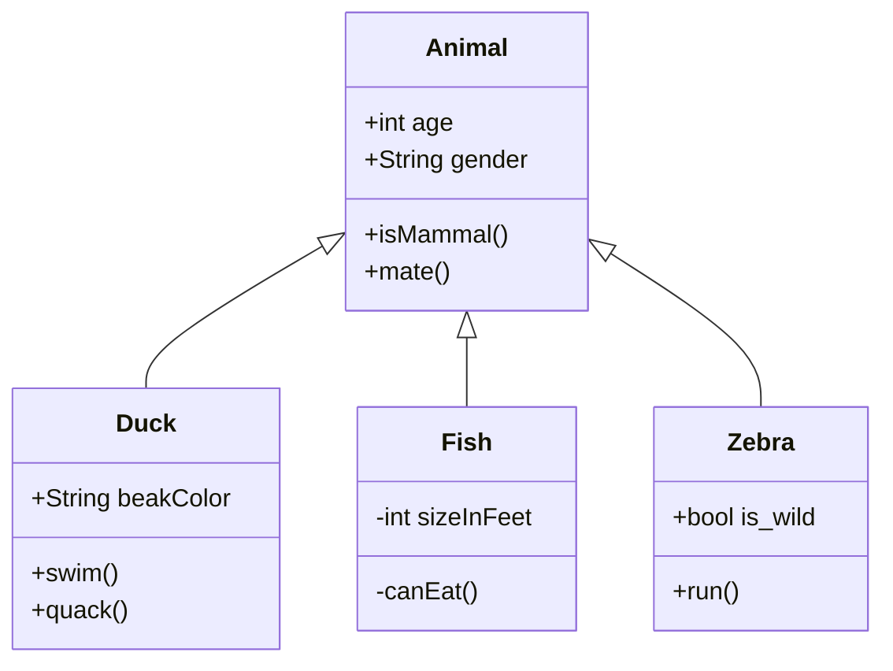

# How To Use Typora

## Windows Version

### Headers

When it comes to making headers, there is the same level and sizing like in HTML. However, the number of # dictates the header size. Have text follow behind it and it will make the respected header size. Can also do ctrl-[1-6]. 

### Javascript

Can write basic Javascript in here, but this will only work if being exported in HTML.

<button>Click Me</button>

<script>
// Select the button
const button = document.querySelector('button');

// Style the button nicely
button.style.position = 'relative';
button.style.padding = '20px 40px';
button.style.fontSize = '20px';
button.style.border = 'none';
button.style.borderRadius = '10px';
button.style.background = 'linear-gradient(135deg, #ff6ec4, #7873f5)';
button.style.color = '#fff';
button.style.cursor = 'pointer';
button.style.overflow = 'visible';

// Function to create particles
function createParticle(x, y) {
    const particle = document.createElement('div');
    particle.style.position = 'absolute';
    particle.style.width = '10px';
    particle.style.height = '10px';
    particle.style.background = `hsl(${Math.random() * 360}, 100%, 50%)`;
    particle.style.borderRadius = '50%';
    particle.style.pointerEvents = 'none';
    particle.style.left = `${x}px`;
    particle.style.top = `${y}px`;
    particle.style.opacity = '1';
    
    button.appendChild(particle);
    
    // Animate the particle
    const angle = Math.random() * 2 * Math.PI;
    const distance = 50 + Math.random() * 50;
    const xMove = Math.cos(angle) * distance;
    const yMove = Math.sin(angle) * distance;
    
    particle.animate([
        { transform: 'translate(0,0)', opacity: 1 },
        { transform: `translate(${xMove}px, ${yMove}px)`, opacity: 0 }
    ], {
        duration: 1000 + Math.random() * 500,
        easing: 'cubic-bezier(0.4, 0, 0.2, 1)',
    });
    
    // Remove particle after animation
    setTimeout(() => particle.remove(), 1500);
}

// Click event
button.addEventListener('click', (e) => {
    const rect = button.getBoundingClientRect();
    const x = e.clientX - rect.left;
    const y = e.clientY - rect.top;
    
    for (let i = 0; i < 30; i++) {
        createParticle(x, y);
    }
    
    // Button flash effect
    button.animate([
        { transform: 'scale(1)' },
        { transform: 'scale(1.2)' },
        { transform: 'scale(1)' }
    ], {
        duration: 300,
        easing: 'ease-out'
    });
});
</script>

### Text Basics

To make text **bold** use `****` and place text inside or ctrl+b

To make text *italic* use `**` and place text inside or ctrl+i

To make text <u>underlined</u> use `<ul></ul>` and place text inside or ctrl+u

To make text ^superscript^ use `^^` with the text inside

To make text ~subscript~ text use `~~` 

To create an external link, use `[Link here](https://youtube.com)`. The [] will contain the text to show to go to link. The () will contain the actual URL to go to.

### List

#### Testing text

There is a way to make numbered, bullet, and check list.

To make a numbered list just put the number one followed by a dot and space. Then per enter the next in the sequence will appear.

To make an unordered list, use put a dash followed by a dash then space. Then per enter the next in the sequence will appear.

To make a check list, just do - [ ] followed by text. Then per enter the next in the sequence will appear.

These list can also be nested. To do this just click tab on the current and a new sub list will be made. This follows the same rules for both list types above.

- This
- is
- an
  - now nested
  - list
- list


1.  I am
2.  Some numbered
   1.  Nested
   2.  Numbered Text
3.  Text


- [ ] This is an exampleOf a check box
  - [ ] that is nested inside
- [ ] here

### Footnote

To make a footnote, the use of `[^NameOfNote]` must be given. There are two parts to this. The first part will have the that syntax come at any part of the text this will be located at. The second part should will have that syntax come at the start of the text and this is the actual text to display  once made. Both of these names must be the same to link to each other. Also, the footnote that contains the actual text will always be at the bottom of the documents no matter where it is placed in the document.

This is some wild text[^note]

[^note]: This is some content

### Code

When writing code, there are two ways to do this: 

- inline --> This just uses \`\` and anything inside, but does not provide complex syntax highlighting. This is good for small single line code examples

- block --> This is will contain a pair of triple back ticks and this will provide syntax highlighting. Can also select a programming language for this as well by writing out the name right after the

```python
print("Example Here")

def csvparser(x: int,y: int) -> int:
  return x + y
```

### Math

When wanting to write math, there are two ways to do this:

- inline --> This is good for small math example and is made with double dollar sign
- block --> This is good for large math sequences and it is made with a double pair of two dollar signs

Here is example $3+4=7$ math
$$
\text{tmp hello}\\
3+4
$$


These both use the LaTeX syntax for this

### Git Alerts

There are special ways to contain notes in a special block to signal what it is supposed to mean. There are five different versions: tip, warning, caution, note, and important.

These are made by doing `> [!VersionName]`.

>  [!NOTE]
>
> Example note

### Table

There is a way to make a table. The easiest way to make this is just to go to paragraph -> table -> insert table. After, select the size of the table and work with it.

| True            | False This this is upper super duper wild |
| --------------- | ----------------------------------------- |
| Some true text  | Some false text                           |
| wild stuff here | With the things here                      |

### Diagrams

When it comes to diagrams there are many different types of diagrams that can be made. To actually make these, create a code block and for the language make it "mermaid".

[Click here]([Flowcharts Syntax | Mermaid](https://mermaid.js.org/syntax/flowchart.html)) to see how to make each of the different chart types.

[Click here](https://mermaid.live/edit#pako:eNpVjTFvgzAUhP-K9aZWIhE4BGMPlRpos0Rqh0yFDFYwGCXYyBilKfDfaxJVbW96p7vv3gBHXQhgUJ715Si5sWif5go5PWeJNHVnG94d0GLxNG6FRY1W4jqizcNWo07qtq1V9Xjvb-YSSobdXBPIylqdpnuU3Pg3JUaUZjveWt0e_ib7ix7RS1a_Szf_P5FGOOo1Kzkr-eLIDUq4OYAHlakLYNb0woNGmIbPFoYZzsFK0YgcmDsLbk455GpyTMvVh9bND2Z0X0lwu-fOub4tuBVpzSvDfytCFcIkulcWWLC6TQAb4BNYGNIlwUFEyRrTOAqoB1dgBC9xSGmESez7dBXGkwdft5_-MiZr3wlHPiE-XgfTN3EqdGs) to see examples of how each of these are made.



