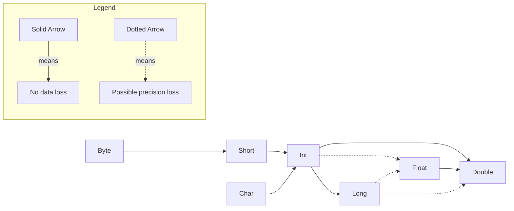
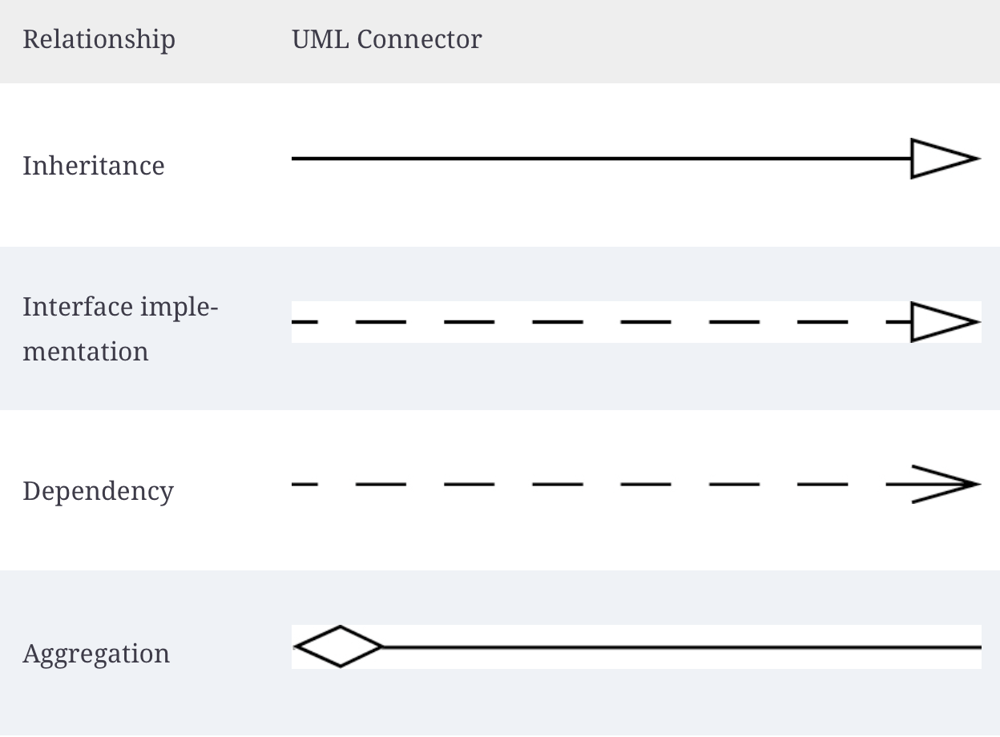

#  Chapter 1: An Introduction To Java

<!--Go back and read section-->

# Chapter 2: The Java Programming Environment

All java files will have the .java extension.

When it comes to downloading the java versions, there are *different* terminology used for this.

| Name                     | Acronym | Description                                                  |
| ------------------------ | ------- | ------------------------------------------------------------ |
| Java Development Kit     | JDK     | The software for programmers who want to write Java programs. |
| Java Runtime Environment | JRE     | The software for running Java programs, without development tools. Only supported until Java 8. This is not wanted. |
| Standard Edition         | SE      | The Java platform for use on desktops and simple server applications. This is wanted. |
| OpenJDK                  | N/A     | A free and open-source implementation of Java SE.            |
| Hotspot                  | N/A     | The “just in time” compiler developed by Oracle.             |
| GraalVM                  | N/A     | An “ahead of time” compiler for executables that start quickly, but don’t support all Java features. |
| Long Term Support        | LTS     | A release that is supported for multiple years, unlike the six-month releases that showcase new features. Choose the latest LTS release |

The way to run a java file it to use the command on the CLI **java** followed by the java file name with the extension like `java Main.java`. There is another version of this called **javac** where this does compile the .java files, but does not compile the code to machine code like in C. Instead, this turns into something called <u>bytecode</u>. This creates a new file with the same name, but ends with .class instead. When there is a .class file and wanting to run it, it does not need to have the extension behind it and can just have it without the extension like `java Main`.

> *Bytecode* is just an intermediate step in the compilation process that makes the instructions for the code platform independent. This means that the JVM that actually runs the code can spit out whatever correct instructions for any OS to use correctly.

<!--Go back and read section more-->

# Chapter 3: Fundamentals of Programming Java

## Basic File Outline

It is important to note that java is case sensitive when it comes to naming things.

```java
void main(){
    IO.println("Hello, World");
}
```

> [!IMPORTANT]
>
> The code above is not the common standard prior to java versions 25. This was an in development feature. Normally this would look like:
> ```java
> public class Main{
>     public static void main(){
>         System.out.println("Hello, World");
>     }
> }
> ```
>
> The first line name will be the same EXACT name as the java file. The second line will be named the normal main function with other extra properties.


Just like in C/C++, the use of curly brackets is used to define a scope of a function.

In java, "functions" are actually called a *method*.

To have the program actually run, there has to be a method called main in the program. This is like the important main method in something like C/C++.

The IO part of the program is something called a *class*. A class is a container for the program logic that defines the behavior of an application.

In java, everything is considered a class.

When it comes to naming conventions of class files, they use PascalCasing.

// TODO[^ JDK]

## Commets

To leave commets, this is the same as C with // for single line and /**/ for multi-line commets.

Each statement has to end with a semi-colon as this is the only way to mark that the statement is done. This means that multiple parts of a single statement can span multiple lines like the following below:

```java
void main(){
    System. // Single line commit
    out.
    println("This is a test");
    /*
    Multi line
    commet
    */
}
```

There is a special type of commet called a doc commet. This is basically the same as the the multi line commet except, there is an extra * at the top part of the commit like /***/. Will talk about later when talking about automatic documentation generation.

## Data Types

Java has 8 primitive data types and these must be used when declaring a variable.

### Integers

- **byte** --> holds integers -127 - 126. This takes 1 byte of memory.
- **short** --> holds integers -32,768 - 32,767. This takes 2 bytes of memory.
- **int** --> holds integers –2,147,483,648 - 2,147,483,647. This takes 4 bytes of memory.
- **long** --> holds integers –9,223,372,036,854,775,808 - 9,223,372,036,854,775,807. This takes 8 bytes of memory.

This data types memory sizes are fixed no matter the max CPU bit size. For example, in Golang when giving a variable of type int it can be a 32 or 64 bit number depending on the CPU architecture. However, in java an int will always be 4 bytes no matter what.

When choosing the **long** data type, the number of this should end with the suffix L like `long x = 8000000000L`.

There other smaller data values that can be given like:

- Hexadecimal numbers start with 0x prefix
- Octal numbers start with 0
- Binary numbers start with 0b or 0B

Java allows underscores between numbers to imroving readablility.

Unlike C/C++, java does not have a unsigned version of the integer values.

### Floating Point

There is only **float** and **double** types here. The first will takes 4 bytes and the second will take 8 bytes. However, their value ranges are not exact and instead an approximation. The first is about 6 - 7 decimal digits while the other is about 15 decimal digits.

It is important that the **float** type ends with the suffix F just like the **long** integer type ends with L. If not, then even if this is specified to be of type float it will still come out to be of type double and could throw an error.

All floating point numbers follow the [IEEE754](https://mathcenter.oxford.emory.edu/site/cs170/ieee754/) specification.

When decimal point number, the result of dividing a positive floating-point number by 0 is positive infinity. Dividing 0.0 by 0 or the square root of a negative number yields NaN.

There is a class called "Double" that has access to special methods and variables that cover different cases.

- `Double.POSITIVE_INFINITY` --> This is when the value is positive infinity
- `Double.NEGATIVE_INFINITY` --> This is when the value is negative infinity
- `Double.NaN` --> This is when the value in undefined
- `Double.IsNaN(float)` --> This is method is used to check if the variable is of not a number type

### Char

To represent a single character use the **char** data type. Unlike something like C/C++, the char type here takes 2 bytes instead of 1.

This type is created by using single quotes around the character. The value can be a literal single ANSCII character or something like a unicode character. A hexadecimal number value can be placed inside there so represent a more complex unicode value.

To represent a raw unicode value, prefix the 4 numbers with \u. There are other common escape sequences that are used to represent something else like:

- \n for newline
- \t for tab space
- \\\ for backslash literal
- \\" for double quote literal
- \\' for single quote literal
- \\s for single space
- \u3042 for あ

When a Unicode character falls within the *Basic Multilingual Plane* (U+0000 to U+FFFF), it can be represented using a single 16-bit char in Java.

For characters outside this range (U+10000 to U+10FFFF), Java uses a *surrogate pair*, which consists of two char values stored next to each other in memory. These two char's together represent a single Unicode code point. However, the use of the **String** data type is needed. While this will be talked about later, but fornow a string is just a collection of characeter types.

```java
public class Main {
    public static void main(String[] args) {
        // Unicode for 'あ' is U+3042
        char japaneseChar = '\u3042';
        char japaneseCharLiteral = 'あ';
        char thing = 'x';
        String BIG_THING = "\uD83D\uDE00"; // 

        // Print the character
        System.out.println("The Japanese character raw is: " + japaneseChar);
        System.out.println("The Japanese literal is: " + japaneseChar);
        System.out.println("Regular Character is : " + thing);
    }
}

```

> [!CAUTION]
>
> When using the unicode \u literal, this is processed before even the text or commets in the file are. This mens if something like "\u0022+\u0022" is written this this actually turns into trying to add together 2 empty string like ""+""

### Boolean

To represent a true or false value, use the **Boolean** data type. This is used to only represent true or false values. The values for true and false in java are literally "true" and "false". Another way these are represented is any non-zero value is considered true and any zero value is considered false.

## Variables

### Declaring a Variable

Java is a *strongly typed* language. This means each variable has to have the type specified and this type cannot be changed once declared. The rule for declaring a variable is data type followed by name space separated and ending with a semicolon like `int x;` . 

> [!IMPORTANT]
>
> Java versions from 21 and above, there is a special variable called _ that is already predefined. This is used to symbol that a variable that is syntactially required but never used.

When declaring multiple variables of the same data type, they can be name comma separated instead of having to be declared on separate lines like `int x, y, z;`.

### Giving a Value

Once a variable is declared, it has to be assigned a value before it can be used anywhere. If it does not get a value before being used then an error in the program will occur.

To give a value, just use the = symbol and the value on the left side will get the value on the right hand side of the equal symbol. The two ways to actually assign a value to one is:

1. Do it while declaring the variable like `int x = 50;`
2. Do it after variable is declared like `int x;` then doing `x = 50;`

> Java has a keyword called **var**. This can be in palce of the data type and declare the name like normal. This makes it so the data type of the variable can be infered instead of having to specify the data type. This is helpful when declaring object types which will be talked about later. This was finalized in java 11.

The only requirement for the **var** keyword is a value must be assigned to the variable once it is being declared.

### Constant

To declare a variable who's value should never change (like $\pi$ will always be 3.14), the use of the keyword **final** will be used. This keyword will go before declaring the data type like `final int x = 60;`.

If this variable's value is attempting to be changed during run time, then an error will appear.

It is a common practice to have constants be named all upper case and have _ be a separator between the names.

### Enum

In Java, when a variable should only ever be a specific set of values, the **enum** (enumeration) data type should be used.

An **enum** is really just a special type of class. When declared, this is just an object under the hood and gets access to all the methods from the `java.lang.Object` class since it <u>inherits</u> them.

This is defined using the **enum** keyword followed by a name to reference it. After, there is a set of curly braces and inside the curly braces, the names will be given. However, these do not need a data type or be assigned any value. These will be comma separated if more than one is given.

Create a variable of that enum data type. However, this can not only get values from that enum specific type. To assign this values, use the enum type name followed by the value name to assign this. This works since under the hood all the specified types are given the **static** keyword which will be talked about later.

> [!TIP]
>
> Is it convention to name the variable names all uppercase.

```java
class Main{
    public static void main(String[] args){
        enum Signal{
    		YELLOW,
    		GREEN,
   		 	RED
		}
        
        Signal light;
        light = Signal.GREEN;
        System.out.println(light); // prints the text "GREEN"
        System.out.println(Signal.YELLOW)
    }
}
```

There is a way to specify the enum values to be by using the <u>constructor</u> syntax and creating the names as if they're function calls by putting parenthses by them and passing a value inside. When making the <u>constructor</u>, make sure to have this be the exact same name as the enum type name. However, if doing this then make sure all the variable names declared a specific value as well. There can even be more than one value passed into each constant variable.

To actuallty access the data for each specific constant type, a variable must be declared for each value that will be per type. These shoud have a <u>access modifier</u> of **private**. This <u>access modifier</u> stuff will be talked about later. This will also be declared in the constructor. This will use the **this** keyword which will also be talked about later. After, make sure to declare methods thats sole purpose is to get the values of that type requested.

Under the hood, Java enums are much more powerful than simple integers. Each enum constant is an instance of a class that inherits from `java.lang.Enum`. This structure allows enums to behave like objects, providing access to built-in methods while maintaining a fixed, restricted set of possible values.

It it important to note where an enum can be declared. An enum can be declared inside a class; like between the `public class Main` curly braces or it can be declred outside that block. However, it cannot be declared inside methods; like the `main()` method. It can even be declared inside its own file since this is considered a special type of class.

```java
class Main{
	public enum Status {
	    SUCCESS(200, "OK"),
	    NOT_FOUND(404, "Not Found"),
	    ERROR(500, "Internal Server Error");

	    private int code;
	    private String message;

	    Status(int code, String message) {
	        this.code = code;
	        this.message = message;
	    }

	    public int getCode() {
	        return code;
	    }

	    public String getMessage() {
	        return message;
	    }
	}
	
    public static void main(String[] args){
    	Status x = Status.NOT_FOUND;
    	
    	System.out.println(x);
    	System.out.println(Status.SUCCESS);
    }
}
```

## Operators

### Arithmetic Operators

Just like in C/C++, java has the basic arithmetic operators like +, -, *, and / for adding, subtracting, multiplication, and division.

It is important to note when dividing numbers if both of them are integer types then this will perform integer division. However, if one or both of them are a floating point type then it performs floating point arithmetic.

The other symbol, like in C/C++, is the modules (%) operator for getting the remainder of division. This will return an integer only.

### Mathematical Functions and Constants

Just like in C/C++, there is a special library to deal with more complex math content. In java, this is done in a class called "Math". Inside here are the methods to perform the math equations. Some are:

- `Math.sqrt(x)` that takes in a number and returns the square root result of it.
- `Math.pow(x,y)` that takes two numbers of [type](https://youtube.com) double and returns the value of $x^y$ type double.
- `Math.sin` is the sin math variable
- `Math.cos` is the cos math variable
- `Math.tan` is a tan math variable
- `Math.log` is the natual log
- `Math.exp` is the natual log
- `Math.log10` is the log base 10

In java 21, there is a math method called `clamp(x,y,z)`. This gives the ability to check that a variable (x) is in scope of a minimum (y) and maximum (z) value. The return cases are:
$$
f(x,y,z) =
\begin{cases}
z & \text{if } x > z \\
y  & \text{if } x < y \\
x & \text{if } x \le z & x \ge y
\end{cases}
$$
There are other math constants like PI, E, and T (which is $2\pi$).

### Type Conversions Rules

There is a way to convert the data type from one variable to another data type. This is helpful when things need to be changed or meet certain requirements. For example, a function MUST take two floats, but have two ints.

The rules for the data type conversion is:



### Type Casting

To actually convert between two types, do `(Data Type) VariableName`. It is important that the variable is already declared.

For Example:

```java
public class Main{
    public static void main(String[] args){
        int x = 50;
        System.out.println(x);
        double y = (double) x;
        System.out.println(y);
    }
}
```

> [!WARNING]
>
> If trying to type cast from one data type to another that does not support that range, then it will truncate to a number that is can be represented for that data type at random. For example, going from an int to byte type.

There is a way to check that something is of a specific data type. This uses the **instanceof** keyword. This will also have two values like `Variable instanceof DataType`. This will return a boolean value back (true or false) if it meets the requirements of the assignment. However, this data type can ONLY be an object. So <u>primitive</u> data types like int, float, etc cannot be checked. 

```java
public class Main{
    public static void main(String[] args){
        int x = 50;
        // Following two lines below will cause an error
        bool isType = x instanceof int;
        System.out.println(isType);
        
        // This will work and prints "true"
        Integer y = 50;
        isType = y instanceof Integer;
        System.out.println(isType);
    }
}
```

### Assignment

When it comes to assigning a variable data, it can use the = like before. However, there is a way to also use arithmetic expressions with it at the same time once the variable is declared already. This is done with a short hand math symbol followed by the = symbol (like +=). For example, `x += 50` is the same as doing `x=x+50`.

This can be done with any of the arithmetic symbols.

> [!IMPORTANT]
>
> If the value on the right hand side when doing this is not the same type as the variable on the left, then this will auto type cast the resulting value on the right to the type on the left hand side. For example `x += 50.5` and in this case x in an int. Here the 50.5 will convert to 50 because under the hood this turns into `x = (int)(x + 50.5)`.
>
> However, as of java 20, can add the flag "-Xlint:lossy-conversions" when compiling and this will show a warning that this is happening.

### Increment Operator

Instead of having to write mantually adding or subtracting from a value each time by one, java supports a shorthand for this called *incrementing*.  This can be done by putting ++ or -- on a variable name like `x--`. This can be done anywhere in code and this will subtract 1 from the value. There is also a prefix version of this by just putting the ++ or -- before the variable name. However, these do mean different things, but only really matters when being done in assignment expressions. Doing the prefix version willl add/subtract 1 from the number first then do the arithmetic operation, but the postfix version will work with the variable first then add/subtract 1 from it.

For Example

```java
public class Main{
    public static void main(String[] args){
        int m = 7;
        int n = 7;
        int a = 2 * ++m; // m will be 8
        int b = 2 * n++; // n will be 7
        System.out.println(a);
        System.out.println(b);
    }
}

```

### Relational and boolean Operators

There is a way to show equality between two values and is done with ==. This is used to check if two values are equal to each other. This will also return a boolean value secretly to tell if this was true or false.

There is another version to check inequality which is !=. This checks if the value is NOT equal to the other value and returns a boolean values based on that.

There are other symbols that can be used to like < (less than), > (greater than), <= (less than or equal), and >= (greater than or equal).

There is also a way to do logic operators like && and || to check for logical AND and OR statements. This will also return a boolean value to see if the result did meet the requirements. These both work the same way as in C/C++ where there will be two separete expressions on each side of the logic symbols like `ExpressionOne && Expression2`. The && version will only return true if both expressions are true. The || willl return true of at least 1 of the expressions returns true.

For Example:

```java
public class Main{
    public static void main(String[] args){
        int x = 50;
        int y = 100;
        
        boolean isFalse = x > y;
        boolean isTrue = x == y || x < y;
        
        System.out.println(isTrue);
        System.out.println(isFalse);
    }
}
```

### Conditional Operator

There is a shorthand way to to write some logic where if an expression returns true then it can be assigned one value and if false it returns another value. To do this use the format `condition ? ValueTrue:ValueFalse`.

```java
public class Main{
    public static void main(String[] args){
        int x = 50;
        int y = x > 100 ? 100:-1;
    
        System.out.println(y);
    }
}
```

### Switch Expression

Instead of just just checking one case like the conditional operator, can use **switch** expressions. This is a way to check in multiple different cases if a value equals something then it will return a certain value back. This also uses another keyword called **case** which is what is used to check if the value meets the criteria for that case and if yes then that case code goes off and if not then skip that case code or can just do a single thing . There is also another keyword called **default** that will go off only if all the previous cases failed. 

When the cases are being checked, they go in the order in which they are declared.

When a code block is being used to execute multiple things and needs to return something, the use of the **yield** keyword must be used at the end of it. To use this just put the value to return 

The syntax for this is:

```java
switch(ValueToCheck){
    case CaseValue -> ThingToDo;
    case CaseValueTwo -> {
        ThingsToDo
    }
    case caseValueThree -> {
        ThingsToDo
        yield ValueToReturn
    }
    default -> ThingToDo;
}
```

The syntax above is available in java versions 14+. Prior to this, the -> had to use : instead and had to use the **break** keyword at the end of each case block.

Being Used:

```java
public class Main{
    public static void main(String[] args){
        int x = 50;
        float y = switch(x){
                case 30 -> 30.30;
                case 40 -> 40.40;
                case 50 -> {
                    System.out.println("The value was 50!");
                    yield 50.0 * 4.0;
                }
                default -> -1;
        }
    }
}
```

When it comes to cases, if there are multiple different results that should execute the same code or return the same value, then instead of putting them for their own case statement, they can be added on a single case statement like by just comma separating the values. For example, `case 1,2,3 ->` will execute the same code when the value is 1, 2, or 3.

> [!NOTE]
>
> If the value to be tested is an enum and the cases are the enum values, then the EnumName.value does not need to be used and can just do the value for each case.

### Bitwise opertors

Just like in C/C++, there is the common bitwise operators:

- & (AND)
- | (OR)
- ^ (XOR)
- ~ (NOT)
- \>\> (BITWISE SHIFT RIGHT) --> This will shift all the bits over 1 place 
- << (BITWISE SHIFT LEFT) --> This will shift all the bits over 1 place 

However, these only work on integer types. These can also be used in expressions in something like `(n & 0b1000) / 0b1000` where n is an int type.

However, if the value being tested on is a boolean type, then this will return a true or false value each time just like the && and || logic operators. Otherwise, returns an int value for this.

When it comes to the >> and <<, these will shift the bits by the specified about on the right hand side. The left hand side of this will be the int or binary number to shift the bits on while the right hand side will be the specific about of bits to shift by.

> [!NOTE]
>
> When shifting the bits left, this is like multipling the value by $2^\text{ShiftAmount}$. When moving to the right then it is like diving by $2^\text{ShiftAmount}$.

## Strings

When it comes to strings, under the hood they are just a sequence of **char** types. When it comes to to declaring a string, this will be done using the **String** type, which is secretly an object type. The string type is really just a class in the java.lang module that can be used.

There is eomthign called a *string literal* and that is just when using a string with double quotes that is not being assigned to a variable.

### Concat

There is something called *concatenation*. This is just combining two strings together to form a bigger one. This is done by adding two different strings together with the + symbol.  This will return a new string with the combined format except 

A string can be added to another data type (int, boolean, float, etc). However, it is converted to a string version and then added to the string like `String age = "I am " + 20 + " years old"`.

If there needs to be sone expression done on the contnet before it is converted into a string, then surround it with parentheses and do everything else with *concatenation* like normal.

Although a string is used make up of **char** type, the single **char** type  cannot do these auto conversions.

There is a special method in the string class called `join()`. This is used to join multiple strings together based on a certain delimiter type. The syntax is the specific delimiter in a string followed by other string variable types like `String x = String.join("\t", "	Hello", "	World")` will join the strings based on a tab delimiter.

There is another method called `repeat()`. This will take the sting of the thing being called on and just return an appended version of the tring to itself the same string over n times. The only argument this takes in an integer on how many times to repeat this.

### Static and Instance Methods

There are two types of methods here: 

- *instance methods* --> An instance method requires an object (instance of a class) to be created. Once the object exists, it can call methods defined in its class.
- *static methods* -->  A static method does not require an instance and can be called directly using the class name.

For example, `String.join()` is a static method because it is called using the class name without creating an object. In contrast, `.replace()` is an instance method because it must be called on a specific `String` object.

The easiest way to tell the two apart is if the . is coming right after a stirng type then this is a *insance method*. However, if the . is followed by a class name then it is a *static method*.

### Indexes and Substrings

There is a method for the string type called `length()`. This will return the number of total of **char** values it takes to represent that string.

There is another method called `charAt()`. This will take in 1 integer parameter. This returns the single character value at that position in the string. However, just like C/C++, strings are zero indexed so this can take any value from 0 to $string.length -1$.

There another method called `indexOf()`. This will take a single string parameter of anything. What this will do is return back the first instance that thing it found in the string in an integer.

Another method is called `substring()`. This will return part of the string this was called on. This takes two variables with the first being the index to start at and the second being the index to end at (no inclusive).

### String are Immutable

In Java, **String** objects are *immutable*, meaning their internal character data cannot be modified after creation. If a string variable is updated to a new value, the original data in memory is not overwritten. Instead, a completely new string object is allocated, and the variable is updated to point to this new memory location.

A significant advantage of this design is the *String Pool*. To optimize memory, Java maintains a special area where it stores unique string literals. When multiple variables are assigned the exact same literal value, Java saves resources by having all those variables point to the same existing object in the pool. This prevents the redundant creation of identical "boxes" in memory, leading to better performance and reduced memory footprints.

### String Equality

When it comes to seeing if two strings are equal, this is not done with the equality operator like ==. Instead, the string class has an instance method `equals()` that is a instance method. This will take a single **string** object and will return true if those both are equal and false otherwise.

There is another version of this called `equalsIngoreCase()` where it will also compare two strings and return the same value, except this does not take if the letters are capitalized into consideration.

If the == is used on two strings, all this does it test if those strings are located in the same memory location. So if needed to check that then use the == operation.

### Empty and Null Strings

An empty string is just "" and this will have a length of zero.

There is an instance method called `isEmpty()` that can be called. This will return true if the string is empty and false otherwise. This does not need any parameters.

The other ways to see if this is empty is using the `length()` instance method and see if it returns zero or use the `equals()` method with "" as the argument.

There is a special value called **null** that is used to represent that the current object does not actually point to anything in memory.

### The String API

The `String` class in Java has a lot of built-in methods for working with text. Most of these are *instance methods*, meaning they are called on a specific string object. Only a few are *static methods*, which are called using the class name itself.

There is a method called `length()`. This is an *instance method* and it does not take any parameters. It returns an integer that represents the total number of characters in the string.

Another method is `charAt()`. This is an *instance method* and it takes one parameter, which is an integer. This integer represents the index position. It returns a single `char` value at that position. Since strings are zero-indexed, valid values go from 0 to `length() - 1`.

There is an instance method called `equals()`. This takes one parameter, which is another string. It returns a boolean value (true or false) depending on if both strings have the same content.

There is also `equalsIgnoreCase()`. This is an *instance method* and it takes one string parameter. It returns a boolean, just like `equals()`, but it ignores uppercase and lowercase differences.

Another method is `compareTo()`. This is an *instance method* and it takes one string parameter. It returns an integer:

- a negative value if the current string comes before the other string
- a positive value if it comes after
- 0 if they are equal

There is a method called `isEmpty()`. This is an *instance method* and it does not take any parameters. It returns true if the string has a length of 0.

There is also `isBlank()`. This is an *instance method* and it does not take any parameters. It returns true if the string is empty or only contains whitespace.

There are also `startsWith()` and `endsWith()`. These are *instance methods* and each takes one parameter, which is a string. They return a boolean depending on whether the string starts or ends with that value.

There are multiple versions of `indexOf()`. All of them are *instance methods*:

- One version takes one parameter, which is a string. It returns the index of the first occurrence.
- Another version takes two parameters: a string and an integer. The integer represents the starting index for the search.
- Another version takes three parameters: a string and two integers. These define the range to search in.

All versions return an integer index of where the substring is found, or -1 if it is not found.

There is also `lastIndexOf()`. This is an *instance method*:

- One version takes one string parameter
- Another version takes a string and an integer (starting position)

These return the last occurrence of the substring, or -1 if not found.

Strings are immutable, so these methods return new strings instead of changing the original.

There is a method called `replace()`. This is an *instance method* and it takes two parameters. Both parameters are sequences of characters (most of the time just strings). The first parameter is what to replace, and the second is what to replace it with. It returns a new string with the changes.

There is also `substring()`. This is an *instance method*:

- One version takes one integer parameter (starting index)
- Another version takes two integer parameters (start and end index)

It returns a new string that is part of the original. The ending index is not included.


There are methods called `toLowerCase()` and `toUpperCase()`. These are *instance methods* and do not take any parameters. They return a new string with all characters converted to lower or upper case.

There are also `strip()`, `stripLeading()`, and `stripTrailing()`. These are *instance methods* and do not take any parameters. They return a new string with whitespace removed:

- `strip()` removes from both ends
- `stripLeading()` removes from the front
- `stripTrailing()` removes from the end

There is a method called `repeat()`. This is an *instance method* and it takes one integer parameter. This integer represents how many times to repeat the string. It returns a new string with the repeated content.

There is also `join()`. This is a *static method*, so it is called using the class name. It takes at least two parameters:

- the first parameter is a string delimiter
- the remaining parameters are multiple strings to join together

It returns a new string where all elements are combined with the delimiter in between.

Further documentation of the [String](https://docs.oracle.com/javase/8/docs/api/java/lang/String.html) class.

### Online Documentation

Since java has so many premade classes and methods, it would be hard to remember them all. To avoid having to remember them all, go [here](https://docs.oracle.com/en/java/javase/25/docs/api) to see all the predefined stuff available in the java 25 API specification.

There are other version of specific java versions or classes that can be see by going to the site above and looking something up specifically.

### StringBuilder Class

There are times when a string needs to be modified a lot, such as reading a file line by line or character by character and continuously adding to the same value. Using a normal **String** for this is inefficient because every time something is added, a completely new string object is created in memory. This takes extra time and uses more memory.

To avoid this, there is a special type called **StringBuilder**.

The **StringBuilder** type is not created the same way as a normal string. It must be created using the **new** keyword, such as`StringBuilder name = new StringBuilder()`.

This creates an object with no initial value (an empty sequence of characters). It can also be initialized with a starting value by passing in a string as a parameter when creating it.

Under the hood, **StringBuilder** works using a resizable array of **char** values. This acts as an internal buffer. Instead of resizing every time something is added, it allocates extra space ahead of time (called *capacity*). The actual number of characters currently being used is the *length*.

When more characters are added and the buffer runs out of space, a larger array is created and the data is copied over. However, this does not happen every single time something is added, which makes it much more efficient than using regular strings for repeated modifications.

There is a special instance method called `append()`. This takes a single sting and adds that to the char buffer.

Another instance method `length()` will return the current amount of chars in the array like the **String** version of this.

Another instance method `insert()` is used to add text at a particular point in char array. The first parameter this takes is the starting index this should enter at. The second parameter will be the actual string to add in. This will return the string builder array.

Another instance method `delete()` will remove string data from the char buffer. The first parameter this takes is the starting index for this to remove at. The second parameter will be the index this will end at (not inclusive). This will return the string builder array.

Another instance method `reverse()` will reverse all the char data in the array. This does not take any parameters. This will return the string builder array.

Once done with all the string adding, there is an instance method `toString()` that will return a **String** object with all the string content that the builder contained. This does not take any parameters though. 

Further documention for [StringBuilder](https://docs.oracle.com/javase/8/docs/api/java/lang/StringBuilder.html) class.

### Text Block

A feature added in java 15 allows for creating a multi line string in a string literal way. This makes it easier to use strings in a more human readable way. These are called *text blocks*.

Theses are created using three \"\"\" pair instead of \"\" like with strings.

These are really good for writing things like SQL queries and HTML blocks where things can span multiple lines.

```java
public class Main{
    public static void main(String[] args){
        String greetings = """
            Hello! My name is Jack!
            I am 20 years old!
            See you soon!
            """;
// Same as --> Hello! My name is Jack!\nI am 20 years old!\nSee you soon!\n
    }
}
```

## Input and Output

When it comes to getting input from a user, this is typically done though a GUI. However, there is a way to get basic toy user input from the CLI.

There is the before mentioned ways of `System.out.println()` and `IO.println()`. However, the second version is for java version 25 only while the other is for all versions.

However, when it comes to getting input, the basic ways are to use `IO.readln()`, using a Scanner type from java.util.Scanner, or using a BufferedReader type from `java.io.BufferedReader`.

When using the `IO.readln()`, this is the simplest way to get input. This will read text from the user until the enter key is hit. The value obtained will be returned as a string. Because of this, the value has to be type casted to its respectful data type to be unless it is supposed to be a string. To convert the types, this is not done with the normal type cast stuff mentioned before. Instead, there are special objects called *wrapper classes* that represent that data type that are used to do the type casing. For example, Integer is the name of the object to convert a string to an **int** type. The same object are available for each of the <u>primitive data types</u> which are: Double, Float, Long, Short, Byte, Boolean, and Character (char type). Each of these have a static method called `parse*()` where * is to be replaced by the name of the wrapper type like `parseInteger()`. These will all take in a single parameter of the string representation of this. It will then return the primitive data type version value of this.

When using the Scanner object from `java.util.Scanner`, this setup is different. Here it will specify where the input is coming from when declaring the Scanner object. This will get the value System.in as the argument. After, that object now has access to methods that can read user input. This will have an instance `nextLine()` method to read in a string of input until enter key is hit. However, unlike the `IO.readln()` version, there data techenically does not need to call the *wrapper classes* since there are special instance methods that can be used to read specifc data and have it auto converted. The methods follow `next*()` where * is to be replaced with the data type name like `nextChar()`. Also unlike other stuff so far, the `java.util.Scanner` is not part of the `java.lang` package so this type is not available by default. At the top of the file put the following: `import java.util.Scanner`.

When using the BufferedReader object, this works similar to the StringBuilder object where this preallocates a large amount of extra memory (8192 bytes by default) to help reduce expensive I/O operations like reading from a hard drive or network. If buffering did not happen, doing a call like `read()` or `readLine()` would cause a direct call to the OS. This is declared differently then the Scanner object. When. Just like the Scanner object, this also needs to be imported with `import java.io.BufferedReader`. More about this will talked about later.  // TODO[^BufferReader]

Although the `IO.readln()` and `IO.println()` can be used to get user input, theses are more used for programmers compared to displaying information for users. This is because when having to use things like *wrapper classes*, they follow a strict format. For example, entering a numer of 50,000 and having to convert that with the `Integer.parseInteger()` would case an error to occur. However, if done with the Scanner object with `nextInt()` then this would not cause an error and would return back 50000.  The `IO.println()` should only be used to show basic information that does not require formatting as well. Therefore, it is always better to use the Scanner object to get user related input.

There is a final way to interact with I/O that is a specialized way, which is with the Console object. This must be imported with `import java.io.Console`. This is really only good when wanting to make CLI applications AND certain information entered must be private. This is similar to the Scanner object class in terms of what it does, but slightly different. This can read and write input. However, it can do things like getting passwords without showing the password. It has access to an instance method `readLine()` that is used to get text like normal and will return a **String** version of it. There is also an instance method `readPassword()` that will read in data and return a **Char[]** version of it. It also has access to an instance method `printf()` that works like the C version when it comes to outputting data and data formatting like %s, %d, %f, etc. The `System.console()` *static method* must be called and assigned to this to actually return an instance of this.

> [!IMPORTANT]
>
> The `IO.println()` and `IO.readln()` are from java 25+ only.

```java
import java.io.Console;
import java.io.BufferedReader;
import java.util.Scanner;

public class Main{
    public static void main(String[] args){
        // Make a scanner object to read input
        Scanner scr = new Scanner(System.in);
        // Make a console object
        Console console = System.console();
        
        System.out.print("Enter Number: ");
        int x = scr.nextInt();
        
        // Read standard input
        String username = console.readLine("Enter username: ");

        // Read secure input
        char[] password = console.readPassword("Enter password for %s: ", username);
    }
}
```


The full documentation for the java 25 [IO](https://docs.oracle.com/en/java/javase/25/docs/api/java.base/java/lang/IO.html) package, java [Scanner](https://docs.oracle.com/javase/8/docs/api/java/util/Scanner.html) class,  java [Console](https://docs.oracle.com/javase/8/docs/api/java/io/Console.html) class, and java [BufferedReader](https://docs.oracle.com/javase/8/docs/api/java/io/BufferedReader.html) class.

### Formatting Output

When it comes to outputting formatted text, this is useful when things should be displayed in certain ways. For example, there is an instance method for the **String** object `formatted()`. The actual string this method is called on will be a formatted string version of this. The formatting will use C style formatting with the `printf()` function with things like %s, %d, %f, etc.

| Formatter | Description                     |
| --------- | ------------------------------- |
| %x        | Displays hexadecimal numbers    |
| %o        | Displays octal numbers          |
| %f        | Displays float numbers          |
| %s        | Displays string types           |
| %c        | Displays char types             |
| %b        | Displays boolean types          |
| %%        | Displays the actual % symbol    |
| %-        | Displays the actual - separator |
| %d        | Displays integer numbers        |

When it comes to displayig float, it has some special flags that can be added to it to change how the float actually appears. 

```java
public class Main{
    public static void main(){
        String templateFormat = "Value is %8.2f and name is %s\n";
        float x = 5000.3123456;
        String name = "Jack";
        
        // Could also do "Value is %8.2f and name is %s\n".formatted(x,name);
        System.out.println(templateFormat.formatted(x, name));
    }
}
```

## Control Flow

Just like C/C++, java has both conditional statements and loops to determine control flow.

It is important to know what *block scope* is. All things declared and done live in a particular scope  that is specified between curly brackets. There can be blocks inside other blocks. Things like variables will live inside that scope and anything outside it will no be visable to any inner scopes.

Each block can be thought of as a level. The blocks that are inside other blocks are called *nested blocks* and the block that contains it is called the *outer block*. If something like a variable is declared inside the outer block and then declared again inside an nested block then this will cause an error. There are other programming languages that support this and this is called *shadowing variables*. However, java does not support this.

### Conditional Statements

*Conditional statements* are ones that execute a certain block of code depending if the specified condition is met.

Just like C/C++, when declaing a conditional statement, this is done with the **if** keyword. The syntax for this is `if(condition){statement(s)}`. The condition MUST be something that can evaulate to a **boolean** true or false. If and only if the result of the condition is true then the code in the if scope will be executed. Otherwise, that code is skipped over.

Another version of this is called an *if-else* conditional. This will make it so it use the **if** and **else** keyword. This makes it so if the if part of the conditional does not evaultate to true, then instead of just skipping over it will execue some other code specified in the else block. The syntax is `if (condition){statement(s)}else{statements}`. Unlike the **if** part, the **else** part does not have a condition to evaulate and therefore does not need parentheses and just needs curly braces.

There is another keyword that is added to this called **else if**. This is not like the **else** where the block code is executed if the **if** part fails. Instead, this will also take a condition just like the **if** part. This code block will only execure only if the **if** part failed and then if the condition for this block passes. Unlike the previous two parts, there can be multiple **else if** blocks for one if statements.

When it comes to adding all three different parts together, the **if** part is always the first one followed by the **else if** parts followed by the **else** as the last part. Also, the conditions are checked in sequenial order until the **if** or the one or more **else if** blocks are true or if they are all false then the **else** part will execute.

There is someting called *flow charts* that help to visualize how the code execute will play out per case.

### Loops

When wanting to execute a code block repeatly, the use of a loop is needed.

The first type of loop is the **while** loop. This will execute code until the targeted condition results to false. The syntax for this is `while(condition){statement(s)}`. This is used when the number of times a code block needs to execute is unknown and should only stop once a condition is met.

The way a **while** statement works is it first checks to see if the resulting condition returns true. If it is then start the code execution block. Once this block is done, it does not go on to the next set of text. This goes back to check the condition and if it result to true then it will execute the same code block again. This repeats until the condition results to a false value. This means there should be some value being updated, changed, or removed in the code block that will soon result in the condition becoming false. If this does not happen then this will result in an *infinite loop* which is when the **while** loop never actually ends and therefore the program can never end and no further code after that block can be executed.

```java
public class Main{
    public static void main(){
        int x = 50;
        
        while (x > 40){
            IO.println(x);
            x--; // deincrements the value each time to ensure no infinite loop
        }
    }
}
```

There is a different version of a while loop called a do-while loop. In a while loop, the condition is checked BEFORE the code block is executed. This means there is a chance the loop never executes because the condition evaulates to false the first time. However, a do-while loop will ALWAYS execute the code block at least once and then check the condition afterwards. 

The syntax for a do-while loop is different compared to a normal while loop since this now uses the **while** and **do** keywords. The syntax is `do {Code to Execute}while(condition);`. The code, the **do** bloxk will always execute that code and then check the condition in the while loop and if it is true then reexecute the code in the **do** block. Another important thing is to make sure the while part ends with a semicolon or this will cause an error.

```java
public class Main{
    public static void main(){
        double balance = 100.00;
        double payment = 50.53;
        double interestRate = 0.10;
        int years = 3;
        
        do {
    		balance += payment;
    		double interest = balance * interestRate / 100;
            balance += interest;
            years++;
        } while (input.equals("N")); // Loops until user enters "N" for input
    }
}
```

### For Loops

There may be times when a code block should only execute a certain amount of times max, but not forever like a while loop where it can execute any amount of times until a condition is met. That is where a for loop is used. This is made with the keyword **for**.

The syntax needed in a for loop is different compared to a while loop. This will also have parentheses, but the content inside is broken into three parts:

1. *Initializer* --> This will be a value that acts like a counter to determine how many times the code block will run.
2. *Condition* --> This will be the condition that is checked each time over and over until the total number of specified times to run is reached or the condition evaulates to false
3. *Increment* --> This will be how much to increase the initializer value by. This helps increment the counter to reduce the number of times the code needs to run.

The syntax for this is `for(Initializer;Condition;Increment){Code to Execute}`. It is imporant to note that each part is separated by a semicolon.

For the *increment*, this typically uses the increment (++) or decrement (--) syntax.

It is important to note that for the *initializer* part, the variable used does not need to be declared beforehand. It can be declared right there like a normal variable. However, if the variable is declared there then it will only exist in the scope of the for block. For example `for (int x = 0; x < 10; x++)`.

If wanting to only do one thing with the for loop like print something out, then the use of curly brackets is not needed and the line just needs to be indented. However, there can only be one thing that needs to be executed otherwise curly brackets need to be used.

```java 
public class Main{
    public static void main(){
        for(int i = 50; i < 60; i++)
            IO.println(i);
        // Can even do --> for (int i = 50; i < 60; i++) IO.println(i); 
    }
}
```

When it comes to making the *initializers* and *increment* variables, there can be multiple of them declared as long as they are comma separated. For example, `for(int x = 1, y = 6; x < y; x++, y--)`.

### Switch Statement

Instead of writing a bunch of if-else statements, a *switch statement* can be used. This is different compared to the *switch expression* mentioned earlier. This is because this does not return a value. Instead, this is just used to check if a value occurred like if writing a bunch of if else statements.

The syntax for this is the exact same as the *switch expression*.

Before it was mentioned that there is another way to write switch statements/expressions without -> syntax, but this is the old and outdated method since the -> syntax has been fully supported since java 14. However, versions before that use the old syntax. The old syntax will need to make use of another keyword called **break**. Without **break**, something called *fallthough* will occur. This is when a case does execute all the code assigned to it, but will execute the next case under it as well and this repeats until it hits the **break** keyword or end of the switch statement. To prevent this, the **break** keyword needs to be placed at the end of each case statement block to prevent this. The only part of this that does not need to follow this rule is the **default** case.

Something called exceptions, which are talked about later, can be a return value for this as well.

### Breaking Control Flow

When it comes to control flow loops, there are times that once or if a certain value is reached, the loop should exit and not continue and otherwise keep on going. This can be done by affecting the condition of the loop expressions, however this can make things more complicated. Instead, there are two keywords:

- **break** --> This one was already seen before, but this will make it so when this statement is executed, it will immediately leave the control flow statement and not execute anything else that was in that block scope.
- **continue** --> This is used to affect execution of code, but not like the **break**. Instead of leaving the control flow block, this skips executing the rest of the code below it and then will go back to the loop block and start it all over again. This will count as an iteration as well.

When it comes to these keywords, they do not follow anything as they are just used alone.

Both of these only affect the inner most control flow loop. This means if there is a for loop inside another for loop, but the nested for loop as a break statement, then this does not leave both of the for loops. Instead, only the inner one control flow is broken and then 

```java
public class Main{
    public static void main(){
        int x = 50;
        int y = 50;
        
        // using break
        for(int i = ; i < x; i++){
            // skips the whole for loop since x > 10
            if (x > 10){
                break;
            }
            x += 10;
        }
        
        // using continue
        for (int i = 0; i < y; i++){
            // adds 2 to i then skips executing the i++ if it is divisable by 2
            if (i/2 == 0){
                i+=2;
                continue;
            }
            i++;
        }
    }
}
```

##  Big Numbers

There are rare times when even the data type like **long** or **double** are not enough for the numbers that need to be held. Instead, there are special classes called **BigInteger** and **BigDecimal** that can make this happen. These are located in the `java.math` package so this needs to be imported first before bring used.

When creating theme, there are two ways to do it:

1. The first is turning a normal small value into a big version. This is done by using the static method of the respected class called `valueOf`. The only argument this takes is the single number being assigned to this.
2. The second way is using using the constructor of that class. This is when the special keyword **new** will need to be used.

When it comes to math operations like adding and multiplying, the basic +, *, -, and / is not supported with these types. Instead, each of the object types have an instance method called `add`, `multiply`, `subtract`, and `divide`. This will take in a single value and that is another big data type of the same type and do the math on the current value being called on with the one passed in and return the result.

## Arrays

When wanting to hold multiple different values of the same type and be referenced by the same name, this is where *arrays* come in handy. These act as special container to hold multiple different variables of the same type under the same name.

There is no special data type for creating an array. Instead, there is a special syntax. To create an array, put a set of square brackets right after (not spaced) the data type. After, there can be three things done to actually create it:

1. Create an array object by assigning it the syntax like `new <dataType>[SizeOfArray]`. This will create an array of the specified size meaning that can hold n number of variables of that type.
2. Do not have to do the `new <dataType>[SizeOfArray]` thing. Instead, assign it equal to a set of curly braces and put the values in there comma separated. What this will do is auto fill the array with that specified amount of data and then it will take the total number of things added to it and make that the size of the array.
3. Can just end the variable name without assigning it to anything. However, this just declares the variable, but does not assign it to any part in actual memory. Instead, it will be assigned to the keyword **null** which is used to represent that something has no memory for it. So using this array will cause errors.

Once an array is declared, it cannot change size at all. It will always be that size unless a new array is made and all the values from the original are copied to the new array.

```java
public class Main{
    public static void main(String[] args){
        int[] a = null;
        int[] b  = new int[10];
        int[] c = {2,4,6,8};
        
        if (a == null){
            System.out.println("Not declared");
        }
        else{
            System.out.println("Declared Now");
        }
        System.out.println(b);
        System.out.println(c);
    }
}
```

There is one more way to declare an array, but it is more used to reuse the same variable and declare it with a new array called an *anonymous array*. This makes use of the 3rd and 1st syntax of declaring an array. It looks like `arr = new int[] {1,2,3,4,5}` which will allow that variable to be reused again and point to the new array and this will also assign the values plus get the size of the array already.  This syntax can be used to pass an array to something without declaring a variable to hold it, so it will not be assigned to anything.

### Accessing Array Values

When it comes to actually getting values from the array, the syntax is `arrayName[indexOfValue]`. This will get back the value from that position in the array. A position in the array is called an *index*. The indexes start at 0 to $MaxLength-1$. If this is not followed then the common *off by one* error can occur.

This syntax is also how values in an array are changed. Use that same syntax except now assign it to a value.

```java
public class Main{
    public static void main(String[] args){
        int[] b  = new int[10]; // create array to hold 10 integer values
        b[0] = 40; // assign value 40 to index 0
        System.out.println(b[0]); // access the variable to print result
    }
}
```

> [!IMPORTANT]
>
> When an array is created with the 1st syntax, then this will auto assign all the positions in the array a *default value* respected of their type.
>
> | Data Type       | Default Value |
> | --------------- | ------------- |
> | int             | 0             |
> | float           | 0.0           |
> | double          | 0.0           |
> | byte            | 0             |
> | String          | null          |
> | char            | ''            |
> | boolean         | false         |
> | Any Object Type | null          |

All array type have a special variable called "length" that can be accessed using the dot notation like when called methods from objects. This variable contains the total size of the array. This is helpful when just needed the total number of elements possible in the array.

An array can be declared with a size of zero by just using the 1st syntax and then making it size zero or using 2nd syntax and just assign it to curly braces and that is all.

> [!IMPORTANT]
>
> There is a difference between an array with a size of zero and array with a value of null

### The For Each Loop

There is a special *for loop* syntax that is used to go over a collection of something like an array, but this can be used for other things that work to store collections of things called a *for each* loop. 

The way these work is there will be a variable that is declared that only exist in the scope of the loop. This will be assigned the value of the collection from the current index being worked on. Basically this is the same as doing `<dataType> variableName = collectionType[i]` of a normal *for loop*.

Although these loops function the same way as a normal ones, they have two differences:

1. Syntax --> the syntax for this is `for( <dataType> VariableName : CollectionVariable)`.
2. Declaring Limit --> the limit of the size for this are automatically calculated. This means the loop will automatically know when the end of the collection is reached so it can exit without error.

> [!NOTE]
>
> The *for each* loop can only over a collection of things that implement the special class "Iterable". The class stuff will be talked more about in the next chapter.

> [!NOTE]
>
> The value assigned to the temporary variable depends on if the data type is a primitive or object type. 
>
> 1. If it is a primitive type, then the value assigned to the variable is only a copy of it and not the real thing. This means changing the value of that variable does not affect the version in the collection type
> 2. If it is a object type, then the value assigned to the variable is the original thing from the collection. This means modification to the variable version also affect the version of it in the collection.

If just wanting to print the output of the array, then this can be done without having to use a *for loop* or *for each* loop. Arrays have access to an instance method called `toString`. This does not take any arguments, but does return a string version of the entire collection type.

### Array Copying

An array declared as the same type as the other can be assigned value to the other. However, this make the new array refer to the same data in memory as the original. This means changes the data in array 1 affects the data in array 2.

To avoid this, there is a static method in the class "Array" called `copyOf`. This takes 2 parameters with the 1st being the actual array and the 2nd is the length of the array. This returns a new array in memory that just holds the same values as the other to the new variable that is supposed to be assigned to this. It is important to note that the length of this does not have to be exactly the same as the original array. If the value is bigger then it will copy all the values from the other array and give more space for more data to be stored and each extra space will be assigned the *zero value* of the respected data type. However, if the value is smaller then this will truncate the values of the original array and only get the values of the length specified.

> [!NOTE]
>
> Unlike C/C++, array values are stored on the *heap* and not the *stack*.

### CLI arguments

When it comes to getting CLI arguments, there is the special way to get them which is predefined when declaring the main method. Inside the parentheses there will be the things "String[] args". The variable "args" will hold string representations of the values passed in on the CLI space separated. This variable will store them in an array of strings. The first index will always be the name of the program currently running and the second index going on will be the actual CLI arguments.

### Array Sorting

When it comes to sorting an array, this can be done with own custom algorithm to do so or can use the built in instance method on the array called `sort` which takes no arguments and does not return nothing. All this does is changes the indexes of the values in the array to be from low to high. The method implements a tuned version of the *quick sort* algorithm.

### Random Numbers

Going back to the "Math" class, there is a static method called `random` that does not take any arguments. However, this returns a random float number between the values 0.0 (inclusive) to 1.0 (exclusive). This means multiplying the result by a number will make the range of values $0\text{ to }n-1$. The values also needs to be *type casted* to an int if the random value to be returned needs to be an integer.

If the random numbers need to also be from a specified range, then add a value to the result after the multiplication of the result is calculated. This will make it then $0+min \text{ to } (n-1)+min$. An example of this is `System.out.println( (int) (Math.random() * 10) + 1)` which will make the value range from 1 to 10.

### Special Methods For Array Class

The statics methods `toString`, `copyOf`, and `sort` were already mentioned before. However, there are three more that are useful as well:

- `copyOfRange` --> this will copy the values from the array, but only in a specified range. This takes 3 parameters:
    1. Actual array to copy
    2. Starting index to copy from inclusive
    3. Ending index to copy from exclusive. However, if longer than actual array then it will pad the extra slots with *zero values* of the respected type.

- `fill` --> this will be used to set all the index values with a specified value. This takes 2 parameters:
    1. Actual array to copy from
    2. Value to actual copy into all the indexes
- `equals` --> this test of two arrays are the exact same by seeing if both arrays have the same length size and if the index elements match (each element has to also be in the same index).

### Multi-dimensional Arrays

A special thing called a *multi-dimensional* array exist which is just another version of an array. However, this has 2 square brackets to access indexes that is needed.

To make these just put an extra set of brackets when declaring the array. This follows the same rules for syntax design 1 and 2. A good way to visualize this is using a *matrix* in math.

When it comes to the indexes, it will now require two sets of brackets to be used. The first pair will be which row to access the data from and the second will be which column of that row to access data from.

When it comes to using the 3rd method of declaring variables, these will have a set of main curly brackets. Inside that, there will be a separate pair of them to represent a row and its column of data. This can be repeated to create that many rows and columns of data. However, each column must have the same exact size otherwise this will cause an error.

```java
public class Main{
	public static void main(String[] args){
        int[][] matrix = {
            {1,2,3},
            {4,5,6},
            {7,8, 9}
        };
        // Prints the value 6 from row 1 and column 2
        System.out.println(matrix[1][2]);
        System.out.println(matrix[1]);
    }
}
```

This can still use the syntax of a single dimensional array when accessing the array. However, this will just return that actual array of data from that column instead of the single value.

### Jagged Arrays

Before when talking about the multi-dimensional array, the columns of each row had to be the same size. However, there is a way to declare a multi-dimensional array with different sized columns per row called a *jagged array*.

To declare this, use the 1st method of declaring an array and then instead of specifying the size in the 2nd set of brackets, just leave that part empty. Now that the number of rows are specified, assign each row the creating array syntax `new <dataType>[NumberOfColumns]`. This will need to be done for each row before it is used.

Can also use the curly bracket syntax and just put the creating array syntax as if making multiple rows and the different sizes of the rows.

The easiest way to do this is just declare the array with the curly brackets like normal then declare the nested arrays with the curly brackets like normal, but they just won't be all of the same column size.

Once these steps are done, the array can be accessed like a normal multi-dimensional array.

```java
public class Main {
    public static void main(String[] args) {

        int[][] arr1 = new int[3][];
        arr1[0] = new int[2];
        arr1[1] = new int[4];
        arr1[2] = new int[1];

        arr1[0][0] = 1; arr1[0][1] = 2;
        arr1[1][0] = 3; arr1[1][1] = 4; arr1[1][2] = 5; arr1[1][3] = 6;
        arr1[2][0] = 7;

        int[][] arr2 = {
            new int[2],
            new int[4],
            new int[1]
        };

        arr2[0][0] = 10; arr2[0][1] = 20;
        arr2[1][0] = 30; arr2[1][1] = 40; arr2[1][2] = 50; arr2[1][3] = 60;
        arr2[2][0] = 70;

        int[][] arr3 = {
            {100, 200},
            {300, 400, 500, 600},
            {700}
        };

        int[][] arr5 = new int[3][];
        arr5[0] = new int[] {1, 2};
        arr5[1] = new int[] {3, 4, 5};
        arr5[2] = new int[] {6};

        int[][] arr6 = new int[3][];
        arr6[0] = new int[2];        
        arr6[1] = new int[] {7, 8};     
        arr6[2] = new int[4];         

        arr6[0][0] = 9; arr6[0][1] = 10;
        arr6[2][0] = 11; arr6[2][1] = 12; arr6[2][2] = 13; arr6[2][3] = 14;
    }
}
```

When it does come to multi-dimensional and jagged arrays, each data piece for the array is note stored continuously in memory like in C/C++. Instead, each array is stored in separate parts of memory, but each individual array pieces are stored continuously.

# Chapter 4: Objects and Classes

## Introduction to Objected Oriented Programming

The current development of most modern languages is with something called object orientated programming (OOP). This also happens to be javas biggest strangth.

Object orientated programming is meant to help reduce complexity to people who need to use something and wanting to hide certain things from people. For example, the `sort` static method from the array class does not have it publically shown how the tuned quick sort algorithm is done, but the user can call and use it with ease.

### Classes

A class specifies how an object is made (data types, methods, etc). A class is just like making a custom data type. The class itself can be thought of as a templeate that all variables of this data type will have, but not all have the same values. For example, a template to make a butterfly knife might be the same design wise. However, the material, color, blade and blade design.

When a object type is actually declared, then it is called an instance of the class. This is because each instance can have unique data apart from other instances.

Java has a lot of default classes in the language for cases like date and time, networking, math, etc. This makes it easier for people to use certain things in the language. An example of this is the "String" class which makes working with strings possible and gives methods to make working with strings easier.

One of the key ideas of OOP is *encapsulation*. This is basically just information hiding. An example of this is, again, the `sort` method of the "Array" class. This is implmented and calling it to be used is easy since all the user has to do it pass in the array as an argument. However, how the quick sort algorithm is actually done is *encapsulated*.

The variables inside an object are called *instances fields*. However, the functions that actually interact with that object data are called *methods*.

The key way to make *encapsulation* work is each object should interact with its own *instance fields* AND this should only be done through that objects own methods. Here are some examples:

- Direct variable value change --> If an object has an *instance field* "age". Then the only way that age should be able to changed is through a method like `person.changeAge(21)`, but not something like `person.age = 21`.
- Object changing value in other object --> If an object has a method like `changeObjValAge()` and takes in an object just to changes it *internal fields*, then this is also incorrect
- Only see input and output --> This means methods should only have it to where it gets inputs and then someout returns. This should be like a blackbox thing.

One class can be made using another class. There is techenically a "mega class" called "Object" that all other classes made will get.

When a class uses another class as a building block, it get access to all methods and instance variables declared in the steping stone block. In OOP, this is called *inheritance*. *inheritance* will be talked more about later on.

### Objects

When working with objects, there should be 3 characteristics of them that should be identified:

- Object Behavior --> what can be done with this object, or what methods can be applied to it?
- Object State --> how does the object react when methods are invoked?
- Object Identity --> how is the object distinguished from others that may have the same behavior and state?

All instances of the same object types will make have a resemblance because they all will have the same <u>behavior</u> because they will all have the same methods that can be called.

Next, each object stores information about what it currently looks like. This is the object’s <u>state</u>. An object’s state may change over time, but not spontaneously. A change in the state of an object must be a consequence of method calls. (If an object’s state changed without a method call on that object, someone broke encapsulation.)

However, the state of an object does not completely describe it, because each object has a distinct identity. For example, in an order processing system, two orders are distinct even if they request identical items. The individual objects that are instances of a class always differ in their identity and usually differ in their state.

These key characteristics can influence each other. For example, the state of an object can influence its behavior. (If an order is “shipped” or “paid,” it may reject a method call that asks it to add or remove items. Conversely, if an order is “empty”—that is, no items have yet been ordered—it should not allow itself to be shipped.)

### Idenifying Classes

When it comes to naming conventions, classes are typically named with nouns using *PascalCase*, such as Item, Order, or Payment. When naming methods for an object, verbs are used in *camelCase*. For instance, if a class is named Item, a method might be named add. When expressed in a sentence, it would be: "An add action is performed on an Item object." Variables also follow *camelCase* but use nouns, such as itemPrice, while constants are written in ALL_CAPS to indicate the value never changes.

### Relationships Between Classes

When it comes to relationship between classes, there are different ways they can be linked. Depending on the type can affect how the system depends on other resources. The relationship types are:

- *dependance* (uses-a) --> when another class uses a different class as one of its parameters in its methods. This can be though of as "Order uses a Item" becase Order relies on the Item class to check the status of an item, but the Account class does not since it does not need to track items. Thus, a class depends on another class if its methods use or manipulate objects of that class. It is important that this is minimized since this can lead to bug errors and changing either of the classes. This usage of classes it called *coupling*.
- *Aggregion* (has-a) --> This is when one class needs another class as an *instance variable*. For example, the Order class has an Item.
- *Inheritance* (is-a) --> This is used to express relationships between special or general class. For example, the class RushOrder is an Order class. This means that the RushOrder class got all the methods and instance variables from the other class. The class that inhreits from another should extend the functionality of the previous class. For example, there can be a general class called Employee, but a class Boss, Manager, and Underwriter inherit all the infomration from the Employee class, but also extends that by adding more methods and instance variables.

There is a specal way that classes are represented called a *UML diagram*. With this, there are also arrows that are used to represent the relationships between the things.



Learn how to make [UML diagrams](https://www.youtube.com/watch?v=WnMQ8HlmeXc).

## Using Predefined Classes

### Objects and Object Vartiables

To work with objects, their initial state has to first be established. This is done by using something called a *constructor*. This is just a special method that is used to create an object in memory and give that object the specified state values for that object instance. When creating the constructor method, this will always have the same exact name as the class itself.

When actually creating the object, the *constructor* method will be called and the use of the **new** keyword will be needed. For example, there is a class named "Employee" and it needs to be initialized with at least a name and age in that order. This will look like `Employee x = new Employee("Jack", 20)` and this first tells the variable x is of type Employee. Then this is assigned to the *constrctor* function while using the **new** keyword and then setting the inital values for this instance object which can now be refered with x.

Just like arrays, the actual object does not have to be assigned to a variable and can just pass that single created instance of the object by just using `new ConstructorName()` like normal. For example, a method called "addHero" needs a Hero object, but this does not need to be assigned to a variable each time, then it can look something like `addHero(new Hero("Jack", "Flying"))`.

When making the object by assigning it to a variable then the variable can call the methods defined in that class. However, when declaring the object without assigning to a variable, the method can still be called for that by just using the dot operator like normal followed by the method name. For example, `new Date().toString()` would create the object and then return the string version of this so there can be a string variable that can hold this.

There is a difference between objects and object variables:

- Object --> This is when the variable of that type is defined, but actually does not assigned an actual object type in memory. This looks like `ObjectType x` only. Because of this, then this variable should not call its methods because techenically this is calling these methods on nothing. When doing this, the variable is not even considered an object yet since it does not even point to one in memory.
- Object Variable --> This is when the variable of the object type is declared AND is actually assigned an instance of that object to it with a *constructor* or assigned to another variabele of the same object type. When calling methods on this object, they will take the instance values of that then doing somethign with that variable data.

> [!WARNING]
>
> When assigning an object to another object that is already declared, just like with arrays, this makes both variables point to the same object in memory. So changing the data of the object will affect both of the variables pointing to it.

There is a way to signal that an object does not point to anything in memory by assigning this to the keyword **null**. This is like the *zero value* for primitive types except for objects. 

### The LocalDate Class

There is a class called "Date" that is in the package `java.util.Date`. This is used when wanting to work with date and time data. There is also another class called "LocalDate"  located at `java.time.LocalDate`. The two are used in different cases becaue they function differently. The first is used to represent a point in time,  while the other is used to express days in a familer notion to reading a normal calander.

The "Date" object has a constrctor that can be called that does auto creates all the information if nothing is passed in. However, to specifiy initial state data, this will take the values.

The "LocalDate" object does not have a constructor that is called. Instead, it has a static *factory method* called `now` that will return the data information for the current date. This will then also have access to special instance methods that can be used to work with that information. This class also has other *factory methods* that can be called and inside those they call all the needed constructors.

The "LocalDate" object also has a static factory method called `of`. This will take the arguments in the following order: Year, Month, Day which are all integers. After, that object variable can then call the special instance methods for it.

```java
import java.util.Date;
import java.time.LocalDate;

public class Main{
    public static void main(String[] args){
        Date timer = new Date();
        LocalDate date = LocalDate.now();
        LocalDate date2 = LocalDate.of(1999,6,14); // June 14th, 1999
        
        IO.println(timer);
        IO.println(date);
        IO.println(date2);
    }
}
```

There are some classes that have methods that are *deprecated*. This is when that function is no longer supported and removed from the class. This means only older versions of java before it was *deprecated* in the current version should access it. An example of this is the instance method `getDay` in the "Date" class.

There is a special CLI tool called `jdeprscan`. This is used to check if there is anything in a .class, .jar, or directory of class being used that is deprecated. The syntax for this tool is `jdeprscan <options><path>`. The \<path\> will be a .class, .jar, or directory of classes.

Some of the flags for this are:

- --release \<Java Version\> --> this checks for deprecation based on that version of java
- --for-removal --> checks to see if something is remove and not just deprecated
- --list --> this will just show all deprecations and this actually does not need to specify a path file

Can read more about [Date](https://docs.oracle.com/javase/8/docs/api/java/util/Date.html) and [LocalDate](https://docs.oracle.com/javase/8/docs/api/java/time/LocalDate.html) objects documentation.

## Defining Own Class

### Employee Class Example

When it comes to creating an actual class, this is made with the **class** keyword. The syntax for this is `class <ClassName>` followed by curly braces. This is the simplest way to declare a class. Inside the curly braces is where the constructor, methods, and instance variables are declared.

### Declaring Methods

To actually declare a method (aka function), this will follow the syntax of `<ReturnType> <MethodName>(Parameter(s))` followed by curly braces and inside those will be the code that runs in that scope. Each parameter will just be the name of the variable name of how to refer to that data passed into that method.

Unlike normal methods, when it comes to making the constructor, this is just named the same exact thing as the class name. This also does not have a return type, but does take in arguments like regular methods do. Also, inside the curly braces of this is where the instance variables will be initialized or other things done to them. This looks like `<ClassName>(parameter(s))` followed by curly braces. because constructors are special methods, this means that initialized instance objects cannot actually be called again as trying to do so will cause a compile time error.

When it comes to constructors, there can be more than one defined per class. This means that when calling the constructor, not all data has to be passed into it as long as there is a constructor to cover that case. For example, say there is a constructor that required name and age, and salary. However, the actual data received is only the name and age as the salary was optional for them to give. Instead of just not making the object at all, there will be a second constructor made that only requires the name and age. A constructor can have any number of parameters (even 0 parameters).

// TODO [^OverrideMethod]

### Declaring Instance Variables

When it comes to declaring instance variables, these are declared at the top of the class declaration name, but still the curly braces. These will be the variables that all object instances will have access to. These are declared like normal variables.

When declaring these, there is an option to assign them a default value. This is good if there should be an instance field that is the same across all object instances. For example, if each object instance will have an array with 10 values max then can do `int[] arr = new int[10]` instead of declaring it in the *constructor* method.

### Var Keyword

There is a special keyword **var** that is used in place of describing the type of the variable. This is used to make code more readable when the type of the variable can easily be infered or seen. For example, when declaring an object type, the object type of it does not need to be specified since the right hand side clearly declares what it is so this can just use the **var** keyword like `var x = new Employee()` instead of `Employee x = new Empployee()`. However, there are some some rules for this:

- Can ONLY be used in local methods.

- Cannot be use for method parameters.

- Cannot be used for return types of methods.

- Cannot be used for instance variables.
- Still considered a *statically typed* variable; meaning the data type is still determined at compile time.

[Go here](https://openjdk.org/projects/amber/guides/lvti-style-guide) to see guidelines on kind of when and where to use the **var** keyword.

When an object is assigned to the **null** keyword and it is trying to be used, this will cause a *NullPointerException* exception. This is a critical thing that will result in the program terminating. Since java 14 the error reporting of this has improved by the *stack trace* returning exactly what line and what variable caused this to occur. However, there are two ways this can be delt with:

1. Use the *conditional operator* or *ternary operator* syntax to check if the type is null and do something based on that to assign it a default value.
2. In the premade "Object" class, there is a static method called `requireNonNullElse`. If this fails then this will assign the default value specified, otherwise it will return the object back. This takes in two parameters:
    1. This is the variable of the object itself
    2. This is the default value to assign IF is that variable is a null object
3. If there should be no way that the oject is null at all then use the static method `requireNonNull`. This will throw a *NullPointerException* if it is, but returns the object back if it is good. The paraemeters are:
    1. The object itself to check
    2. This is an optional second parameters, but it will be a string to represent a custom message to display with the error.

> Both of the static methods in the Object class above were made in java 9 and 7 respectively.

```java
public class Main{
    public static void main(){
        String name = null;
        
        Object.requireNonNullElse(name, "Was Null");
        System.out.println(name);
        
        // Checks if this is null or not and if it is then throw exception
        //Object.requireNonNull(n);
        //System.out.println(name);
    }
}
```

### Access Modifiers

When it comes to accessing instance fields and methods of objects, this can be bad since not only does this break the *encapsulation* principle, but it can also cause code breaking issues. To prevent this, there are things called *access modifiers*. There are 3 ways to do this using 3 differnt keywords:

1. **private** --> This makes it so ONLY that object can access that instance variable/method. This means trying to do something like `x.age` or `x.info()` will cause an error if called and these are given this keyword.
2. **protected** --> This makes it so the instance method/variable can ONLY be used inside the current package this class lives in. Packages will be talked about in [packages section](#Packages).
3. **public** --> This makes it so this can be accessed from any where and anything. This means that once an object instance of this type is declared, that variable or method can be used.
4. default --> This is when no access modifier is put on the variable/method. By default this will then make all so that variable and method can only be accessed thought the class and current package.

A more visual look of this is with a table below

| Access Modifier       | Class | Package | Subclass | World |
| --------------------- | ----- | ------- | -------- | ----- |
| private               | Yes   | No      | No       | No    |
| default (no modifier) | Yes   | Yes     | No       | No    |
| protected             | Yes   | Yes     | Yes      | No    |
| public                | Yes   | Yes     | Yes      | Yes   |

The actual access modifier keyword will be placed before the date type of the variable data type and method return type like `private String info()`.

When it does to describing the cases more:

- class --> This is the actual java file itself. Meaning, only that .java file can access those methods or functions. Any other java file in any way cannot access these instance methods/variables.
- Package --> This is just all java files in the current folder. This means that all java files declared in the same folder gives the ability to have the information accessed. However, if the object type is declared outside the current folder then it cannot be accessed.
- Subclass --> As slightly mentioned before, this is when *inheritance* is done. The class that inherits from the other class, then this makes it get the instance variables/methods from that other class.
- World --> This is just where that content can be accessed from any part of the system.

There are times when *access modifiers* cannot be used or subset can and these are:

- class declaration --> this can only use the public or default version only
- local variables --> cannot use any of them
- method parameters --> cannot use when defining arguments for method
- interface fields --> talked about later, but cannot use any
- static block --> talked about later, but cannot use any

> [!TIP]
>
> Is is very common practice and highly encouraged to make ALL instance variables private as to prevent being accessed from outside the class as that would break the *encapsulation* principle.
>
> When it comes to methods, these should be marked private if that method is not to be called outside the class. For example, there are three methods MA, MB, and MC. MA will do some processing, MB takes that processing and count number of processed stuff, MC displays it all. Here MB servers as a helper method that MUST have MA go first to get the needed data. This means if MB or MC is called directly before MA is called then this causes an error. This means the user should only be able to call MA while MB and MC are private so they are never called. This enforces *encapsulation* principle since the user does not know that two additional methods are being called since they just called the single MA method.

> [!IMPORTANT]
>
> There is a small quirk with the **private** keyword. If there is a class that takes in an object of the same type, then that parameter object variable can access the private fields of the object which is like class based access privileges.
>
> <u>For example</u>
>
> ```java
> public class Employee {
>     private String name;
>     private int age;
> 
>     public Employee() {
>         this.name = "Jack";
>         this.age = 20;
>     }
> 
>     public boolean compare(Employee x) {
>         // Even though x is a different instance object, since it is part of   			the same class this can access the private fields of it
>         boolean result = (this.age == x.age);
>         System.out.println(result ? "Same" : "Not the same");
>         return result;
>     }
> }
> ```

### Final Keyword on Instance Variables

When marking an instance variable with the **final** keyword, this does not have to have a value assigned to it right away. Although it can, as long as it is assigned a value in the *constructor* method, then this can be assigned a value. However, once past that *constructor* method then the value cannot be changed and trying to do so will cause an error.

There is a subtle rule to this. For classes that are mutable, as declaring a variable of that type, this mean that variable cannot reference any other object of that type, but the object itself can still change data. For example, `final Employee one = new Employee();` will make it so if there is another Employee class declared and it is trying to be assigned to the "one" variable then it will cause an error, but that Employee class object instance itself can still change its data. Basically, this is like a contract saying "there is no way this variable will ever be assigned to a different object of type Employee ever".

However, the rule above does not apply if the class is already an immutable class like the **String** class as once a string is assigned to it then it cannot be changed. If it is then a whole new object of the **String** type in memory is created and then referenced by that variable now, but the old one is not. However, this small ability to change strings can be countered by just making this a constant with the **final** keyword. 

### Implicit and Explicit Parameters

There are two definitions when it comes to passing in arguments:

- *Explicit* --> this is when the arguments are directly passed into the function for it to use
- *implicit* --> these are arguments that are passed to the function without specifically declaring them.

For example, in `x.showInfo()`, the "x" would be the <u>implicit</u> and the method called would be the <u>explicit</u>. Under the hood, <u>implicit</u> arguments are passed into the method call without knowing. So the method call actually looks like `x.showInfo(x)`. The x will always be in front even if there are other arguments.

Now when actually inside the method definition, the <u>implicit</u> type here will not be the name of the actual object, instead it is referred by the keyword **this**. In the actual method, the first implicit argument will be "\<objectType\> this". However, this is really only used when the *explicit* parameter variables are named the same exact way as the objects *instance field* names. The way this is use is by doing `this.<instanceFieldName>`.

For example:

```java
void info(String name, int a, int count){
    this.name = name; // the parameter name is the exact as the instance fields name
    age = a;
    // below will cause an error
    // count = count
}
```


### Field Accessors

These are methods designed to get/set the value of an objects instance fields as these are a common example of them. The reason something like this is used is to help enforce *encapsulation* principle for objects. The particular of creating methods for getting or setting instance fields are called <u>getters/setters</u>. This can also be used to help create more complex logic when it comes to getting and setting instance data to an object.

When return data from an object, it is always bad to return mutable data (like an object that is an instance variable). If this does happen, the actual same object reference in memory is passed back to the thing getting the data. This means that if the external variable makes a change to that data it also affects the one in memory. To fix this return a whole new object of the same data type back instead and initialize it with the data needed to make it the exact same.

> [!NOTE]
>
> An object can be returned from a function, but only if that object is an immutable object. For example, the "Data" object is a mutable, but the "LocalDate" object is immutable.

There will be two examples, the 1st showing the bad way and this breaking the <u>encapsulation</u> principle, but the 2nd way showing the good way by protecting the <u>encapsulation</u> principle.

1st way:

```java
import java.util.Date;

public class EmployeeBad {
    private Date hireDay;

    public EmployeeBad(Date hireDay) {
        this.hireDay = hireDay;
    }

    // BAD: returns internal reference
    public Date getHireDay() {
        return hireDay;
    }

    public static void main(String[] args) {
        System.out.println("=== BAD EXAMPLE ===");

        Date originalDate = new Date();
        EmployeeBad emp = new EmployeeBad(originalDate);

        // External code gets reference
        Date externalRef = emp.getHireDay();

        // Mutate it
        externalRef.setTime(externalRef.getTime() - 10L * 365 * 24 * 60 * 60 * 1000);

        // Internal state changed!
        System.out.println("Employee hire date after external change: " 
                + emp.getHireDay());
    }
}
```

2nd way:

```java
import java.util.Date;

public class EmployeeGood {
    private Date hireDay;

    public EmployeeGood(Date hireDay) {
        // defensive copy in constructor
        this.hireDay = new Date(hireDay.getTime());
    }

    // GOOD: returns a copy
    public Date getHireDay() {
        return new Date(hireDay.getTime());
    }

    public static void main(String[] args) {
        System.out.println("=== GOOD EXAMPLE ===");

        Date originalDate = new Date();
        EmployeeGood emp = new EmployeeGood(originalDate);

        // External code gets a copy
        Date externalRef = emp.getHireDay();

        // Try to mutate it
        externalRef.setTime(externalRef.getTime() - 10L * 365 * 24 * 60 * 60 * 1000);

        // Internal state unchanged
        System.out.println("Employee hire date after external change: " 
                + emp.getHireDay());
    }
}
```


## Static Fields and Methods

Typically when a class object is declared, it will use the specific data from its instance variables and manipulate that data with the instance methods of it. However, there are times that a variable/method needs to be used that pertains nothing to using data of an object created. That is when the **static** keyword is used.

### Static Fields

When this is used on variables declared inside a class, this does not make that variable part of the object instances that are created, but the actual class itself. This means that if the class itself wants to use that variable then it needs to do something like `<ClassName>.StaticVariableName` or just use the static variable name. This means that ALL object instances declared will share this value.

This cannot be used with the **this** keyword.

This will only ever create only copy of this variable in memory. Meaning there is not a separate version created per object that is created. Instead, each object will point to the same memory location. For example, if there are 5 objects variables of the same type. If version 1 changes the value of the static value to 500 then the other 4 instances will also see the value of 500 since these all share the same static variable in memory. 

When this is being referenced outside the class itself, then this does not need to declare an instance of that object to access that data. This can just do something like `<ClassName>.StaticVariableName`.

However, static variables are not used too oftern and should be used very rarely.

### Static Constants

While normal static variables are rare, creating static constants are quite common. An example of this can be found in the "Math" class with the static variable "PI" which in the actual implementation looks like `public static final double PI = 3.14159265358979323846;`. Another example of this is the "out" portion of the `System.out.println()` which looks like `public static final PrintStream out = . . .;`.

> [!NOTE]
>
> There are speical ways that something set with **final** keyword can be changed still, however this method would be called a *native method*. These are not part of the languages and are not able to be implemented writing normal java code. *native methods* can by pass access control of any variable so it can do what it wants with any variable.

> [!TIP]
>
> Typically, constant static variables are named with all uppercase letters and separated by the _.

### Static Methods

Just like static variables, these are used the exact same way like `<ClassName>.StaticMethod`. Just like a static variable, there does not need to be an created version of that object to use this method. An example of this is the `Math.pow(x,y)` method which takes the power of the values passed in like $x^y$.

Static methods will also not have the <u>implicit</u> parameter **this**.

One key thing to note is static methods cannot access instance variables of any type since these do not operate on objects themselves, but just the data passed into them. However, they can access variables that are static in that class.

For example

```java
public class Main{
    static int x = 20;
    private int y = 50;
    
    public static void staticMethod(){
        System.out.println(x); // Works since this is a static variable
        System.out.println(y); // Trying to do this will throw an compile time error
    }
    
    public static void main(String[] args){
        staticMethod();
    }
}
```

Static methods should be used in two cases

1. When a method doesn’t need to access the object state because all needed parameters are supplied as *explicit parameters* (example: Math.pow)
2. When a method only needs to access static fields of the class

### Factory Methods

Another reason to make a method static is to create a <u>static factory</u> method. These serve as a replacement for calling a constructor directly with the `new` keyword. This approach promotes modularity and aligns with SOLID principles. Examples of this are found in the "LocalDate" class, where methods like `now()` and `of()` create and return a "LocalDate" object.

When implementing this, the actual constructor is typically given a **private** or **protected** access modifier to prevent direct instantiation.

Some reasons to use factory methods over constructors include:

1. Descriptive Names --> Constructors must share the name of the class. Factory methods can have distinct names, such as `getCurrencyInstance()` versus `getPercentInstance()`, which clarifies the intent.
2. Varying Return Types --> Unlike constructors, a static factory method can return any subtype of its declared return type. For example, a `Burger.create("cheese")` method could return a `CheeseBurger` object, while `Burger.create("plain")` returns a `PlainBurger`.
3. Instance Control --> A constructor always creates a new object. A factory method can return the same instance repeatedly. For example, a "Boolean.valueOf(boolean)" method returns pre-existing `TRUE` or `FALSE` objects rather than allocating new memory every time.

```java
// Example covering Naming, Instance Sharing, and Subtype returns
public class Burger {
    private String type;

    // The constructor is private to force the use of factory methods
    private Burger(String type) {
        this.type = type;
    }

    // 1. Descriptive Name: Clarifies that a default burger is being made
    public static Burger createStandardBurger() {
        return new Burger("Standard");
    }

    // 2. Subtype Return: Returns a specific subclass based on input
    public static Burger createCustomBurger(String flavor) {
        if (flavor.equalsIgnoreCase("cheese")) {
            return new CheeseBurger(); // Returns a subclass
        }
        return new Burger(flavor);
    }

    // 3. Instance Sharing: Returns a cached/static instance to save memory
    private static final Burger PLAIN_BURGER = new Burger("Plain");
    public static Burger getPlainBurger() {
        return PLAIN_BURGER; // Returns the same object every time
    }

    public String getType() {
        return type;
    }
}

// Subclass for the demonstration of returning subtypes
class CheeseBurger extends Burger {
    public CheeseBurger() {
        super("Cheese");
    }
}

// Usage in a main context
class Main {
    public static void main(String[] args) {
        // Descriptive name usage
        Burger b1 = Burger.createStandardBurger();
        
        // Instance sharing usage
        Burger b2 = Burger.getPlainBurger();
        
        // Subtype return usage
        Burger b3 = Burger.createCustomBurger("cheese");
    }
}
```

A specific class can also be created for the sole purpose of object creation, known as a <u>factory class</u>. This class exists to support another class by handling all instantiation logic. For example, instead of the `Burger` class deciding which specific object to return, a `BurgerFactory` handles that responsibility. This separation ensures the `Burger` class remains simple, while the `BurgerFactory` centralizes the rules for creating various burger types. When a new burger is needed, the request is made to the factory, which returns the completed object.

<u>For Example</u>

#### Burger Class

```java
public class Burger {
    private String flavor;

    // Protected constructor limits creation to the same package or factory
    protected Burger(String flavor) {
        this.flavor = flavor;
    }

    public String getFlavor() {
        return flavor;
    }
}
```

#### Veggie Burger Class

```java
public class VeggieBurger extends Burger {
    public VeggieBurger() {
        super("Veggie (Plant-Based)");
    }
}
```

#### Deluxe Burger Class

```java
public class DeluxeBurger extends Burger {
    public DeluxeBurger() {
        super("Deluxe (Bacon and Egg)");
    }
}
```

#### Burger Factory Class

```java
// Factory Class
// This class handles the logic of which specific burger to create
public class BurgerFactory {

    public static Burger createBurger(String type) {
        if (type.equalsIgnoreCase("veggie")) {
            return new VeggieBurger();
        } else if (type.equalsIgnoreCase("deluxe")) {
            return new DeluxeBurger();
        } else {
            // Static Factory Method logic can still be used for defaults
            return new Burger("Standard Cheese");
        }
    }
}
```

#### Main Class

```java
public class Main {
    public static void main(String[] args) {
        // The client interacts with the Factory, not the specific subclasses
        // This uses a topic called polymorphism which will be talked about later
        Burger order1 = BurgerFactory.createBurger("veggie");
        Burger order2 = BurgerFactory.createBurger("deluxe");

        System.out.println("Order 1 flavor: " + order1.getFlavor());
        System.out.println("Order 2 flavor: " + order2.getFlavor());
    }
}
```

### The main Method

Every executable Java program requires a special entry point called the `main` method. The standard signature is `public static void main(String[] args)`. The name is fixed because the Java launcher specifically searches for this identifier to begin execution. The `static` modifier is necessary because the JVM must call the method before any objects have been created. The `String[] args` parameter allows the program to accept input from the command line.

In modern Java 25+, this requirement has been simplified through <u>Implicitly Declared Classes</u>. It is now possible to write `void main()` without an explicit `class <ClassName>` declaration. Under the hood, the compiler automatically generates a "secret" class (typically the name of the current file running) to wrap the code. The JRE determines which file to execute based on the filename passed to the `java`command in the terminal. So writing any methods outside a class declaration are called *compact compilation unit* files. All the variables and methods are called *Top-level variables and methods*

It is important to know that the two styles of specifically declaring a class part and the *compact compilation* cannot be mixed. Must choose one or the other or this will cause an error.

The rules for the main method are:

1. If there is more than one main method, static main methods are preferred over instance methods
2. Methods with a String[] parameter are preferred over those with no parameters.
3. Private main methods are not considered.
4. If main is not static, the class must have a non-private no-argument constructor. Then the launcher constructs an instance of the class and invokes the main method on it.

## Method Parameters

When calling a method and passing the parameters to it, there are two ways this is done:

1. <u>call by reference</u> --> the parameters passed to the method are the actual memory location of the original. Meaning that the data modified in the method is not just a copy of a local variable, but the original.
2. <u>call by value</u> --> the parameters passed to the method are copies of the original value, This means if the variable data is changed inside the method this will not affect the original variable data. This is basically as declaring a <u>local variable</u>.

Java will always use *call by value* no matter what. This will always work for all <u>primitive</u> data types. However, when it comes object data types this is different. While the value of the object is still passed by value, the object created will point to the same memory location reference, so when data for that object is modified, it affects the value in that memory location so even thought this is techenically a copy of the original object, the both point to the same memory location.

## Object Construction

### Overloading

When creating a constructor, there does not need to be only one declared per object declaration. For example, assigning `new StringBuilder("To do:\n");` or `new StringBuilder();` to a variable of that type will still create that object type and the program will not fail. This is a java feature called <u>overloading</u>. This happens there are more than one method (remember a constructor is just a special method) with the exact same name exist, but have different parameter requirements.

When choosing which correct method to use when there is <u>overloading</u>, the actual JDK (javac tool from here) will figure out which needs to be called at compile time. A compile time error occurs if the compiler cannot match the parameters, either because there is no match at all or because there is not one that is better than all others. The process of finding a match is called <u>overloading resolution</u>. The different unique names of the methods are called <u>signatures</u>. A signature is the name of the method combined with that unique parameter instance for it. The return type does not affect a signature. 

```java
class Main{
    static int add(){
        return 1 + 1;
    }
    
    static int add(int x){
        return x + 1;
    }
    
    static String add(String x){
        return x+".";
    }
    
    // Will cause failure because has same signature as first add() version. The return type is not part of the signature
    /*static void add(){
        System.out.println("WILL CAUSE ERROR");
    }*/
    
    public static void main(String[] args){
        System.out.println(add());
        System.out.println(add(3));
        System.out.println(add("Hello, friend"));
    }
}
// Needed to give the methods the static keyword only because the main method is static.
```


### Default Field Initialization

Not all field variables have to be initialized when an object is created, that is no value assigned to it when declared or when the constructor is called. When this happens, that variable will get a <u>default value</u>. A default value is just a value that is automatically assigned to the variable. The default values for the different types are:

| Data Type                 | Value |
| ------------------------- | ----- |
| int (other numeric types) | 0     |
| String                    | ""    |
| char                      | ''    |
| boolean                   | false |
| Object                    | null  |
| float/double              | 0.0   |

However, relying on this behavior is considered bad practice since it makes the code harder to read.

> [!TIP]
>
> Is it important to note that <u>default value</u> initialization only happens for object instance variables, but when it comes to local variables (method scope) theses do not happen automatically so a value must be assigned to them.

### Constructor with No Arguments

This is when a constructor is defined to take in no arguments. This means that the values inside the constructor will be set to their <u>default values</u> implicitly or explicitly (constructor call).

```java
public class Employee{
    private String name;
    private int age;
    
    Employee(){
        this.name=""; // Set custom default value to "" instead of null
        // The age variable gets a default value of 0 since nothing was even assigned
    }
    
    Employee(String name){
		// This will set the name to the custom type, but sets the age to 50 by default
        this.age = 50;
        this.name = name;
    }
}
```

> [!cAUTION]
>
> An object can be defined with no constructor and this will automatically make one without any parameters when being compiled. However, this feature should not be relied on.

### Explicit Field Initialization

It is always a good idea to always set the instance variable fields to some default value or specific value regardless of the number of constructor methods created. This is just a good safety measure. The values can be set set a specific value or even a value from a method call. Specific values being assigned are carried out BEFORE the constructor method is called.

### Parameter Names

Since parameters can do something call <u>shadow</u> instance variables (create a local variable with the same name), it is a common practice to have the parameters be named the same exact same thing as the instance fields then when needed to affect the instance field versions, that is where the **this** keyword syntax is used. However, that only needs to be used really if the parameters or local variables have the same name, otherwise can call the instance variable like normal. However, it is still good practice to use the **this** keyword.

```java
public class Employee{
	private String name;
    private int age;
    
    Employee(int a, String name){
        this.name = name;
        age = a;
    }
}
```


### Calling Another Constructor

There is a way to have a constructor call another constructor when first being called. This makes use of the **this** keyword. Inside the current constructor being called, do something like `this(argument(s))` where the arguments must match an existing signature for a method. This process is called <u>constructor chaining</u>. Important to know that this does not return anything as this is just a redirection of how to initialize the instance field variables.

The reason for using this is to follow the <u>DRY</u> (don't repeat yourself) design principle. This will be talked about in another file about design principles. There is a way to overuse the <u>DRY</u> principle, but to help counter this there are the design principles <u>WET</u> and <u>AHA</u>.

> [!IMPORTANT]
>
> In versions of java 22 - 24 (with the preview mode enabled) or java25+ (default feature), the chained constructor does not need to be the first thing called in the original constructor. However, in versions lower than java 22 this will cause a compile time error since this has to be the first thing in constructor body.

```java
public class Employee{
	private String name;
	private int age;
	protected int salary;
	
	public Employee(String name, int age, int salary){
		this.name = name;
		this.age = age;
		this.salary = salary;
	}
	
    // this calls the Employee constructor with the three parameters instead of calling it directly
	Employee(){
		this("Jack", 50, 500);
	}
}
```


Although that rule was lifted, there are new ruled to be followed if doing this. This is called the <u>early construction phase</u> and the following cannot cannot happen until the constructor is called:

- Read any instance variable
- Write any instance variable that has an explicit initialization
- Invoke any methods on this object
- Pass this to any other methods

However, there are still things that can be done like (as long as using parameters only):

- Default Naming
- Input Validation
- Cleaning data
- Parameter changing

*Example of breaking the rules*

Example base part of class

```java
class Employee {
    private String name = "Unknown"; // explicit initialization
    private double salary;
    
    static int nextId = 1;

    Employee(String name, double salary) {
        this.name = name;
        this.salary = salary;
    }
}
```


#### Reading Instance Variable

```java
Employee(double s) {
    System.out.println(name); //  NOT allowed
    this("Employee #" + nextId, s);
}
```

#### Write to Instance Variable

```java
Employee(double s) {
    name = "Temp"; //  NOT allowed (has initializer)
    this("Employee #" + nextId, s);
}
```

#### Invoke Method on Keyword

```java
Employee(double s) {
    printInfo(); // NOT allowed
    this("Employee #" + nextId, s);
}

void printInfo() {
    System.out.println(name + " earns " + salary);
}
```

#### Pass to Other Method

```java
Employee(double s) {
    log(this); // NOT allowed
    this("Employee #" + nextId, s);
}

static void log(Employee e) {
    System.out.println("Logging employee");
}
```


*Example of working cases*

#### Default Naming

```java
Employee(double s) {
    this("Employee #" + nextId, s);
    nextId++;
}
```

#### Input Validation

```java
Employee(double s) {
    if (s < 0) s = 0;
    this("Employee #" + nextId, s);
    nextId++;
}
```

#### Normalizing Data

```java
Employee(String name) {
    name = name.trim(); // normalize input
    this(name, 50000);  // default salary
}
```

#### Parameter Transformaion

```java
Employee(double monthlySalary) {
    double yearly = monthlySalary * 12;
    this("Employee #" + nextId, yearly);
    nextId++;
}
```


### Initialization Blocks and Static Version

These are basically a way to run code like a constructor. [Watch this](https://www.youtube.com/watch?v=8N_6LIRZyJc) to learn about this for extra information.

## Records

There are times when a class is created, but it is not meant to do anything, but hold data. For example, there is a class called "point" and this is used to just take an X and Y point and just hold the data. No actual methods will be made to manipulate that data besides ones to look at the data like `toString()` and implement an equals method to compare two points. However, the actual data itself will never be changed at all. An example class of this is made below:

```java
class Point {
    private final int x;
    private final int y;

    public Point(int x, int y) {
        this.x = x;
        this.y = y;
    }

    public int x() { return x; }
    public int y() { return y; }

    public String toString() {
        return "Point[x=" + x + ", y=" + y + "]";
    }

    public boolean equals(Object o) { /* long code */ }
    public int hashCode() { /* long code */ }
}
```

Instead of making all this code for this single class, it can all be made automatically with something called a record.

### Record Concept

A record is a fast way to skip all the boilerplate code to making a class that will just be used for reading and storing data. A record, just like an enum, is a special type of class is java.

To make a record, just like an enum where declaring this is `enum <name>`, to make a record class is `record <name>`. However, right after the name, put a set of parentheses and inside there will be all the data types along with their names like if this is a set of parameters in a method call. At the end just put a set of empty curly braces. For example, `record Point(int x, int y){}`. In java terms, the instance fields made here are called "components".

> [!NOTE]
>
> The record feature was not introduced until java 14, but finalized in java 16.

> [!NOTE]
>
> Records are considered immutable objects since not only are their fields set with the **final** keyword, but there are also no setter method generated like there are getter methods. However, just like talked about earlier, the variable might be mutable, but if the thing is an object, then the data inside that object is mutable still, just that record cannot be assigned to point to a different object in memory.

What a record actually does is make a class EXACRTLY as the giant one given in the example above. The only difference is it actually puts code inside the `hashCode()` and `equals()` method to get these to actually work.

Despite there being base methods generated, there can still be custom methods defined inside this. There can even be methods that have the **static** keyword defined in here. Just put them inside the curly braces of the record instead of leaving it empty.

However, this rule is not the same when it comes to creating instance variables. There can be custom variables made, but they MUST be static instance variables. Adding a normal instance variable will cause an error. The only way to add instance variables is to pass them as a parameter.

Another important thing about records is they cannot extend other classes (inheritance which will be talked about later). This is because be default, just like enums extend the enum class, records extend the record class already. Under the hood, a record class itself gets the **final** keyword which means other classes cannot extend from it (inherit from it).

However, a record can inherit from an interface; this will be talked about more later as well.

> [!IMPORTANT]
>
> Java does not extending a class by more than one at a time (multiple inheritance).

### Constructors: Canonical, Compact, and Custom

#### Canonical Constructor

When creating a record in the basic example above, since the constructor is automatically made, this is called a <u>canonical constructor</u> which is just a constructor that implements all the instance variables as parameters and assigns all values to each one. However, there are ways to make a custom constructor, but this is not typical of a normal constructor.

#### Compact Constructor

This is a special way to define a constructor that is ONLY available to records. This is a way to create a custom constructor, but not have to define all the parameters like the canonical constructor because they will be defined automatically. This means the constructor does not even need parentheses to add the parameters since they will be auto added later one. Also, the constructor does not need to assign the values to the instance variables since this will also be done automatically as well. For example:

```java
    public Point {
        if (x < 0) x = 0;
        if (y < 0) y = 0;
    }
	// This really turns into the version below 

	 /*Point(int x, int y){
        if (x < 0) x = 0;
        if (y < 0) y = 0;
         
        this.x = x;
        this.y = y;
    }*/
```

#### Custom Constructor and Method

Instead of having this generate the predefined basic constructor like the one in the big code example, this an be done the custom way like in a normal class. This is really only done if the data passed in needs to be validated or transformed before being assigned. There can even be <u>overloading</u> inside a record as well. However, it is important that the parameters of the custom constructor are listed and defined EXACTLY as in the records parentheses in the same order listed and with the same names.

```java
record Point(int x, int y){
    // this constructor will cause an error since this parameter listing is not the exact same.
    /*Point(int y, int x){
    	if (x < 0 || y < 0){
    		x = 0;
    		y = 0;
    	}
        this.x = x;
        this.y = y;
    }*/
    
    // This constructor will work fine because the names are the same AND they are listed exactly the same as in the parentheses of the record
    Point(int x, int y){
    	if (x < 0 || y < 0){
    		x = 0;
    		y = 0;
    	}
        this.x = x;
        this.y = y;
    }
    
    //  Custom method to be defined
    void int difference(){
        return this.x - this.y;
    }
}
```

> [!NOTE]
>
> When making more one or more constructor(s) inside a record, it must ALWAYS call the <u>canonical constructor</u> (aka constructor that implements all the fields). The <u>canonical constructor</u> is made regardless if it was defined custom wise or not. Each constructor MUST call that with the `this()` constructor call syntax. If a constructor does not call this then an error will be thrown because under the hood ONLY a the <u>canonical constructor</u> can assign values to the record and nothing else.

```java
// This works since this called the this() canonical constructor version
Point(int y){
    this(5,y);
}

// This will cause errors since this the canonical constructor was not called
/*Point(int y){
    this.y = y;
    this.x = 50;
}*/
```

Side not, it is legal in java to have instance fields and method with the same exact name. That is why the custom methods generated to get access to the data are not like `getX` and are just `x()`.

## Packages

Once there become a large amount of java files made, there needs to be a way to organize them. The way java does this is using something called <u>packages</u> 

### Encapsulation

When using packages, the **encapsulation** principle is enforced by default. The way this works is only classes that a


### Package Names


### Class importation


### Module Imports


### Static Imports


### Class into a Package


### Compiling with Packages


### Package Access


### The Class Path


### Setting the Class Path


## JAR Files


### Creating JAR Files


### The Manifest


### Executable JAR Files


### Multi-Release JAR Files


### CLI Options


## Documentation Comments

### Commit Insertion


### Class Comments


### Method Comments


### Field Comments


### Package Comments


### HTML Markup


### Links


### General Comments


### Code Snippets


### Comment Extraction


## Class Design Hints


# Chapter 5: Inheritance


A *flowchart* is also use to show how the code will be executed.

# TODO

[^BufferReader]: Finish writing about the BufferReader Object
[^ JDK]: Talk about JDK, JVM, JRE, and java CLI tools, etc
[^OverrideMethod]: Talk about method overriding functionality


972-392-1144
