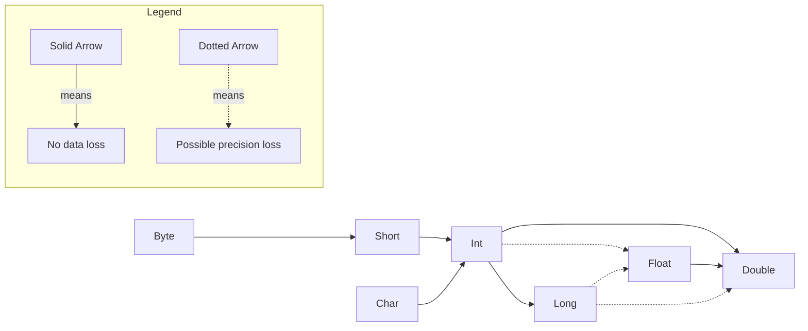

# An Introduction To Java


## The Java Programming Environment

All java files will have the .java extension.


When it comes to downloading the java versions, there are different terminology used for this.

| Name                     | Acronym | Description                                                  |
| ------------------------ | ------- | ------------------------------------------------------------ |
| Java Development Kit     | JDK     | The software for programmers who want to write Java programs. |
| Java Runtime Environment | JRE     | The software for running Java programs, without development tools. Only supported until Java 8. This is not wanted. |
| Standard Edition         | SE      | The Java platform for use on desktops and simple server applications. This is wanted. |
| OpenJDK                  | N/A     | A free and open-source implementation of Java SE.            |
| Hotspot                  | N/A     | The “just in time” compiler developed by Oracle.             |
| GraalVM                  | N/A     | An “ahead of time” compiler for executables that start quickly, but don’t support all Java features. |
| Long Term Support        | LTS     | A release that is supported for multiple years, unlike the six-month releases that showcase new features. Choose the latest LTS release |


The way to run a java file it to use the command on the CLI **java** followed by the java file name with the extension like `java Main.java`. There is another version of this called **javac** where this does compile the .java files, but does not compile the code to machine code like in C. Instead, this turns into something called *bytecode*. This creates a new file with the same name, but ends with .class instead. When there is a .class file and wanting to run it, it does not need to have the extension behind it and can just have it without the extension like `java Main`.

> *Bytecode* is just an intermediate step in the compilation process that makes the instructions for the code platform independent. This means that the JVM that actually runs the code can spit out whatever correct instructions for any OS to use correctly.

## Fundamentals of Programming Java

### Basic File Outline

It is important to note that java is case sensitive when it comes to naming things.

```java
void main(){
    IO.println("Hello, World");
}
```

> [!IMPORTANT]
>
> The code above is not the common standard prior to java versions 25. This was an in development feature. Normally this would look like:
> ```java
> public class Main{
>     public static void main(){
>         System.out.println("Hello, World");
>     }
> }
> ```
>
> The first list will be the same EXACT name as the class file. The second line will be named the normal main function with other extra properties.


Just like in C/C++, the use of curly brackets is used to define a scope of a function.

In java, "functions" are actually called a *method*.

To have the program actually run, there has to be a method called main in the program. This is like the important main method in something like C/C++.

The IO part of the program is something called a *class*. A class is a container for the program logic that defines the behavior of an application.

In java, everything is considered a class.

When it comes to naming conventions of class files, they use PascalCasing.

### Commets

To leave commets, this is the same as C with // for single line and /**/ for multi-line commets.

Each statement has to end with a semi-colon as this is the only way to mark that the statement is done. This means that multiple parts of a single statement can span multiple lines like the following below:

```java
void main(){
    System. // Single line commit
    out.
    println("This is a test");
    /*
    Multi line
    commet
    */
}
```

There is a special type of commet called a doc commet. This is basically the same as the the multi line commet except, there is an extra * at the top part of the commit like /***/. Will talk about later when talking about automatic documentation generation.

### Data Types

Java has 8 primitive data types and these must be used when declaring a variable.

#### Integers

- **byte** --> holds integers -127 - 126. This takes 1 byte of memory.
- **short** --> holds integers -32,768 - 32,767. This takes 2 bytes of memory.
- **int** --> holds integers –2,147,483,648 - 2,147,483,647. This takes 4 bytes of memory.
- **long** --> holds integers –9,223,372,036,854,775,808 - 9,223,372,036,854,775,807. This takes 8 bytes of memory.

This data types memory sizes are fixed no matter the max CPU bit size. For example, in Golang when giving a variable of type int it can be a 32 or 64 bit number depending on the CPU architecture. However, in java an int will always be 4 bytes no matter what.

When choosing the **long** data type, the number of this should end with the suffix L like `long x = 8000000000L`.

There other smaller data values that can be given like:

- Hexadecimal numbers start with 0x prefix
- Octal numbers start with 0
- Binary numbers start with 0b or 0B

Java allows underscores between numbers to imroving readablility.

Unlike C/C++, java does not have a unsigned version of the integer values.

#### Floating Point

There is only **float** and **double** types here. The first will takes 4 bytes and the second will take 8 bytes. However, their value ranges are not exact and instead an approximation. The first is about 6 - 7 decimal digits while the other is about 15 decimal digits.

It is important that the **float** type ends with the suffix F just like the **long** integer type. If not, then even if this is specified to be of type float it will still come out to be of type double and could throw an error.

All floating point numbers follow the IEEE754 specification. There is a pdf file about this in the Assets folder called IEEE754.pdf

When decimal point number, the result of dividing a positive floating-point number by 0 is positive infinity. Dividing 0.0 by 0 or the square root of a negative number yields NaN.

There is a class called Double that has access to special methods and variables that cover different cases.

- `Double.POSITIVE_INFINITY` --> This is when the value is positive infinity
- `Double.NEGATIVE_INFINITY` --> This is when the value is negative infinity
- `Double.NaN` --> This is when the value in undefined
- `Double.IsNaN(float)` --> This is method is used to check if the variable is of not a number type

#### Char

To represent a single character use the **char** data type. Unlike something like C/C++, the char type here takes 2 bytes instead of 1.

This type is created by using single quotes around the character. The value can be a literal single ANSCII character or something like a unicode character. A hexadecimal number value can be placed inside there so represent a more complex unicode value.

To represent a raw unicode value, prefix the 4 numbers with \u. There are other common escape sequences that are used to represent something else like:

- \n for newline
- \t for tab space
- \\\ for backslash literal
- \\" for double quote literal
- \\' for single quote literal
- \\s for single space
- \u3042 for あ

When a Unicode character falls within the *Basic Multilingual Plane* (U+0000 to U+FFFF), it can be represented using a single 16-bit char in Java.

For characters outside this range (U+10000 to U+10FFFF), Java uses a *surrogate pair*, which consists of two char values stored next to each other in memory. These two char's together represent a single Unicode code point. However, the use of the **String** data type is needed. While this will be talked about later, but fornow a string is just a collection of characeter types.

```java
public class Main {
    public static void main(String[] args) {
        // Unicode for 'あ' is U+3042
        char japaneseChar = '\u3042';
        char japaneseCharLiteral = 'あ';
        char thing = 'x';
        String BIG_THING = "\uD83D\uDE00"; // 

        // Print the character
        System.out.println("The Japanese character raw is: " + japaneseChar);
        System.out.println("The Japanese literal is: " + japaneseChar);
        System.out.println("Regular Character is : " + thing);
    }
}

```

> [!CAUTION]
>
> When using the unicode \u literal, this is processed before even the text or commets in the file are. This mens if something like "\u0022+\u0022" is written this this actually turns into trying to add together 2 empty string like ""+""

#### Boolean

To represent a true or false value, use the **Boolean** data type. This is used to only represent true or false values. The values for true and false in java are literally "true" and "false". Another way these are represented is any non-zero value is considered true and any zero value is considered false.

### Variables

#### Declaring a Variable

Java is a *strongly typed* language. This means each variable has to have the type specified and this type cannot be changed once declared. The rule for declaring a variable is data type followed by name space separated and ending with a semicolon like `int x;` . 

> [!IMPORTANT]
>
> Java versions from 21 and above, there is a special variable called _ that is already predefined. This is used to symbol that a variable that is syntactially required but never used.

When declaring multiple variables of the same data type, they can be name comma separated instead of having to be declared on separate lines like `int x, y, z;`.

#### Giving a Value

Once a variable is declared, it has to be assigned a value before it can be used anywhere. If it does not get a value before being used then an error in the program will occur.

To give a value, just use the = symbol and the value on the left side will get the value on the right hand side of the equal symbol. The two ways to actually assign a value to one is:

1. Do it while declaring the variable like `int x = 50;`
2. Do it after variable is declared like `int x;` then doing `x = 50;`

Java has a keyword called **var**. This can be in palce of the data type and declare the name like normal. This makes it so the data type of the variable can be infered instead of having to specify the data type. This is helpful when declaring object types which will be talked about later.

The only requirement for the **var** keyword is a value must be assigned to the variable once it is being declared.

#### Constant

To declare a variable who's value should never change (like π will always be 3.14), the use of the keyword **final** will be used. This keyword will go before declaring the data type.

If this variable's value is attempting to be changed during run time, then an error will appear.

It is a common practice to have constants be named all upper case and have _ be a separator between the names.

#### Enum

In Java, when a variable should only ever hold one of a specific set of values, the **enum** (enumeration) data type is used. This acts as a specialized container for a group of constants, ensuring that invalid values cannot be assigned.

An enum is defined using the **enum** keyword followed by a name. After, there is a set of curly braces and inside the curly braces, the allowed constants are listed, typically in uppercase. A variable is then declared using the enum name as its data type. While these variables can be assigned at declaration, they can also be reassigned later to any other constant defined within that same enum.

Enums can also include a *constructor*. This allows specific data to be associated with each constant by placing parentheses and the data immediately after the constant name. When a constructor is defined, it must match the data being passed in. For instance, if one constant stores an integer, all constants in that enum must provide an integer to that constructor. To access this stored data, a field and a method are used within the enum body.

Under the hood, Java enums are much more powerful than simple integers. Each enum constant is an instance of a class that inherits from `java.lang.Enum`. This structure allows enums to behave like objects, providing access to built-in methods while maintaining a fixed, restricted set of possible values.

It it important to note where an enum can be declared. An enum can be declared inside a class; like between the `public class Main` curly braces or it can be declred outside that block. However, it cannot be declared inside methods; like the `main()` method.

```java
// Case 1: Basic Enum - Used for simple categorization
enum Difficulty {
    EASY, MEDIUM, HARD
}

// Case 2: Enum with Data - Each constant carries an associated value
enum Currency {
    // Each constant passes a symbol to the constructor
    USD("$"), 
    EUR("€"), 
    JPY("¥");

    // Field to store the constructor data
    private String symbol;

    // Constructor - must match the data type passed in the constants
    Currency(String symbol) {
        this.symbol = symbol;
    }

    // Method to retrieve the stored data
    public String getSymbol() {
        return this.symbol;
    }
}

public class Main {
    public static void main(String[] args) {
        // --- Working with Basic Enums ---
        // Declaration and assignment
        Difficulty level = Difficulty.EASY;
        System.out.println("Current Difficulty: " + level);

        // Reassignment
        level = Difficulty.HARD;
        System.out.println("Updated Difficulty: " + level);

        // --- Working with Enums with Data ---
        // Accessing the constant and its internal method
        Currency money = Currency.USD;
        System.out.println("Currency: " + money);
        System.out.println("Symbol: " + money.getSymbol());

        // Direct access without a variable
        System.out.println("The symbol for Yen is: " + Currency.JPY.getSymbol());
    }
}
```

### Operators

#### Arithmetic Operators

Just like in C/C++, java has the basic arithmetic operators like +, -, *, and / for adding, subtracting, multiplication, and division.

It is important to note when dividing numbers if both of them are integer types then this will perform integer division. However, if one or both of them are a floating point type then it performs floating point arithmetic.

The other symbol, like in C/C++, is the modules (%) operator for getting the remainder of division. This will return an integer only.

#### Mathematical Functions and Constants

Just like in C/C++, there is a special library to deal with more complex math content. In java, this is done in a class called "Math". Inside here are the methods to perform the math equations. Some are:

- `Math.sqrt(x)` that takes in a number and returns the square root result of it.
- `Math.pow(x,y)` that takes two numbers of type double and returns the value of $x^y$ type double.
- `Math.sin` is the sin math variable
- `Math.cos` is the cos math variable
- `Math.tan` is a tan math variable
- `Math.log` is the natual log
- `Math.exp` is the natual log
- `Math.log10` is the log base 10

In java 21, there is a math method called `clamp(x,y,z)`. This gives the ability to check that a variable (x) is in scope of a minimum (y) and maximum (z) value. The return cases are:
$$
f(x,y,z) =
\begin{cases}
z & \text{if } x > z \\
y  & \text{if } x < y \\
x & \text{if } x \le z & x \ge y
\end{cases}
$$
There are other math constants like PI, E, and T (which is 2π).

#### Type Conversions Rules

There is a way to convert the data type from one variable to another data type. This is helpful when things need to be changed or meet certain requirements. For example, a function MUST take two floats, but have two ints.

The rules for the data type conversion is:



#### Type Casting

To actually convert between two types, do `(Data Type) VariableName`. It is important that the variable is already declared.

For Example:

```java
public class Main{
    public static void main(String[] args){
        int x = 50;
        System.out.println(x);
        double y = (double) x;
        System.out.println(y);
    }
}
```

> [!WARNING]
>
> If trying to type cast from one data type to another that does not support that range, then it will truncate to a number that is can be represented for that data type at random. For example, going from an int to byte type.

There is a way to check that something is of a specific data type. This uses the **instanceof** keyword. This will also have two values like `Variable instanceof DataType`. This will return a boolean value back (true or false) if it meets the requirements of the assignment. However, this data type can ONLY be an object. So *primitive* data types like int, float, etc cannot be checked.

```java
public class Main{
    public static void main(String[] args){
        int x = 50;
        bool isType = x instanceof int;
        System.out.println(isType)
    }
}
```

#### Assignment

When it comes to assigning a variable data, it can use the = like before. However, there is a way to also use arithmetic expressions with it at the same time once the variable is declared already. This is done with a short hand math symbol followed by the = symbol (like +=). For example, `x += 50` is the same as doing $x=x+50$.

This can be done with any of the arithmetic symbols.

> [!IMPORTANT]
>
> If the value on the right hand side when doing this is not the same type as the variable on the left, then this will auto type cast the resulting value on the right to the type on the left hand side. For example `x += 50.5` and in this case x in an int. Here the 50.5 will convert to 50 because under the hood this turns into `x = (int)(x + 50.5)`.
>
> However, as of java 20, can add the flag "-Xlint:lossy-conversions" when compiling and this will show a warning that this is happening.

#### Increment Operator

Instead of having to write mantually adding or subtracting from a value each time by one, java supports a shorthand for this called *incrementing*.  This can be done by putting ++ or -- on a variable name like `x--`. This can be done anywhere in code and this will subtract 1 from the value. There is also a prefix version of this by just putting the ++ or -- before the variable name. However, these do mean different things, but only really matters when being done in assignment expressions. Doing the prefix version willl add/subtract 1 from the number first then do the arithmetic operation, but the postfix version will work with the variable first then add/subtract 1 from it.

For Example

```java
public class Main{
    public static void main(String[] args){
        int m = 7;
        int n = 7;
        int a = 2 * ++m; // m will be 8
        int b = 2 * n++; // n will be 7
        System.out.println(a);
        System.out.println(b);
    }
}

```

#### Relational and boolean Operators

There is a way to show equality between two values and is done with ==. This is used to check if two values are equal to each other. This will also return a boolean value secretly to tell if this was true or false.

There is another version to check inequality which is !=. This checks if the value is NOT equal to the other value and returns a boolean values based on that.

There are other symbols that can be used to like < (less than), > (greater than), <= (less than or equal), and >= (greater than or equal).

There is also a way to do logic operators like && and || to check for logical AND and OR statements. This will also return a boolean value to see if the result did meet the requirements. These both work the same way as in C/C++ where there will be two separete expressions on each side of the logic symbols like `ExpressionOne && Expression2`. The && version will only return true if both expressions are true. The || willl return true of at least 1 of the expressions returns true.

For Example:

```java
public class Main{
    public static void main(String[] args){
        int x = 50;
        int y = 100;
        
        boolean isFalse = x > y;
        boolean isTrue = x == y || x < y;
        
        System.out.println(isTrue);
        System.out.println(isFalse);
    }
}
```

#### Conditional Operator

There is a shorthand way to to write some logic where if an expression returns true then it can be assigned one value and if false it returns another value. To do this use the format `condition ? ValueTrue:ValueFalse`.

```java
public class Main{
    public static void main(String[] args){
        int x = 50;
        int y = x > 100 ? 100:-1;
    
        System.out.println(y);
    }
}
```

#### Switch Statement

Instead of just just checking one case like the conditional operator, can use **switch** statements. This is a way to check in multiple different cases if a value equals something then it will return a certain value back. This also uses another keyword called **case** which is what is used to check if the value meets the criteria for that case and if yes then that case code goes off and if not then skip that case code or can just do a single thing . There is also another keyword called **default** that will go off only if all the previous cases failed. 

When the cases are being checked, they go in the order in which they are declared.

When a code block is being used to execute multiple things and needs to return something, the use of the **yield** keyword must be used at the end of it. To use this just put the value to return 

The syntax for this is:

```java
switch(ValueToCheck){
    case CaseValue -> ThingToDo;
    case CaseValueTwo -> {
        ThingsToDo
    }
    case caseValueThree -> {
        ThingsToDo
        yield ValueToReturn
    }
    default -> ThingToDo;
}
```

The syntax above is available in java versions 14+. Prior to this, the -> had to use : instead and had to use the **break** keyword at the end of each case block.

Being Used:

```java
public class Main{
    public static void main(String[] args){
        int x = 50;
        float y = switch(x){
                case 30 -> 30.30;
                case 40 -> 40.40;
                case 50 -> {
                    System.out.println("The value was 50!");
                    yield 50.0 * 4.0;
                }
                default -> -1;
        }
    }
}
```

A switch statement can also be used by itself without having to return a value to assign and this will make it so it does not return anything, but can be used to check if a certain condition value is meet and then execute the needed code.

> [!NOTE]
>
> If the value to be tested is an enum and the cases are the enum values, then the EnumName.value does not need to be used and can just do the value for each case.

#### Bitwise opertors

Just like in C/C++, there is the common bitwise operators:

- & (AND)
- | (OR)
- ^ (XOR)
- ~ (NOT)
- \>\> (BITWISE SHIFT RIGHT) --> This will shift all the bits over 1 place 
- << (BITWISE SHIFT LEFT) --> This will shift all the bits over 1 place 

However, these only work on integer types. These can also be used in expressions in something like `(n & 0b1000) / 0b1000` where n is an int type.

However, if the value being tested on is a boolean type, then this will return a true or false value each time just like the && and || logic operators. Otherwise, returns an int value for this.

When it comes to the >> and <<, these will shift the bits by the specified about on the right hand side. The left hand side of this will be the int or binary number to shift the bits on while the right hand side will be the specific about of bits to shift by.

> [!NOTE]
>
> When shifting the bits left, this is like multipling the value by $2^\text{ShiftAmount}$. When moving to the right then it is like diving by $2^\text{ShiftAmount}$.

### Strings

When it comes to strings, under the hood they are just a sequence of **char** types. When it comes to to declaring a string, this will be done using the **String** type. The string type is really just a class in the java.lang module that can be used.

There is eomthign called a *string literal* and that is just when using a string with double quotes that is not being assigned to a variable.

#### Concat

There is something called *concatenation*. This is just combining two strings together to form a bigger one. This is done by adding two different strings together with the + symbol.  This will return a new string with the combined format except 

A string can be added to another data type (int, boolean, float, etc). However, it is converted to a string version and then added to the string like `String age = "I am " + 20 + " years old"`.

If there needs to be sone expression done on the contnet before it is converted into a string, then surround it with parentheses and do everything else with *concatenation* like normal.

Although a string is used make up of **char** type, the single **char** type  cannot do these auto conversions.

There is a special method in the string class called `join()`. This is used to join multiple strings together based on a certain delimiter type. The syntax is the specific delimiter in a string followed by other string variable types like `String x = String.join("\t", "	Hello", "	World")` will join the strings based on a tab delimiter.

There is another method called `repeat()`. This will take the sting of the thing being called on and just return an appended version of the tring to itself the same string over n times. The only argument this takes in an integer on how many times to repeat this.

#### Static and Instance Methods

There are two types of methods here: 

- *instance methods* --> An instance method requires an object (instance of a class) to be created. Once the object exists, it can call methods defined in its class.
- *static methods* -->  A static method does not require an instance and can be called directly using the class name.

For example, `String.join()` is a static method because it is called using the class name without creating an object. In contrast, `.replace()` is an instance method because it must be called on a specific `String` object.

The easiest way to tell the two apart is if the . is coming right after a stirng type then this is a *insance method*. However, if the . is followed by a class name then it is a *static method*.

#### Indexes and Substrings

There is a method for the string type called `length()`. This will return the number of total of **char** values it takes to represent that string.

There is another method called `charAt()`. This will take in 1 integer parameter. This returns the single character value at that position in the string. However, just like C/C++, strings are zero indexed so this can take any value from 0 to $string.length -1$.

There another method called `indexOf()`. This will take a single string parameter of anything. What this will do is return back the first instance that thing it found in the string in an integer.

Another method is called `substring()`. This will return part of the string this was called on. This takes two variables with the first being the index to start at and the second being the index to end at (no inclusive).

#### String are Immutable

Once a string is declared, they are considered *immutable*. This means that the string itself can never be changed. Even though a string can be reassigned to other strings, under the hood they are really just pointing to a new part of memory to refer to the new string object.

The benefit is java uses something called *memory pooling*. This can be thought of as boxes with content inside. Intead of just 
