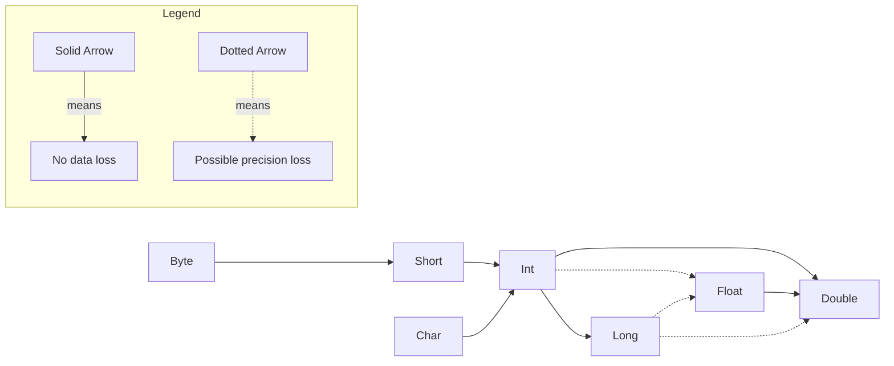

# An Introduction To Java


## The Java Programming Environment

All java files will have the .java extension.


When it comes to downloading the java versions, there are different terminology used for this.

| Name                     | Acronym | Description                                                  |
| ------------------------ | ------- | ------------------------------------------------------------ |
| Java Development Kit     | JDK     | The software for programmers who want to write Java programs. |
| Java Runtime Environment | JRE     | The software for running Java programs, without development tools. Only supported until Java 8. This is not wanted. |
| Standard Edition         | SE      | The Java platform for use on desktops and simple server applications. This is wanted. |
| OpenJDK                  | N/A     | A free and open-source implementation of Java SE.            |
| Hotspot                  | N/A     | The “just in time” compiler developed by Oracle.             |
| GraalVM                  | N/A     | An “ahead of time” compiler for executables that start quickly, but don’t support all Java features. |
| Long Term Support        | LTS     | A release that is supported for multiple years, unlike the six-month releases that showcase new features. Choose the latest LTS release |


The way to run a java file it to use the command on the CLI **java** followed by the java file name with the extension like `java Main.java`. There is another version of this called **javac** where this does compile the .java files, but does not compile the code to machine code like in C. Instead, this turns into something called *bytecode*. This creates a new file with the same name, but ends with .class instead. When there is a .class file and wanting to run it, it does not need to have the extension behind it and can just have it without the extension like `java Main`.

> *Bytecode* is just an intermediate step in the compilation process that makes the instructions for the code platform independent. This means that the JVM that actually runs the code can spit out whatever correct instructions for any OS to use correctly.

## Fundamentals of Programming Java

### Basic File Outline

It is important to note that java is case sensitive when it comes to naming things.

```java
void main(){
    IO.println("Hello, World");
}
```

> [!IMPORTANT]
>
> The code above is not the common standard prior to java versions 25. This was an in development feature. Normally this would look like:
> ```java
> public class Main{
>     public static void main(){
>         System.out.println("Hello, World");
>     }
> }
> ```
>
> The first list will be the same EXACT name as the class file. The second line will be named the normal main function with other extra properties.


Just like in C/C++, the use of curly brackets is used to define a scope of a function.

In java, "functions" are actually called a *method*.

To have the program actually run, there has to be a method called main in the program. This is like the important main method in something like C/C++.

The IO part of the program is something called a *class*. A class is a container for the program logic that defines the behavior of an application.

In java, everything is considered a class.

When it comes to naming conventions of class files, they use PascalCasing.

### Commets

To leave commets, this is the same as C with // for single line and /**/ for multi-line commets.

Each statement has to end with a semi-colon as this is the only way to mark that the statement is done. This means that multiple parts of a single statement can span multiple lines like the following below:

```java
void main(){
    System. // Single line commit
    out.
    println("This is a test");
    /*
    Multi line
    commet
    */
}
```

There is a special type of commet called a doc commet. This is basically the same as the the multi line commet except, there is an extra * at the top part of the commit like /***/. Will talk about later when talking about automatic documentation generation.

### Data Types

Java has 8 primitive data types and these must be used when declaring a variable.

#### Integers

- **byte** --> holds integers -127 - 126. This takes 1 byte of memory.
- **short** --> holds integers -32,768 - 32,767. This takes 2 bytes of memory.
- **int** --> holds integers –2,147,483,648 - 2,147,483,647. This takes 4 bytes of memory.
- **long** --> holds integers –9,223,372,036,854,775,808 - 9,223,372,036,854,775,807. This takes 8 bytes of memory.

This data types memory sizes are fixed no matter the max CPU bit size. For example, in Golang when giving a variable of type int it can be a 32 or 64 bit number depending on the CPU architecture. However, in java an int will always be 4 bytes no matter what.

When choosing the **long** data type, the number of this should end with the suffix L like `long x = 8000000000L`.

There other smaller data values that can be given like:

- Hexadecimal numbers start with 0x prefix
- Octal numbers start with 0
- Binary numbers start with 0b or 0B

Java allows underscores between numbers to imroving readablility.

Unlike C/C++, java does not have a unsigned version of the integer values.

#### Floating Point

There is only **float** and **double** types here. The first will takes 4 bytes and the second will take 8 bytes. However, their value ranges are not exact and instead an approximation. The first is about 6 - 7 decimal digits while the other is about 15 decimal digits.

It is important that the **float** type ends with the suffix F just like the **long** integer type. If not, then even if this is specified to be of type float it will still come out to be of type double and could throw an error.

All floating point numbers follow the IEEE754 specification. There is a pdf file about this in the Assets folder called IEEE754.pdf

When decimal point number, the result of dividing a positive floating-point number by 0 is positive infinity. Dividing 0.0 by 0 or the square root of a negative number yields NaN.

There is a class called Double that has access to special methods and variables that cover different cases.

- `Double.POSITIVE_INFINITY` --> This is when the value is positive infinity
- `Double.NEGATIVE_INFINITY` --> This is when the value is negative infinity
- `Double.NaN` --> This is when the value in undefined
- `Double.IsNaN(float)` --> This is method is used to check if the variable is of not a number type

#### Char

To represent a single character use the **char** data type. Unlike something like C/C++, the char type here takes 2 bytes instead of 1.

This type is created by using single quotes around the character. The value can be a literal single ANSCII character or something like a unicode character. A hexadecimal number value can be placed inside there so represent a more complex unicode value.

To represent a raw unicode value, prefix the 4 numbers with \u. There are other common escape sequences that are used to represent something else like:

- \n for newline
- \t for tab space
- \\\ for backslash literal
- \\" for double quote literal
- \\' for single quote literal
- \\s for single space
- \u3042 for あ

When a Unicode character falls within the *Basic Multilingual Plane* (U+0000 to U+FFFF), it can be represented using a single 16-bit char in Java.

For characters outside this range (U+10000 to U+10FFFF), Java uses a *surrogate pair*, which consists of two char values stored next to each other in memory. These two char's together represent a single Unicode code point. However, the use of the **String** data type is needed. While this will be talked about later, but fornow a string is just a collection of characeter types.

```java
public class Main {
    public static void main(String[] args) {
        // Unicode for 'あ' is U+3042
        char japaneseChar = '\u3042';
        char japaneseCharLiteral = 'あ';
        char thing = 'x';
        String BIG_THING = "\uD83D\uDE00"; // 

        // Print the character
        System.out.println("The Japanese character raw is: " + japaneseChar);
        System.out.println("The Japanese literal is: " + japaneseChar);
        System.out.println("Regular Character is : " + thing);
    }
}

```

> [!CAUTION]
>
> When using the unicode \u literal, this is processed before even the text or commets in the file are. This mens if something like "\u0022+\u0022" is written this this actually turns into trying to add together 2 empty string like ""+""

#### Boolean

To represent a true or false value, use the **Boolean** data type. This is used to only represent true or false values. The values for true and false in java are literally "true" and "false". Another way these are represented is any non-zero value is considered true and any zero value is considered false.

### Variables

#### Declaring a Variable

Java is a *strongly typed* language. This means each variable has to have the type specified and this type cannot be changed once declared. The rule for declaring a variable is data type followed by name space separated and ending with a semicolon like `int x;` . 

> [!IMPORTANT]
>
> Java versions from 21 and above, there is a special variable called _ that is already predefined. This is used to symbol that a variable that is syntactially required but never used.

When declaring multiple variables of the same data type, they can be name comma separated instead of having to be declared on separate lines like `int x, y, z;`.

#### Giving a Value

Once a variable is declared, it has to be assigned a value before it can be used anywhere. If it does not get a value before being used then an error in the program will occur.

To give a value, just use the = symbol and the value on the left side will get the value on the right hand side of the equal symbol. The two ways to actually assign a value to one is:

1. Do it while declaring the variable like `int x = 50;`
2. Do it after variable is declared like `int x;` then doing `x = 50;`

Java has a keyword called **var**. This can be in palce of the data type and declare the name like normal. This makes it so the data type of the variable can be infered instead of having to specify the data type. This is helpful when declaring object types which will be talked about later.

The only requirement for the **var** keyword is a value must be assigned to the variable once it is being declared.

#### Constant

To declare a variable who's value should never change (like π will always be 3.14), the use of the keyword **final** will be used. This keyword will go before declaring the data type.

If this variable's value is attempting to be changed during run time, then an error will appear.

It is a common practice to have constants be named all upper case and have _ be a separator between the names.

#### Enum

In Java, when a variable should only ever hold one of a specific set of values, the **enum** (enumeration) data type is used. This acts as a specialized container for a group of constants, ensuring that invalid values cannot be assigned.

An enum is defined using the **enum** keyword followed by a name. After, there is a set of curly braces and inside the curly braces, the allowed constants are listed, typically in uppercase. A variable is then declared using the enum name as its data type. While these variables can be assigned at declaration, they can also be reassigned later to any other constant defined within that same enum.

Enums can also include a *constructor*. This allows specific data to be associated with each constant by placing parentheses and the data immediately after the constant name. When a constructor is defined, it must match the data being passed in. For instance, if one constant stores an integer, all constants in that enum must provide an integer to that constructor. To access this stored data, a field and a method are used within the enum body.

Under the hood, Java enums are much more powerful than simple integers. Each enum constant is an instance of a class that inherits from `java.lang.Enum`. This structure allows enums to behave like objects, providing access to built-in methods while maintaining a fixed, restricted set of possible values.

It it important to note where an enum can be declared. An enum can be declared inside a class; like between the `public class Main` curly braces or it can be declred outside that block. However, it cannot be declared inside methods; like the `main()` method.

```java
// Case 1: Basic Enum - Used for simple categorization
enum Difficulty {
    EASY, MEDIUM, HARD
}

// Case 2: Enum with Data - Each constant carries an associated value
enum Currency {
    // Each constant passes a symbol to the constructor
    USD("$"), 
    EUR("€"), 
    JPY("¥");

    // Field to store the constructor data
    private String symbol;

    // Constructor - must match the data type passed in the constants
    Currency(String symbol) {
        this.symbol = symbol;
    }

    // Method to retrieve the stored data
    public String getSymbol() {
        return this.symbol;
    }
}

public class Main {
    public static void main(String[] args) {
        // --- Working with Basic Enums ---
        // Declaration and assignment
        Difficulty level = Difficulty.EASY;
        System.out.println("Current Difficulty: " + level);

        // Reassignment
        level = Difficulty.HARD;
        System.out.println("Updated Difficulty: " + level);

        // --- Working with Enums with Data ---
        // Accessing the constant and its internal method
        Currency money = Currency.USD;
        System.out.println("Currency: " + money);
        System.out.println("Symbol: " + money.getSymbol());

        // Direct access without a variable
        System.out.println("The symbol for Yen is: " + Currency.JPY.getSymbol());
    }
}
```

### Operators

#### Arithmetic Operators

Just like in C/C++, java has the basic arithmetic operators like +, -, *, and / for adding, subtracting, multiplication, and division.

It is important to note when dividing numbers if both of them are integer types then this will perform integer division. However, if one or both of them are a floating point type then it performs floating point arithmetic.

The other symbol, like in C/C++, is the modules (%) operator for getting the remainder of division. This will return an integer only.

#### Mathematical Functions and Constants

Just like in C/C++, there is a special library to deal with more complex math content. In java, this is done in a class called "Math". Inside here are the methods to perform the math equations. Some are:

- `Math.sqrt(x)` that takes in a number and returns the square root result of it.
- `Math.pow(x,y)` that takes two numbers of type double and returns the value of $x^y$ type double.
- `Math.sin` is the sin math variable
- `Math.cos` is the cos math variable
- `Math.tan` is a tan math variable
- `Math.log` is the natual log
- `Math.exp` is the natual log
- `Math.log10` is the log base 10

In java 21, there is a math method called `clamp(x,y,z)`. This gives the ability to check that a variable (x) is in scope of a minimum (y) and maximum (z) value. The return cases are:
$$
f(x,y,z) =
\begin{cases}
z & \text{if } x > z \\
y  & \text{if } x < y \\
x & \text{if } x \le z & x \ge y
\end{cases}
$$
There are other math constants like PI, E, and T (which is 2π).

#### Type Conversions Rules

There is a way to convert the data type from one variable to another data type. This is helpful when things need to be changed or meet certain requirements. For example, a function MUST take two floats, but have two ints.

The rules for the data type conversion is:



#### Type Casting

To actually convert between two types, do `(Data Type) VariableName`. It is important that the variable is already declared.

For Example:

```java
public class Main{
    public static void main(String[] args){
        int x = 50;
        System.out.println(x);
        double y = (double) x;
        System.out.println(y);
    }
}
```

> [!WARNING]
>
> If trying to type cast from one data type to another that does not support that range, then it will truncate to a number that is can be represented for that data type at random. For example, going from an int to byte type.

There is a way to check that something is of a specific data type. This uses the **instanceof** keyword. This will also have two values like `Variable instanceof DataType`. This will return a boolean value back (true or false) if it meets the requirements of the assignment. However, this data type can ONLY be an object. So *primitive* data types like int, float, etc cannot be checked.

```java
public class Main{
    public static void main(String[] args){
        int x = 50;
        bool isType = x instanceof int;
        System.out.println(isType)
    }
}
```

#### Assignment

When it comes to assigning a variable data, it can use the = like before. However, there is a way to also use arithmetic expressions with it at the same time once the variable is declared already. This is done with a short hand math symbol followed by the = symbol (like +=). For example, `x += 50` is the same as doing $x=x+50$.

This can be done with any of the arithmetic symbols.

> [!IMPORTANT]
>
> If the value on the right hand side when doing this is not the same type as the variable on the left, then this will auto type cast the resulting value on the right to the type on the left hand side. For example `x += 50.5` and in this case x in an int. Here the 50.5 will convert to 50 because under the hood this turns into `x = (int)(x + 50.5)`.
>
> However, as of java 20, can add the flag "-Xlint:lossy-conversions" when compiling and this will show a warning that this is happening.

#### Increment Operator

Instead of having to write mantually adding or subtracting from a value each time by one, java supports a shorthand for this called *incrementing*.  This can be done by putting ++ or -- on a variable name like `x--`. This can be done anywhere in code and this will subtract 1 from the value. There is also a prefix version of this by just putting the ++ or -- before the variable name. However, these do mean different things, but only really matters when being done in assignment expressions. Doing the prefix version willl add/subtract 1 from the number first then do the arithmetic operation, but the postfix version will work with the variable first then add/subtract 1 from it.

For Example

```java
public class Main{
    public static void main(String[] args){
        int m = 7;
        int n = 7;
        int a = 2 * ++m; // m will be 8
        int b = 2 * n++; // n will be 7
        System.out.println(a);
        System.out.println(b);
    }
}

```

#### Relational and boolean Operators

There is a way to show equality between two values and is done with ==. This is used to check if two values are equal to each other. This will also return a boolean value secretly to tell if this was true or false.

There is another version to check inequality which is !=. This checks if the value is NOT equal to the other value and returns a boolean values based on that.

There are other symbols that can be used to like < (less than), > (greater than), <= (less than or equal), and >= (greater than or equal).

There is also a way to do logic operators like && and || to check for logical AND and OR statements. This will also return a boolean value to see if the result did meet the requirements. These both work the same way as in C/C++ where there will be two separete expressions on each side of the logic symbols like `ExpressionOne && Expression2`. The && version will only return true if both expressions are true. The || willl return true of at least 1 of the expressions returns true.

For Example:

```java
public class Main{
    public static void main(String[] args){
        int x = 50;
        int y = 100;
        
        boolean isFalse = x > y;
        boolean isTrue = x == y || x < y;
        
        System.out.println(isTrue);
        System.out.println(isFalse);
    }
}
```

#### Conditional Operator

There is a shorthand way to to write some logic where if an expression returns true then it can be assigned one value and if false it returns another value. To do this use the format `condition ? ValueTrue:ValueFalse`.

```java
public class Main{
    public static void main(String[] args){
        int x = 50;
        int y = x > 100 ? 100:-1;
    
        System.out.println(y);
    }
}
```

#### Switch Expression

Instead of just just checking one case like the conditional operator, can use **switch** statements. This is a way to check in multiple different cases if a value equals something then it will return a certain value back. This also uses another keyword called **case** which is what is used to check if the value meets the criteria for that case and if yes then that case code goes off and if not then skip that case code or can just do a single thing . There is also another keyword called **default** that will go off only if all the previous cases failed. 

When the cases are being checked, they go in the order in which they are declared.

When a code block is being used to execute multiple things and needs to return something, the use of the **yield** keyword must be used at the end of it. To use this just put the value to return 

The syntax for this is:

```java
switch(ValueToCheck){
    case CaseValue -> ThingToDo;
    case CaseValueTwo -> {
        ThingsToDo
    }
    case caseValueThree -> {
        ThingsToDo
        yield ValueToReturn
    }
    default -> ThingToDo;
}
```

The syntax above is available in java versions 14+. Prior to this, the -> had to use : instead and had to use the **break** keyword at the end of each case block.

Being Used:

```java
public class Main{
    public static void main(String[] args){
        int x = 50;
        float y = switch(x){
                case 30 -> 30.30;
                case 40 -> 40.40;
                case 50 -> {
                    System.out.println("The value was 50!");
                    yield 50.0 * 4.0;
                }
                default -> -1;
        }
    }
}
```

> [!NOTE]
>
> If the value to be tested is an enum and the cases are the enum values, then the EnumName.value does not need to be used and can just do the value for each case.

#### Bitwise opertors

Just like in C/C++, there is the common bitwise operators:

- & (AND)
- | (OR)
- ^ (XOR)
- ~ (NOT)
- \>\> (BITWISE SHIFT RIGHT) --> This will shift all the bits over 1 place 
- << (BITWISE SHIFT LEFT) --> This will shift all the bits over 1 place 

However, these only work on integer types. These can also be used in expressions in something like `(n & 0b1000) / 0b1000` where n is an int type.

However, if the value being tested on is a boolean type, then this will return a true or false value each time just like the && and || logic operators. Otherwise, returns an int value for this.

When it comes to the >> and <<, these will shift the bits by the specified about on the right hand side. The left hand side of this will be the int or binary number to shift the bits on while the right hand side will be the specific about of bits to shift by.

> [!NOTE]
>
> When shifting the bits left, this is like multipling the value by $2^\text{ShiftAmount}$. When moving to the right then it is like diving by $2^\text{ShiftAmount}$.

### Strings

When it comes to strings, under the hood they are just a sequence of **char** types. When it comes to to declaring a string, this will be done using the **String** type. The string type is really just a class in the java.lang module that can be used.

There is eomthign called a *string literal* and that is just when using a string with double quotes that is not being assigned to a variable.

#### Concat

There is something called *concatenation*. This is just combining two strings together to form a bigger one. This is done by adding two different strings together with the + symbol.  This will return a new string with the combined format except 

A string can be added to another data type (int, boolean, float, etc). However, it is converted to a string version and then added to the string like `String age = "I am " + 20 + " years old"`.

If there needs to be sone expression done on the contnet before it is converted into a string, then surround it with parentheses and do everything else with *concatenation* like normal.

Although a string is used make up of **char** type, the single **char** type  cannot do these auto conversions.

There is a special method in the string class called `join()`. This is used to join multiple strings together based on a certain delimiter type. The syntax is the specific delimiter in a string followed by other string variable types like `String x = String.join("\t", "	Hello", "	World")` will join the strings based on a tab delimiter.

There is another method called `repeat()`. This will take the sting of the thing being called on and just return an appended version of the tring to itself the same string over n times. The only argument this takes in an integer on how many times to repeat this.

#### Static and Instance Methods

There are two types of methods here: 

- *instance methods* --> An instance method requires an object (instance of a class) to be created. Once the object exists, it can call methods defined in its class.
- *static methods* -->  A static method does not require an instance and can be called directly using the class name.

For example, `String.join()` is a static method because it is called using the class name without creating an object. In contrast, `.replace()` is an instance method because it must be called on a specific `String` object.

The easiest way to tell the two apart is if the . is coming right after a stirng type then this is a *insance method*. However, if the . is followed by a class name then it is a *static method*.

#### Indexes and Substrings

There is a method for the string type called `length()`. This will return the number of total of **char** values it takes to represent that string.

There is another method called `charAt()`. This will take in 1 integer parameter. This returns the single character value at that position in the string. However, just like C/C++, strings are zero indexed so this can take any value from 0 to $string.length -1$.

There another method called `indexOf()`. This will take a single string parameter of anything. What this will do is return back the first instance that thing it found in the string in an integer.

Another method is called `substring()`. This will return part of the string this was called on. This takes two variables with the first being the index to start at and the second being the index to end at (no inclusive).

#### String are Immutable

In Java, **String** objects are *immutable*, meaning their internal character data cannot be modified after creation. If a string variable is updated to a new value, the original data in memory is not overwritten. Instead, a completely new string object is allocated, and the variable is updated to point to this new memory location.

A significant advantage of this design is the *String Pool*. To optimize memory, Java maintains a special area where it stores unique string literals. When multiple variables are assigned the exact same literal value, Java saves resources by having all those variables point to the same existing object in the pool. This prevents the redundant creation of identical "boxes" in memory, leading to better performance and reduced memory footprints.

#### String Equality

When it comes to seeing if two strings are equal, this is not done with the equality operator like ==. Instead, the string class has an instance method `equals()` that is a instance method. This will take a single **string** object and will return true if those both are equal and false otherwise.

There is another version of this called `equalsIngoreCase()` where it will also compare two strings and return the same value, except this does not take if the letters are capitalized into consideration.

If the == is used on two strings, all this does it test if those strings are located in the same memory location. So if needed to check that then use the == operation.

#### Empty and Null Strings

An empty string is just "" and this will have a length of zero.

There is an instance method called `isEmpty()` that can be called. This will return true if the string is empty and false otherwise. This does not need any parameters.

The other ways to see if this is empty is using the `length()` instance method and see if it returns zero or use the `equals()` method with "" as the argument.

There is a special value called **null** that is used to represent that the current object does not actually point to anything in memory.

#### The String API

The `String` class in Java has a lot of built-in methods for working with text. Most of these are *instance methods*, meaning they are called on a specific string object. Only a few are *static methods*, which are called using the class name itself.

There is a method called `length()`. This is an *instance method* and it does not take any parameters. It returns an integer that represents the total number of characters in the string.

Another method is `charAt()`. This is an *instance method* and it takes one parameter, which is an integer. This integer represents the index position. It returns a single `char` value at that position. Since strings are zero-indexed, valid values go from 0 to `length() - 1`.

There is an instance method called `equals()`. This takes one parameter, which is another string. It returns a boolean value (true or false) depending on if both strings have the same content.

There is also `equalsIgnoreCase()`. This is an *instance method* and it takes one string parameter. It returns a boolean, just like `equals()`, but it ignores uppercase and lowercase differences.

Another method is `compareTo()`. This is an *instance method* and it takes one string parameter. It returns an integer:

- a negative value if the current string comes before the other string
- a positive value if it comes after
- 0 if they are equal

There is a method called `isEmpty()`. This is an *instance method* and it does not take any parameters. It returns true if the string has a length of 0.

There is also `isBlank()`. This is an *instance method* and it does not take any parameters. It returns true if the string is empty or only contains whitespace.

There are also `startsWith()` and `endsWith()`. These are *instance methods* and each takes one parameter, which is a string. They return a boolean depending on whether the string starts or ends with that value.

There are multiple versions of `indexOf()`. All of them are *instance methods*:

- One version takes one parameter, which is a string. It returns the index of the first occurrence.
- Another version takes two parameters: a string and an integer. The integer represents the starting index for the search.
- Another version takes three parameters: a string and two integers. These define the range to search in.

All versions return an integer index of where the substring is found, or -1 if it is not found.

There is also `lastIndexOf()`. This is an *instance method*:

- One version takes one string parameter
- Another version takes a string and an integer (starting position)

These return the last occurrence of the substring, or -1 if not found.

Strings are immutable, so these methods return new strings instead of changing the original.

There is a method called `replace()`. This is an *instance method* and it takes two parameters. Both parameters are sequences of characters (most of the time just strings). The first parameter is what to replace, and the second is what to replace it with. It returns a new string with the changes.

There is also `substring()`. This is an *instance method*:

- One version takes one integer parameter (starting index)
- Another version takes two integer parameters (start and end index)

It returns a new string that is part of the original. The ending index is not included.


There are methods called `toLowerCase()` and `toUpperCase()`. These are *instance methods* and do not take any parameters. They return a new string with all characters converted to lower or upper case.

There are also `strip()`, `stripLeading()`, and `stripTrailing()`. These are *instance methods* and do not take any parameters. They return a new string with whitespace removed:

- `strip()` removes from both ends
- `stripLeading()` removes from the front
- `stripTrailing()` removes from the end

There is a method called `repeat()`. This is an *instance method* and it takes one integer parameter. This integer represents how many times to repeat the string. It returns a new string with the repeated content.

There is also `join()`. This is a *static method*, so it is called using the class name. It takes at least two parameters:

- the first parameter is a string delimiter
- the remaining parameters are multiple strings to join together

It returns a new string where all elements are combined with the delimiter in between.

Further documentation of the [String](https://docs.oracle.com/javase/8/docs/api/java/lang/String.html) class.

#### Online Documentation

Since java has so many premade classes and methods, it would be hard to remember them all. To avoid having to remember them all, go [here](https://docs.oracle.com/en/java/javase/25/docs/api) to see all the predefined stuff available in the java 25 API specification.

#### StringBuilder Class

There are times when a string needs to be modified a lot, such as reading a file line by line or character by character and continuously adding to the same value. Using a normal **String** for this is inefficient because every time something is added, a completely new string object is created in memory. This takes extra time and uses more memory.

To avoid this, there is a special type called **StringBuilder**.

The **StringBuilder** type is not created the same way as a normal string. It must be created using the **new** keyword, such as`StringBuilder name = new StringBuilder()`.

This creates an object with no initial value (an empty sequence of characters). It can also be initialized with a starting value by passing in a string as a parameter when creating it.

Under the hood, **StringBuilder** works using a resizable array of **char** values. This acts as an internal buffer. Instead of resizing every time something is added, it allocates extra space ahead of time (called *capacity*). The actual number of characters currently being used is the *length*.

When more characters are added and the buffer runs out of space, a larger array is created and the data is copied over. However, this does not happen every single time something is added, which makes it much more efficient than using regular strings for repeated modifications.

There is a special instance method called `append()`. This takes a single sting and adds that to the char buffer.

Another instance method `length()` will return the current amount of chars in the array like the **String** version of this.

Another instance method `insert()` is used to add text at a particular point in char array. The first parameter this takes is the starting index this should enter at. The second parameter will be the actual string to add in. This will return the string builder array.

Another instance method `delete()` will remove string data from the char buffer. The first parameter this takes is the starting index for this to remove at. The second parameter will be the index this will end at (not inclusive). This will return the string builder array.

Another instance method `reverse()` will reverse all the char data in the array. This does not take any parameters. This will return the string builder array.

Once done with all the string adding, there is an instance method `toString()` that will return a **String** object with all the string content that the builder contained. This does not take any parameters though. 

Further documention for [StringBuilder](https://docs.oracle.com/javase/8/docs/api/java/lang/StringBuilder.html) class.

#### Text Block

A feature added in java 15 allows for creating a multi line string in a string literal way. This makes it easier to use strings in a more human readable way. These are called *text blocks*.

Theses are created using three \"\"\" pair instead of \"\" like with strings.

These are really good for writing things like SQL queries and HTML blocks where things can span multiple lines.

```java
public class Main{
    public static void main(String[] args){
        String greetings = """
            Hello! My name is Jack!
            I am 20 years old!
            See you soon!
            """;
// Same as --> Hello! My name is Jack!\nI am 20 years old!\nSee you soon!\n
    }
}
```

### Input and Output

When it comes to getting input from a user, this is typically done though a GUI. However, there is a way to get basic toy user input from the CLI.

There is the before mentioned ways of `System.out.println()` and `IO.println()`. However, the second version is for java version 25 only while the other is for all versions.

However, when it comes to getting input, the basic ways are to use `IO.readln()`, using a Scanner type from java.util.Scanner, or using a BufferedReader type from `java.io.BufferedReader`.

When using the `IO.readln()`, this is the simplest way to get input. This will read text from the user until the enter key is hit. The value obtained will be returned as a string. Because of this, the value has to be type casted to its respectful data type to be unless it is supposed to be a string. To convert the types, this is not done with the normal type cast stuff mentioned before. Instead, there are special objects called *wrapper classes* that represent that data type that are used to do the type casing. For example, Integer is the name of the object to convert a string to an **int** type. The same object are available for each of the *primitive data* types which are: Double, Float, Long, Short, Byte, Boolean, and Character (char type). Each of these have a static method called `parse*()` where * is to be replaced by the name of the wrapper type like `parseInteger()`. These will all take in a single parameter of the string representation of this. It will then return the primitive data type version value of this.

When using the Scanner object from `java.util.Scanner`, this setup is different. Here it will specify where the input is coming from when declaring the Scanner object. This will get the value System.in as the argument. After, that object now has access to methods that can read user input. This will have an instance `nextLine()` method to read in a string of input until enter key is hit. However, unlike the `IO.readln()` version, there data techenically does not need to call the *wrapper classes* since there are special instance methods that can be used to read specifc data and have it auto converted. The methods follow `next*()` where * is to be replaced with the data type name like `nextChar()`. Also unlike other stuff so far, the `java.util.Scanner` is not part of the `java.lang` package so this type is not available by default. At the top of the file put the following: `import java.util.Scanner`.

When using the BufferedReader object, this works similar to the StringBuilder object where this preallocates a large amount of extra memory (8192 bytes by default) to help reduce expensive I/O operations like reading from a hard drive or network. If buffering did not happen, doing a call like `read()` or `readLine()` would cause a direct call to the OS. This is declared differently then the Scanner object. When. Just like the Scanner object, this also needs to be imported with `import java.io.BufferedReader`. More about this will talked about later. [^BufferReader]

Although the `IO.readln()` and `IO.println()` can be used to get user input, theses are more used for programmers compared to displaying information for users. This is because when having to use things like *wrapper classes*, they follow a strict format. For example, entering a numer of 50,000 and having to convert that with the `Integer.parseInteger()` would case an error to occur. However, if done with the Scanner object with `nextInt()` then this would not cause an error and would return back 50000.  The `IO.println()` should only be used to show basic information that does not require formatting as well. Therefore, it is always better to use the Scanner object to get user related input.

There is a final way to interact with I/O that is a specialized way, which is with the Console object. This must be imported with `import java.io.Console`. This is really only good when wanting to make CLI applications AND certain information entered must be private. This is similar to the Scanner object class in terms of what it does, but slightly different. This can read and write input. However, it can do things like getting passwords without showing the password. It has access to an instance method `readLine()` that is used to get text like normal and will return a **String** version of it. There is also an instance method `readPassword()` that will read in data and return a **Char[]** version of it. It also has access to an instance method `printf()` that works like the C version when it comes to outputting data and data formatting like %s, %d, %f, etc. The `System.console()` *static method* must be called and assigned to this to actually return an instance of this.

```java
import java.io.Console;
import java.io.BufferedReader;
import java.util.Scanner;

public class Main{
    public static void main(String[] args){
        // Make a scanner object to read input
        Scanner scr = new Scanner(System.in);
        // Make a console object
        Console console = System.console();
        
        System.out.print("Enter Number: ");
        int x = scr.nextInt();
        
        // Read standard input
        String username = console.readLine("Enter username: ");

        // Read secure input
        char[] password = console.readPassword("Enter password for %s: ", username);
    }
}
```


The full documentation for the java 25 [IO](https://docs.oracle.com/en/java/javase/25/docs/api/java.base/java/lang/IO.html) package, java [Scanner](https://docs.oracle.com/javase/8/docs/api/java/util/Scanner.html) class,  java [Console](https://docs.oracle.com/javase/8/docs/api/java/io/Console.html) class, and java [BufferedReader](https://docs.oracle.com/javase/8/docs/api/java/io/BufferedReader.html) class.

#### Formatting Output

When it comes to outputting formatted text, this is useful when things should be displayed in certain ways. For example, there is an instance method for the **String** object `formatted()`. The actual string this method is called on will be a formatted string version of this. The formatting will use C style formatting with the `printf()` function with things like %s, %d, %f, etc.

| Formatter | Description                     |
| --------- | ------------------------------- |
| %d        | Displays integer numbers        |
| %x        | Displays hexadecimal numbers    |
| %o        | Displays octal numbers          |
| %f        | Displays float numbers          |
| %s        | Displays string types           |
| %c        | Displays char types             |
| %b        | Displays boolean types          |
| %%        | Displays the actual % symbol    |
| %-        | Displays the actual - separator |

When it comes to displayig float, it has some special flags that can be added to it to change how the float actually appears. 

```java
public class Main{
    public static void main(){
        String templateFormat = "Value is %8.2f and name is %s\n";
        float x = 5000.3123456;
        String name = "Jack";
        
        // Could also do "Value is %8.2f and name is %s\n".formatted(x,name);
        System.out.println(templateFormat.formatted(x, name));
    }
}
```

### Control Flow

Just like C/C++, java has both conditional statements and loops to determine control flow.

It is important to know what *block scope* is. All things declared and done live in a particular scope  that is specified between curly brackets. There can be blocks inside other blocks. Things like variables will live inside that scope and anything outside it will no be visable to any inner scopes.

Each block can be thought of as a level. The blocks that are inside other blocks are called *nested blocks* and the block that contains it is called the *outer block*. If something like a variable is declared inside the outer block and then declared again inside an nested block then this will cause an error. There are other programming languages that support this and this is called *shadowing variables*. However, java does not support this.

#### Conditional Statements

*Conditional statements* are ones that execute a certain block of code depending if the specified condition is met.

Just like C/C++, when declaing a conditional statement, this is done with the **if** keyword. The syntax for this is `if(condition){statement(s)}`. The condition MUST be something that can evaulate to a **boolean** true or false. If and only if the result of the condition is true then the code in the if scope will be executed. Otherwise, that code is skipped over.

Another version of this is called an *if-else* conditional. This will make it so it use the **if** and **else** keyword. This makes it so if the if part of the conditional does not evaultate to true, then instead of just skipping over it will execue some other code specified in the else block. The syntax is `if (condition){statement(s)}else{statements}`. Unlike the **if** part, the **else** part does not have a condition to evaulate and therefore does not need parentheses and just needs curly braces.

There is another keyword that is added to this called **else if**. This is not like the **else** where the block code is executed if the **if** part fails. Instead, this will also take a condition just like the **if** part. This code block will only execure only if the **if** part failed and then if the condition for this block passes. Unlike the previous two parts, there can be multiple **else if** blocks for one if statements.

When it comes to adding all three different parts together, the **if** part is always the first one followed by the **else if** parts followed by the **else** as the last part. Also, the conditions are checked in sequenial order until the **if** or the one or more **else if** blocks are true or if they are all false then the **else** part will execute.

There is someting called *flow charts* that help to visualize how the code execute will play out per case.

#### Loops

When wanting to execute a code block repeatly, the use of a loop is needed.

The first type of loop is the **while** loop. This will execute code until the targeted condition results to false. The syntax for this is `while(condition){statement(s)}`. This is used when the number of times a code block needs to execute is unknown and should only stop once a condition is met.

The way a **while** statement works is it first checks to see if the resulting condition returns true. If it is then start the code execution block. Once this block is done, it does not go on to the next set of text. This goes back to check the condition and if it result to true then it will execute the same code block again. This repeats until the condition results to a false value. This means there should be some value being updated, changed, or removed in the code block that will soon result in the condition becoming false. If this does not happen then this will result in an *infinite loop* which is when the **while** loop never actually ends and therefore the program can never end and no further code after that block can be executed.

```java
public class Main{
    public static void main(){
        int x = 50;
        
        while (x > 40){
            IO.println(x);
            x--; // deincrements the value each time to ensure no infinite loop
        }
    }
}
```

There is a different version of a while loop called a do-while loop. In a while loop, the condition is checked BEFORE the code block is executed. This means there is a chance the loop never executes because the condition evaulates to false the first time. However, a do-while loop will ALWAYS execute the code block at least once and then check the condition afterwards. 

The syntax for a do-while loop is different compared to a normal while loop since this now uses the **while** and **do** keywords. The syntax is `do {Code to Execute}while(condition);`. The code, the **do** bloxk will always execute that code and then check the condition in the while loop and if it is true then reexecute the code in the **do** block. Another important thing is to make sure the while part ends with a semicolon or this will cause an error.

```java
public class Main{
    public static void main(){
        double balance = 100.00;
        double payment = 50.53;
        double interestRate = 0.10;
        int years = 3;
        
        do {
    		balance += payment;
    		double interest = balance * interestRate / 100;
            balance += interest;
            years++;
        } while (input.equals("N")); // Loops until user enters "N" for input
    }
}
```

#### For Loops

There may be times when a code block should only execute a certain amount of times max, but not forever like a while loop where it can execute any amount of times until a condition is met. That is where a for loop is used. This is made with the keyword **for**.

The syntax needed in a for loop is different compared to a while loop. This will also have parentheses, but the content inside is broken into three parts:

1. *Initializer* --> This will be a value that acts like a counter to determine how many times the code block will run.
2. *Condition* --> This will be the condition that is checked each time over and over until the total number of specified times to run is reached or the condition evaulates to false
3. *Increment* --> This will be how much to increase the initializer value by. This helps increment the counter to reduce the number of times the code needs to run.

The syntax for this is `for(Initializer;Condition;Increment){Code to Execute}`. It is imporant to note that each part is separated by a semicolon.

For the *increment*, this typically uses the increment (++) or decrement (--) syntax.

It is important to note that for the *initializer* part, the variable used does not need to be declared beforehand. It can be declared right there like a normal variable. However, if the variable is declared there then it will only exist in the scope of the for block. For example `for (int x = 0; x < 10; x++)`.

If wanting to only do one thing with the for loop like print something out, then the use of curly brackets is not needed and the line just needs to be indented. However, there can only be one thing that needs to be executed otherwise curly brackets need to be used.

```java 
public class Main{
    public static void main(){
        for(int i = 50; i < 60; i++)
            IO.println(i);
    }
}
```

When it comes to making the *initializers* and *increment* variables, there can be multiple of them declared as long as they are comma separated. For example, `for(int x = 1, y = 6; x < y; x++, y--)`.

#### Switch Statement

Instead of writing a bunch of if-else statements, a *switch statement* can be used. This is different compared to the *switch expression* mentioned earlier. This is because this does not return a value. Instead, this is just used to check if a value occurred and then 


A *flowchart* is also use to show how the code will be executed.

# TODO

[^BufferReader]: Finish writinh about the BufferReader Object

972-392-1144
