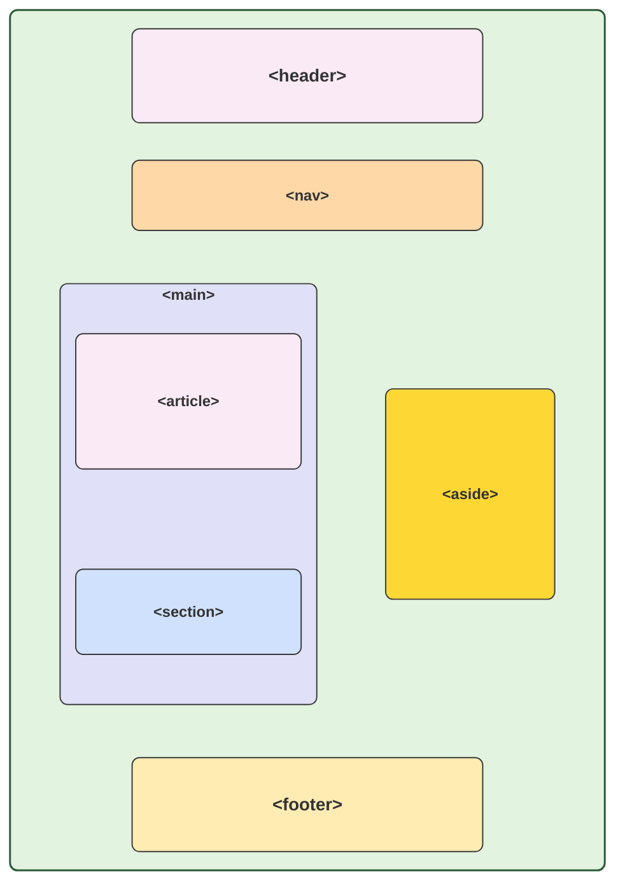
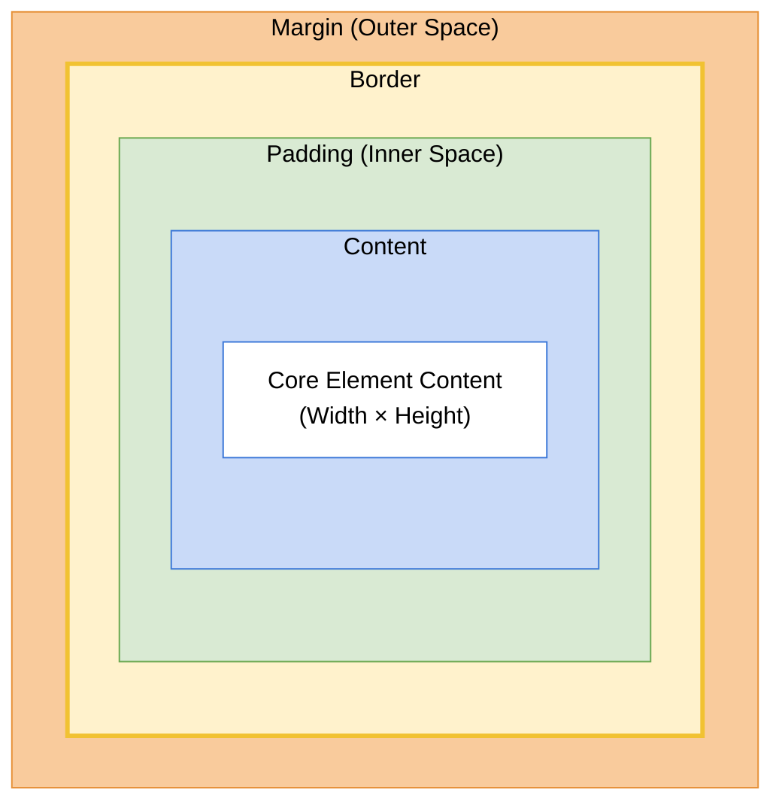

# Chapter 1

When it comes to how the web works, a good thing to start with is the _URL (uniform resource locator)_. There are parts to a _URL_:

1.  **Protocol**: This will be the first portion of the _URL_ before the ://. This will be the **protocol** that is being used to send the data
2.  **Subdomain**: This is the part that comes right after the :// and right before the dot to give the name of the site. This is used to separate sections of a site in an organized way. For example, _us.google.com_ or _jp.google.com_. The biggest point of this is to not have to buy a new domain for the website.
3.  **Second-level domain (domain name)**: This is an actual name of the website that is used. This is used to replace having to remember the actual IP address of the website. This is the thing that comes after the **subdomain** and before the ending dot thing.
4.  **Top-level domain**: This is the ending of the _URL_ and this is supposed to have a meaning of what the site is supposed to be.
5.  **Host (full domain)**: This is just the combination of #2, #3, and #4 combined together.
6.  **Port**: This comes right after the **top-level domain** separated by a colon and this will be a number. The number is used to tell what port to connect to on the server receiving the request.
7.  **Path**: This is the location on the server where the requested resource is located. This comes after the **port** would go.
8.  **Query string**: This is the part that sends data to the receiving device. This will be seen after the **path** is listed. It will have a question mark right after the **path** then followed by the pattern _VariableName=value_. There can be more than one value sent and this will be by adding *&* right after the value of the previous data passed until no more needs to be passed.
9.  **Fragment**: This is used to specify what particular part of the page to go to once it is loaded into the web browser. This is the only part of the _URL_ that is not handled by the receiving server, but by the users web browser. This would also come right after the **query string**.

> <u>For Example</u>
>
> The URL: https://www.hearthstonetopdecks.com/tavern-brawl-gift-exchange/
>
> - The **protocol** here would be _https_.
> - The **subdomain** here would be _www_.
> - The **second-level domain** here would be _hearthstonetopdecks_
> - The **top-level domain** here would be _.com_
> - The **host** would be _subdomain_ + _domain_ + _top-level domain_
> - The **port** would be _443_ by default since one is not specified and goes off the protocol used
> - The **path** would be _/tavern-brawl-gift-exchange/_
> - The **query string** would be something like _?content=true&display=5_ if it does exist
> - The **fragment** would be something like _#result_ if it did exist

When it comes to the web, the way data is sent to the other device is called **client-server model**. This is the most popular model to use when talking about the web. The device that sends the device is called the _client_ and the device that receives the data is called the _server_. The model works by:

1. _Client_ send an _HTTP request_ to the _server_.
2. _Server_ processes the request and sends back an _HTTP response_ of data (if there or have permissions) of the HTML file
3. The _client_ will get that HTML file and in turn can see links to other resources needed like JavaScript files, CSS files, etc. For each additional object needed the _client_ will make a request to the server to get that information.

> [!NOTE]
>
> This is a very brief and high level overview of how the web sends data to each other.

**HTTP (hypertext transfer protocol)** has ways to tell if the sent information was ok or if any type of error happened when trying to get the data. This particular protocol is called a **stateless** once since each request made by the _client_ to the _server_ is independent meaning each request do not know about each other. When it comes to the actual type of HTTP request, there can be many different types like _POST_, _GET_, _PUT_, _DELETE_, etc.

To tell if the request made was good something called **status codes** are used. Some of the most common are:

1. 200 (OK)
2. 404 (not found)

# Chapter 2

## Creating an HTML File

To make an HTML file, create a new file ending with the ".html" extension.

When it comes to naming a file, it is popular to name the main file "index". This is because if the specific resource path is not specified in the URL, then by default it will look for the resource "index.html".

> Going forward, all examples showing all the content will be written in a separate file. However, very small brief examples showing particular will be written out here as a small example.

## HTML tag rules and attributes

When it comes for writing anything in HTML, each thing is called an **HTML tag**. A tag is the way to declare the thing that needs to be created. The syntax is `<tagName>Content here</tagName>`. The part of the first tag name is called the _opening tag_ and the second part with the / is called the _closing tag_. Each tag can have something called an **attribute** and this is used to apply special designs to that particular item like `<tagName attribute="value">Content here</tagName>`

> [!NOTE]
>
> There are some special tags called **void tags**. These are tags that do not have an _opening tag_ and _closing tag_. Instead, they just have a _closing tag_ and the / comes at then end and not start of the name like `<tagName/>`. These will not have any content between them, but can have attributes.

There is a tag `<p></p>` that is just used to put text to the screen. just like `print()` in python.

There is a tag `<h1></h1>` that is used to make headers. The smaller the number the larger the text will be. This ranges from h1 - h6. However, should only use h1 - h3 at most.

There is a tag `<a></a>` that is used to make hyperlinks to other things

There is a tag `<body></body>` that is more of a structural thing that is meant to signal where the main content the user will see will go. This will only hold other HTML tags.

There is a tag `<head></head>` that is used to hold metadata about the page itself. This is information the user does not see. This will only hold other HTML tags.

There is a tag `<title></title>` that is used change the name that is displayed in the tab bar of the web browser. This would actually go in the \<header\> tags.

## Document Structure

The basic structure that every HTML page will follow is:

```html
<!-- This is used to just tell the browser the type of document this is (specifically html5 document type)-->
<!DOCTYPE html>

<!-- This section will contain used to be the root element of the page-->
<html>
  <head>
    <!-- This section will contain metadate about the page-->
    <title>Title of Tab</title>
  </head>
  <body>
    <!-- This section will contain content the user can see-->
  </body>
</html>
```

The only new tag here is the `<html></html>`. This is what actually holds the \<body\> and \<head\> tags. These should be the only things inside it.

To write a comment in HTML do `<!-- text here-->`.

> [!TIP]
>
> The way the document structure is made above is how it should be at minimum for each html document made. If not most places will consider it to be invalid HTML.
>
> There is a way to [validate html](https://validator.w3.org) to ensure it meets current standards.

## Meta Tags

*meta tags* are used to help with *search engine optimization (SEO)*. Basically, making it easier to find when people look up pages using search engines.

Some of the common _SEO_ tags are:

1. `<meta charset="UTF-8" />` --> this will help the browser to display the characters correctly
2. `<meta name="viewport" content="width=device-width, initial-scale=1.0">` --> helps to create a responsive layout
3. `<meta name="descripion" content="Describe page"` --> This will be the text that appears under all sites when before clicking the link to go to the site. This should be something brief like 150 characters max.
4. `<meta name="author" content="Jack Mack"/>` --> Used to give the author of a site

All of these tag types will go inside the \<head\> tags of the document.

> [!NOTE]
>
> There are many other *meta tags* available, but the above three would be the most important.

## Headings, Paragraphs, and Emphasis

When it comes to tags, there can be tags inside other tags. Some tags are supposed to be nested inside other tags, otherwise it is just for styling purposes.

There are some that are *text emphasis* tags. Meaning it is supposed to be used to style text.

There are some HTML tags are are kind of styling tags in a way like:

1. `<strong></strong>`: Will make text bold. This is a text emphasis tag.
2. `<em></em>`: Will make text italic. This is a text emphasis tag.
3. `<mark></mark>`: Will add highlight over text. This is a text emphasis tag.
4. `<del></del>`: Will draw line through text. This is a text emphasis tag.
5. `<sub></sub>`: This makes the text in a subscript form. This is a text emphasis tag.
6. `<sup></sup>`: This makes the text in a superscript form. This is a text emphasis tag.
7. `<h1 - h6></h1 - h6>` --> This will be used to make a heading. This ranges from size h1 to h6 with h1 being the largest and h6 being the smallest. These are like chapter section separators.
8. `<p></p>` --> This is how to make normal text. Same as something like `print()` in python.

<u>For Example</u>

```html
<p>This is a <strong>bold</strong> text</p>
<!-- this will make the word "bold" actually bolded -->
```

> [!NOTE]
>
> When it comes to nesting tags inside others, more than one can be added inside it.

> [!IMPORTANT]
>
> When typing out the HTML code, it does not matter how the code is formatted. The browser will still be able to understand. This means a whole HTML file can be written on a single line without any formatting and it will all still work and look good.

## List

To create a list, there are two ways to do so with the previously mentioned `<ol></ol>` (ordered list) or `<ul></ul>` (unordered list) tags. These two tags will define how the list is actually made. 

To create an item in the list, inside each of the tags add `<li></li>`. This will create an item in the list and add the correct thing defined by the list (number for `<ol>` or bullet point for `<ul>`).

There is a way to nest list inside others. The way this is done is by putting an `<ol></ol>` or `<ul></ul>` inside the `<li></li>` tag.

> [!NOTE]
>
> While the nested ordered or unordered tag will still work if placed outside of the `<li></li>` tag, it is not considered valid HTML. This can be checked by going to the [HTML Validator](https://validator.w3.org).

```html
<!doctype html>
<html lang="en">
<head>
	<meta charset="UTF-8">
	<meta name="viewport" content="width=device-width, initial-scale=1">
	<title>Document</title>
</head>
<body>
<ol>
	<li>Item 1</li>
	<li>Item 2</li>
</ol>

<ul>
	<li>Item 1</li>
	<li>Item 2</li>
</ul>

<ol>
	<li>Item 1</li>
	<li>
		Item 2
		<ul>
			<li>Nested Item 1</li>
			<li>Nested Item 2</li>
		</ul>
	</li> <!-- The </li> goes AFTER the nested list -->
</ol>
</body>
</html>
```

Another type of list, but very uncommon is called a [definition list](https://www.w3schools.com/TAGS/tag_dl.asp).

## Anchor Tags

When wanting to create links to other web content or anything to that matter (email client, download something, etc) this is done with the `<a></a>` tags. This will always need at least one **attribute** to work and that is the *href* attribute. The value for the *href* will be the URL or thing that when the user clicks will take them to. ANYTHING (images, text, etc) between the tags will become a link to that thing. For Example, `<a href="https://youtube.com">Click Me</a>` will make clicking the words "Click Me" open up another tab in Youtube.

When creating a link, if the user will be brought to a different site then this is called an **external** link. An example of this is being on the custom made page an when the user clicks on the link then it brings them to Youtube.

When linking to something that is that is just another file inside the same or different directory then this is called an **relative link**. For this put the file path to the new file that this will open up in the file system so the user can now see that. For example, `<a href="../Testing.html">Go Here</a>`.

There is a way that when a user click on the link, it will bring them to a specific part the page and this is called a **internal link**. The value for this will be something like "#IDOfTagGiven". The attribute of <u>id</u> will be talked about later, but the value that it is set to will be the same thing that *href* attribute will get with the added # in front of it.

Another type of link can be an **email link**. This will make it so when someone clicks on the link, it will open that users chosen email client on their system with who to send to filled out so all they have to do is write the email and the title for it. This time set the *href* attribute value to "mailto:EmailOfPerson".

Another type of link is called **file link** (resource link). These are ones that link to things like pictures, videos, etc that are on the actual device that is serving the contents directory. The *href* value for this will be nothing special and it is just the relative path from the current document to that resource.

For the **file link** (resouce link), this can have a special attribute added to it called *download*. This makes it so the resource does not open in a separate browser. Instead, the device will try to download it instead. When using this, it can or cannot have a specific value assigned to it. If there is then the file will be downloaded with the specific file name and extension given; otherwise it will give it the file name from the one in the *href* attriute.

One extra attribute is *target*. This determines that when the user clicks on the link, does it open in a new tab or does it open it in the same tab. Set the value to "\_blank" and this will open the link in a new tab, but by default will open in same tab (but can differ by browser like edge). 

Another attribute is the *title* attribute. This makes it so when hovering over the link with the cursor some text will appear. What will appear in here is value given to the attribute. 

<u>Resource Download Example</u>

```html
<!-- opens image resource in separate tab-->
<a href="Image.webp">Click me</a>
<!--Downloads image resource as "Image.webp"-->
<a href="Image.webp" download>Click me</a>
<!--Downloads image resource as "SillyImage.webp"-->
<a href="Image.webp" download="SillyImage.webp">Click me</a>
```

## Images

When it comes to adding images to the actual page, the `` tag must be used. There are two common attributes used with this, but one is more important than another:

- _src_: this is the actual path to the image in the file system relative to where the current file is
- _alt_: this is text to be displayed in place of the image in case it is not found (less important one)

> [!NOTE]
>
> The _src_ value can actually be a URL, but the URL must be to an image. This will then take that image and embedded it into the site.

Some other important attributes are:

- _width_: this sets how long the image will be horizontally. The value in this will be a number followed by "px"
- _height_: this sets how long the image will be vertically. The value in this will be a number followed by "px"
- _title_: this functions like when added to the `<a></a>` tag. This will just display the text value given when hovering over the image.

There is a tag called `<figure></figure>`. This is really just if an image or some resource (video, image, etc) need a captian on it. For example, giving credit to someone who took the image. The way it works is put (in this case) the `` tag inside the pair of figure tags. After, put another set of tags called `<figcaptian></figcaptian>` inside. Inside the `<figcaption>` tags just add text inside there and this will display under the thing

<u>For Example</u>

```html
<figure>
	
    <figcaptian>This was taken from the internet</figcaptian>
</figure>
```

## Block vs Inline Elements

When it comes to all tag elements, each one has something called a **block** or **inline** value to it. This means that when the HTML tag is added to the page, it determines how much space it takes up. If a HTML tag is an **inline** then it will only take up the space it needs and other HTML tags can be displayed right beside it. However, if it has the **block** value then no matter how small the content is, NOTHING else will share the same line space as it.

Some properties of each are:

| Inline                                                       | Block                                                        |
| ------------------------------------------------------------ | ------------------------------------------------------------ |
| Inline elements occupy only sufficient width required        | Block elements occupy the full width irrespective of their sufficiency |
| Inline elements don't start a newline                        | Block elements always start a newline                        |
| Inline elements allow other inline elements to sit side by side | Block elements doesn't allow other elements to sit behind    |
| Inline elements don't have top and bottom margin.            | Block elements have top and bottom margin                    |

> [!NOTE]
>
> Margin is just a spacing that pushes away other HTML tag elements

Some examples of **block** HTML tags are:

| Tag                         | Closing Tag | What it does                                               |
| --------------------------- | ----------- | ---------------------------------------------------------- |
| `<div></div>`               | Yes         | Groups content into a section.                             |
| `<p></p>`                   | Yes         | Creates a paragraph.                                       |
| `<h1></h1>` – `<h6></h6>`   | Yes         | Creates headings (largest to smallest).                    |
| `<ul></ul>`                 | Yes         | Creates an unordered (bulleted) list.                      |
| `<ol></ol>`                 | Yes         | Creates an ordered (numbered) list.                        |
| `<li></li>`                 | Yes         | Creates a list item.                                       |
| `<table></table>`           | Yes         | Creates a table.                                           |
| `<form></form>`             | Yes         | Creates a form for user input.                             |
| `<header></header>`         | Yes         | Defines the top section of a page or section.              |
| `<footer></footer>`         | Yes         | Defines the bottom section of a page or section.           |
| `<section></section>`       | Yes         | Groups related content into a section.                     |
| `<nav></nav>`               | Yes         | Contains navigation links.                                 |
| `<article></article>`       | Yes         | Contains independent content, like a blog post or article. |
| `<aside></aside>`           | Yes         | Contains related or sidebar content.                       |
| `<main></main>`             | Yes         | Contains the main content of the page.                     |
| `<blockquote></blockquote>` | Yes         | Displays a long quotation.                                 |
| `<hr>`                      | **No**      | Creates a horizontal line or thematic break.               |
| `<pre></pre>`               | Yes         | Displays preformatted text exactly as written.             |

Some examples of **inline** HTML tags are:

| Tag                 | Closing Tag | What it does                                     |
| ------------------- | ----------- | ------------------------------------------------ |
| `<span></span>`     | Yes         | Groups inline content for styling or scripting.  |
| `<small></small>`   | Yes         | Makes text smaller.                              |
| `<a></a>`           | Yes         | Creates a hyperlink.                             |
| ``             | **No**      | Displays an image.                               |
| `<button></button>` | Yes         | Creates a clickable button.                      |
| `<input>`           | **No**      | Creates an input field.                          |
| `<label></label>`   | Yes         | Labels a form input.                             |
| `<strong></strong>` | Yes         | Makes text bold (important).                     |
| `<em></em>`         | Yes         | Emphasizes text (usually italic).                |
| `<mark></mark>`     | Yes         | Highlights text.                                 |
| `<ins></ins>`       | Yes         | Shows inserted (added) text, usually underlined. |
| `<del></del>`       | Yes         | Shows deleted text, usually crossed out.         |
| `<sub></sub>`       | Yes         | Makes text subscript (below the line).           |
| `<sup></sup>`       | Yes         | Makes text superscript (above the line).         |

## Entities, Break line, and Horizontal Line

There are times when a special character needs to be displayed to the screen or a pre-used one like the >. For example, if wanting to write out in a raw formatting `<h1></h1>` then writing it normally will cause it to render like normal. To fix this, there is a special symbol syntax called **entites** that allow this. To use them do `&codeName;`. For example, to have an actual < symbol be displayed to the browser have to type `&lt;`.

There are many more entity symbols [here](https://www.freeformatter.com/html-entities.html).

Can use `<hr/>` (horizontal rule) and this will create a horizontal line that is drawn across the page

Can use `<br/>` (line break) and this will create a newline for the content

There is another special tag `<pre></pre>` that is also used to display test like the `<p></p>`. However, there is an important difference between them. The `<pre>` version will keep all the spacing and formatting of the text no matter what. With the  `<p></p>` tags, these will not display extra spacing or formatting.

## Div and Span

These are special containers that help to group elements together and can provide easier layouts and organization. The two most common ways this is done is `<div></div>` and `<span></span>`. The only difference between the two versions is **div** is a _block level_ element while **span** is a _inline level_ element.

## Classe & ID

There are special attributes called *class* and *id*. These special attributes make it so particular styles can be applied to elements without affecting everything on the page.

### The Class Attribute

When assigning a value to a `class`, it signals that a specific name will be associated with that element. The styles applied to that class name will then be given to the element.

It is important to know that a `class` can be given multiple names at once by just space separating them; For example, `<p class="ThingOne ThingTwo">Hello</p>`. This makes it so the styling tied to each of those names gets applied to that single element. The names given for a class can also be reused for other elements across the page to have that same styling applied to them.

### The ID Attribute

When assigning a value to an *id*, it will take only a single value. Unlike a class, the name used here MUST be unique across the entire document. The value for an *id* CANNOT be shared across multiple elements like a class can. If this is done, it will result in breaking errors since each *id* name has to be completely unique.

### Common Use Cases

When using *id* and *class*, it is common for the *id* attribute to only be used for JavaScript-related things and the *class* attribute to only be used for CSS-related things. While this is not an ironclad rule, following it is highly recommended to keep code clean and organized.

### Overlapping Names

The name for a *class* and an *id* on a single element can actually be the same. Having both match on the same tag is perfectly fine. For example, `<p class="Hello" id="Hello">World</p>`.

## Semantic Elements

**Semantic** elements are just tags that are just more used to help organize code compared to anything else. They help to define certain sections of code so maintainers have an easier time knowing what the section of code should be. Some of these are:

1. `<header></header>`: this groups the header section of the page like the navigation, logo, login part, etc.
2. `<footer></footer>`: this groups the footer sections like the career part, location information, contact info, etc
3. `<nav></nav>`: this groups the navigation area. this should only contain the links of the actual elements that navigate to other pages or sections of the current page. For example the navigation links on the top of the page or side bar menus that take to certain parts (**internal links**) of the current page.
4. `<main></main>`: this groups the main content area. Basically, this should be EVERYTHING in the `<body>` tags.
5. `<article></article>`: 
6. `<section></section>`: this groups certain parts of the page. For example, if there was a results, overview, test, etc sections.
7. `<aside></aside>`: this groups secondary or sidebar content. For example, in amazon where the filters are applied is considered a sidebar.

Just like the `<div>` element, these are all <u>block level</u> elements.

> [!TIP]
>
> The `<div>` element is just for generic grouping. While the others are just for grouping as well, they help give meaning to certain parts of the page. For example, if just wanting to style a particular group of elements that have no meaning but to group them and apply certain styles or features then just use the `<div>`.

<u>For Example</u>

Instead of these being all divs, this semantic tags would be used like this to give better meaning to the page.




## Emmet

This is just a shorter way to write out HTML instead of writing it out all by hand. For example, instead od writing out five `<li></li>` pairs with the same classes attached to them something like `li.class*5` can be done instead.

Here are some rules for using the Emmet syntax:

- Using > will put the thing right after this will make it a child element. For example, doing `div>p`.
- Using + will put the thing right after this as a sibling element. For example, doing `p+p+p`.
- Using . will put the thing right after this as a class attribute name. For example, doing `div.thing`.
- Using # will put the thing right after this as a id attribute name. For example, doing `div#thing`.
- Using * followed by a number will make that many of that thing. For example, doing `ol>li*5` will make a ordered list with five li elements.
- Using the $ is the special for item numbering, This can be combined with the * symbol to make more complex numbering. Each $ will start as being a one. However, when combined with the * followed by a number then it will increment up to that number. For example, doing `ul>li.item$*5` will make an unordered list with five li elements each separate one getting the class of "item1" - "item5".
- Using the {} and putting text inside that will be what places text between the actual tag. For example, doing `p{Text}` will convert to `<p>Text</p>`.

[Go here](https://docs.emmet.io/cheat-sheet/) to see more examples and more in detail how to use Emmet. There are some things not covered here that can more be used.

# Chapter 3

## Form & Tags

### Form

When it comes to getting user input, the most common way to do this is with a form which uses the `<form></form>` tag. It gives the ability to send data to the server to be processed. These are used for things like logging in, signing up, submitting forms, putting in a ticket, etc.

The **form** tag can take a few attributes:

- *action*: Specifies the file path or URL endpoint where submitted form data is sent. Accepts a relative or absolute URL string. If left off or left empty, the form automatically submits data back to the current page URL.
- *method*: Specifies the HTTP method used to send data to the server. HTML forms natively support GET and POST only. If left off, GET is used by default.
    - GET: Appends data directly to the URL as query parameters in a ?variable=value string structure. Should ONLY be used to retrieve or look up information (such as searches). No sensitive or private data should ever be sent using GET because all parameter data remains completely visible in the URL bar, browser history, and server access logs.
    - POST: Transmits data inside the body of the HTTP request. Keeps data hidden from the URL bar, providing a secure method for transmitting sensitive information or making data changes on the server.
- *target*: Dictates where to display the response received from the server after submitting. Accepts string keywords including \_blank (opens response in a new tab or window), \_self (default, opens response in the same frame or tab), \_parent (opens in the parent frame), or top (opens in the full body of the window).
- *enctype*: Dictates how form data is encoded before transmission to the server when *method* is set to "POST". Accepts three specific values:
    - "application/x-www-form-urlencoded": Default value assigned if no other is specified. Converts characters into encoded key-value formats prior to sending.
    - "multipart/form-data": Required whenever the form includes file upload elements. Ensures binary file data sends properly across the request body.
    - "text/plain": Transmits raw data without special encoding. Insecure for structured data processing and should never be used in production.
- *autocomplete*: Controls whether the browser can automatically predict and pre-fill form input fields based on past user entry history. Accepts the value "on" (default) or "off".
- *name*: Assigns an identifying string name to the form, allowing JavaScript DOM operations or scripting interfaces to target and manipulate the element directly.
- *novalidate*: A boolean attribute, meaning it requires no assigned value (or can be written as novalidate="novalidate"). When present, it instructs the browser to bypass native HTML5 client side form validation checks upon submission. Crucially, this setting ONLY disables client side browser checks; backend server validation still runs normally upon receipt of the request.
- *rel*: Specifies the relationship between a linked resource and the form when submitting across external origins (such as using "noopener" or "noreferrer").

> [!NOTE]
>
> Other HTTP methods like DELETE, PUT, HEAD, and PATCH exist for web APIs, but native HTML **form** elements only accept GET and POST within the *method* attribute.

```html
<form action="/submit-data" method="POST">
  <!-- form fields go here -->
</form>
```

### Input

The way to actually get input is adding an `<input/>` tag inside the `<form></form>` tags. This is required to get a form to work.

The **input** tag can take a range of attributes to control input types, data limits, and field state. Below is the list of attributes for the **input** tag:

- *type*: Specifies the operational input control type to display. Accepts values including:
    - text: A single line of text entry.
    - email: Validates that entries conform to standard email formatting ending with an @ symbol and domain name (.com).
    - password: Masks entered characters by displaying dots or asterisks per character for privacy.
    - number: Restricts entry strictly to numeric digits on a single line.
    - date: Provides an interactive calendar picker interface for date selection.
    - time: Provides a time selection interface.
    - checkbox: Displays a square box allowing selection of multiple choices.
    - radio: Displays a circular button for selecting a single choice out of a grouped set.
    - file: Displays a file selector interface to upload local files.
    - submit: Renders a button that submits all form field entries to the server when triggered.
    - range: Displays a slider control to select numeric values within bounded ranges.
    - color: Displays a color picker tool returning hexadecimal color codes.
    - hidden: Stores data that remains invisible on screen but still submits to the server.
    - reset: Renders a button that resets all form controls to default initial values.
    - button: Renders a generic clickable button without default submit behavior.
- *name*: Defines the variable parameter name sent to the server to reference and retrieve submitted field data.
- *value*: Defines the data content stored within the field.
- *placeholder*: Displays temporary hint text inside empty text fields. Automatically vanishes once text entry begins, but will reappear if the field becomes empty again.
- *id*: Assigns a unique document identifier. Essential for connecting the field to a `label` element via the *for* attribute, as well as targeting via CSS or JavaScript.
- *required*: A boolean attribute (requires no value). Prevents client side form submission if the field remains empty. Note that server side validation must still verify data presence on the backend.
- *min* & *max*: Defines lower and upper numeric boundaries for number and range inputs, or date/time limits formatted as strings.
- *minlength* & *maxlength*: Takes positive integer values setting minimum and maximum character limits permitted within text entry fields.
- *disabled*: A boolean attribute (requires no value). Completely deactivates the field, preventing user editing, focus, and excluding field data from being transmitted to the server upon submission.
- *readonly*: A boolean attribute (requires no value). Keeps text content visible and readable while preventing user modifications. Unlike *disabled*, fields marked with *readonly*  STILL transmit data to the server during submission. Applies only to text based inputs and does not function on checkboxes, radio buttons, file inputs, or submit buttons (use *disabled* for those).
- *pattern*: Accepts a regular expression string that input values must match to pass client side browser validation.
- *step*: Takes a numeric value specifying valid increment steps for numbers, range sliders, or date/time fields.
- *autofocus*: A boolean attribute (requires no value). Automatically focuses cursor placement on the input field upon page load.
- *multiple*: A boolean attribute (requires no value). Allows entering or selecting multiple values at once for supported inputs like file uploads or email lists.
- *autocomplete*: Controls field-level autofill behavior ("on", "off", or field tokens like "username" or "current-password").
- *accept*: Specifies permitted file extensions or MIME types when *type* is set to "file" (e.g., ".pdf,image/*").

```html
<form action="/login" method="POST">
  <input type="text" name="username" placeholder="Username" required />
  <input type="email" name="email" placeholder="Email" required />
  <input type="password" name="password" placeholder="Password" required />
  <input type="submit" value="Log In" />
</form>
```

### Label

For all **input** tag types, there is another HTML element called `<label></label>`. This displays text that, when clicked, automatically moves focus to the assigned input field right next to it. Using a `label` requires the *for* attribute, matching the *id* value on the **input** tag. For example, clicking "First Name:" focuses the associated text box directly.

Below is the list of attributes for a `label`:

- *for*: Accepts a string matching the exact *id* value of an **input** field, creating an explicit association that enlarges the clickable target area.
- *form*: Accepts the *id* string of a **form** located elsewhere in the document, linking the `label` to that form even if placed outside the `<form></form>` tags.

```html
<label for="first-name">First Name:</label>
<input type="text" id="first-name" name="first_name" />
```

## Select & Textarea

### Select Tag

This is a special way to create a dropdown menu using the `<select></select>` and `<option></option>` tags wrapped inside `<form></form>` tags. Creating a pair of `<select></select>` tags generates the dropdown list.

Below is the list of attributes for `<select></select>`:

- *name*: Defines the parameter key name sent to the server to reference the chosen option data.
- *disabled*: A boolean attribute (requires no value). Disables interaction with the dropdown list and excludes its value from form submission.
- *required*: A boolean attribute (requires no value). Mandates selecting a non-empty option prior to form submission.
- *multiple*: A boolean attribute (requires no value). Converts the single-select dropdown into a multi-select box where multiple options can be chosen simultaneously.
- *size*: Accepts an integer value specifying the number of visible option rows displayed on screen at one time.
- *form*: Accepts the *id* string of a **form**, linking the dropdown to that form when placed outside `<form></form>` tags.
- *autofocus*: A boolean attribute (requires no value). Automatically shifts browser focus to the dropdown upon page load.

```html
<select name="car-choice">
	<!--Options here-->
</select>
```

### Option Tag

Inside `<select></select>` tags, `<option></option>` tags add individual items to the dropdown list. Text placed inside the tags displays as the clickable option.

Below is the list of attributes for `<option></option>`:

- *value*: Specifies the string or numeric data value transmitted to the server when selected. If left off, the browser sends the raw text content contained inside the tag pair instead.
- *selected*: A boolean attribute (requires no value). Pre-selects the specified option by default when the page loads.
- *disabled*: A boolean attribute (requires no value). Disables selection for that specific individual option while keeping other options active.
- *label*: Accepts a string value to display as a shorter, simplified alternative text label in the user interface.

```html
<select name="car-choice">
  <option value="volvo">Volvo</option>
  <option value="saab">Saab</option>
</select>
```

### Optgroup Tag

There is a special tag called `<optgroup></optgroup>`. This makes it so related options can be grouped together, making choices clearer when dealing with long lists. It goes inside `<select></select>` tags and wraps related **option** tags.

Below is the list of attributes for `<optgroup></optgroup>`:

- *label*: A required attribute taking a string value that defines the non-selectable heading title for the option group.
- *disabled*: A boolean attribute (requires no value). Disables every **option** contained inside the entire group simultaneously.

```html
<select name="cars">
  <optgroup label="Swedish Cars">
    <option value="volvo">Volvo</option>
    <option value="saab">Saab</option>
  </optgroup>
</select>
```

### Textarea Tag

Like an **input** with *type* set to "text", this gives the ability to enter text in a box, but across multiple lines.

To create this, use `<textarea></textarea>` tags placed inside `<form></form>` tags. Placing text inside pre-fills the box.

Below is the list of attributes for `<textarea></textarea>`:

- *rows*: Takes an integer value specifying the height of the text area in visible text lines.
- *cols*: Takes an integer value specifying the width of the text area in average character widths.
- *placeholder*: Displays temporary hint text inside the box that disappears once typing begins.
- *maxlength*: Takes an integer specifying the maximum character count allowed.
- *minlength*: Takes an integer specifying the minimum character count required.
- *readonly*: A boolean attribute (requires no value). Prevents text modification while still including text content when form data sends to the server.
- *disabled*: A boolean attribute (requires no value). Prevents editing and excludes text content from form submission.
- *required*: A boolean attribute (requires no value). Requires text entry before submitting the form.
- *form*: Accepts the *id* string of a **form** to link the text area when placed outside `<form></form>` tags.
- *wrap*: Dictates how line breaks in multi-line text handle during submission. Accepts "soft" (default; wraps text on screen but sends no line breaks to the server) or "hard" (inserts actual newline characters in submitted data; requires setting the *cols* attribute).

```html
<textarea name="comments" rows="4" cols="50" placeholder="Enter comments here..."></textarea>
```

### Label Tag

For element types like **textarea** or **select**, using a `label` (`<label></label>`) displays descriptive text that shifts cursor focus directly to the input box when clicked. The `label` uses the *for* attribute set to the *id* value of the target field. For example, clicking `Comments:` focuses the **textarea** box.

Below is the list of attributes for a `label`:

- *for*: Accepts the *id* string of the target element.
- *form*: Accepts the *id* string of a targeted **form**.

```html
<label for="user-comments">Comments:</label>
<textarea id="user-comments" name="comments"></textarea>
```

## Checkbox and Radio Buttons

A **checkbox** and **radio** button work similarly to `<select></select>`, but present options as a list instead of a dropdown. A **checkbox** allows selecting multiple options, while **radio** restricts selection to a single option.

### Checkbox

Created using an **input** tag with the *type* attribute set to "checkbox". Using a `<label></label>` is standard. Implicit labeling wraps the **input** directly inside the `label`. The nested **input** gets *type* set to "checkbox", *name* to reference the data on the server, and *value* for the actual data value sent.

Explicit labeling keeps the `label` separate from the **input**. The `label` uses the *for* attribute, matching the *id* attribute on the **input** to connect them.

> [!TIP]
>
> Explicit labeling is preferred for complex CSS styling since elements remain separate.

Below is the list of attributes for checkbox **input** types:

- *checked*: A boolean attribute (requires no value). Pre-checks the option by default on page load.
- *disabled*: A boolean attribute (requires no value). Turns off the checkbox to prevent selection and exclude data from submission.
- *required*: A boolean attribute (requires no value). Requires checking the box before form submission can proceed.
- *name*: Defines the key reference name sent to the server.
- *value*: Defines the actual string value sent to the server when checked.

The *name* attribute across checkbox inputs can either be the same or different depending on the desired data handling. Using the same *name* groups the options under one category, allowing the server to receive the selected values together as a list or array. Giving each checkbox a unique *name* makes the inputs completely independent fields, sending each checked box to the server as its own separate data entry.

```html
<!-- Implicit Labeling -->
<label>
  <input type="checkbox" name="newsletter" value="yes" /> Subscribe
</label>

<label>
  <input type="checkbox" name="newsletter" value="yes" /> Subscribe
  <input type="checkbox" name="timer" value="yes" /> Timer
  <!--The name "timer" could also be "newsletter" and this would still work, but data will be sent to server as an array-->
</label>

<!-- Explicit Labeling -->
<label for="terms-check">Agree to terms:</label>
<input type="checkbox" id="terms-check" name="terms" value="accepted" required />
```

### Radio

Made similarly to a **checkbox**, with two key differences:

1. The *name* attribute MUST be identical across all radio buttons in the group unlike the checkbox version. Differing names cause breaking behavior where multiple buttons can be selected at once instead of acting as a mutually exclusive group.
2. The *type* attribute is set to "radio".

Below is the list of attributes for radio **input** types:

- *checked*: A boolean attribute (requires no value). Preselects a specific option by default.
- *disabled*: A boolean attribute (requires no value). Disables picking the option and excludes its value.
- *required*: A boolean attribute (requires no value). Mandates selecting one option from the radio group before submitting.
- *name*: Shared group identifier string required across all related radio inputs.
- *value*: Specifies the unique data value submitted for that specific radio choice.

```html
<label for="pay-card">Credit Card</label>
<input type="radio" id="pay-card" name="payment" value="card" checked />

<label for="pay-cash">Cash</label>
<input type="radio" id="pay-cash" name="payment" value="cash" />
```

## Other Input Types

### Color

Allows selecting colors through a color palette interface. Set the *type* attribute to "color" on the **input** tag, paired with a `label`. The **input** takes *name*, *id*, and *type*. The *value* attribute takes a 7-character hexadecimal color string (e.g., "#ff0000"). If omitted, the default initial value is "#000000" (black).

Below is the list of attributes for color **input** types:

- *name*: References the color parameter key sent to the server.
- *id*: Connects the field to a `label` *for* attribute.
- *value*: Pre-sets a default hex color code string formatted as "#RRGGBB".
- *disabled*: A boolean attribute (requires no value). Disables interaction with the color picker.

```html
<label for="fav-color">Pick Color:</label>
<input type="color" id="fav-color" name="fav_color" value="#0000ff" />
```

### Date

Displays a calendar picker for selecting dates. Set *type* to "date" on the **input** tag. Chosen dates submit automatically in "YYYY-MM-DD" format.

Below is the list of attributes for date **input** types:

- *name*: Specifies how the server references the variable parameter.
- *min*: Defines the lowest selectable date boundary formatted strictly as "YYYY-MM-DD".
- *max*: Defines the highest selectable date boundary formatted strictly as "YYYY-MM-DD".
- *value*: Accepts a default pre-filled date string formatted as "YYYY-MM-DD".
- *required*: A boolean attribute (requires no value). Mandates selecting a date.
- *step*: Specifies allowed date stepping intervals in days (defaults to 1 day).

Note: Date values transmit to the server in "YYYY-MM-DD" format, so *min*, *max*, and *value* boundaries must strictly match this structure.

```html
<label for="event-date">Event Date:</label>
<input type="date" id="event-date" name="event_date" min="2026-01-01" max="2026-12-31" />
```

### Time

Displays a clock picker for selecting times. Set *type* to "time" on the **input** tag.

Below is the list of attributes for time **input** types:

- *name*: Specifies how the server references the variable parameter.
- *min*: Defines the earliest selectable time (formatted as 24-hour "HH:MM" or "HH:MM:SS").
- *max*: Defines the latest selectable time (formatted as 24-hour "HH:MM" or "HH:MM:SS").
- *value*: Accepts a default pre-filled time string.
- *required*: A boolean attribute (requires no value). Mandates selecting a time.
- *step*: Specifies stepping interval increments in seconds (defaults to 60 seconds).

Note: Time values transmit to the server in 24-hour format (HH:MM or HH:MM:SS).

```html
<label for="start-time">Start Time:</label>
<input type="time" id="start-time" name="start_time" min="08:00" max="17:00" />
```

### Range

Displays a slider bar for selecting numeric values across a bounded range. Set *type* to "range" on the **input** tag.

Below is the list of attributes for range **input** types:

- *name*: Specifies how the server references the variable parameter.
- *min*: Accepts a number setting the lowest value on the slider (defaults to 0).
- *max*: Accepts a number setting the highest value on the slider (defaults to 100).
- *value*: Accepts a number setting the default starting position of the slider knob.
- *required*: A boolean attribute (requires no value). Mandates selecting a value.
- *step*: Accepts a number setting step increment movement intervals across the slider.

```html
<label for="score">Score:</label>
<input type="range" id="score" name="score" min="0" max="100" step="10" value="50" />
```

## Datalist

A **datalist** offers a unique variation of `<select></select>`. Instead of restricting selection to predefined options, a **datalist** provides autocomplete suggestions while allowing custom text entries.

Created using `<datalist></datalist>` alongside `<input/>` and `<option></option>` tags:

1. Create the `<input/>` tag with desired *type* and attributes.
2. Add the *list* attribute to `<input/>` with a name value.
3. Create `<datalist></datalist>` with an *id* matching the *list* attribute value on `<input/>`.
4. Add `<option></option>` tags inside `<datalist></datalist>`, giving each a *value* attribute for suggested entries.
5. Connect an optional `label` element as needed.

Below is the list of attributes for `<datalist></datalist>`:

- *id*: Unique identifier string matching the *list* attribute value of the targeted **input**.

Below is the list of attributes for connected **input** fields:

- *list*: References the *id* string of the `<datalist></datalist>` element.
- *type*: Dictates input control behavior (e.g., text).
- *name*: Specifies how the server references the submitted entry parameter.

Below is the list of attributes for **option** inside **datalist**:

- *value*: Specifies suggested selectable text value string.
- *label*: Optional secondary display text string for option suggestions.

```html
<label for="ice-cream">Choose or type a flavor:</label>
<input list="flavors" id="ice-cream" name="flavor" placeholder="Pick a flavor..." />

<datalist id="flavors">
  <option value="Chocolate"></option>
  <option value="Vanilla"></option>
  <option value="Strawberry"></option>
</datalist>
```

## Fieldset and Legend

There is another pair of semantic type tags that can be used to better organize content in the **form** called `<fieldset></fieldset>` and `<legend></legend>`.

### Fieldset

This acts like the continer for the actual **input** and **label** tags. On the screen, this will add a larger black border with thin lines around the elements. This helps to better separate visually for the user what is for what and the **fieldset** tag helps to tell what belongs with what. For example, having a billing and shipping parts can be placed in separate **fieldset** tags to show they are different.

This is even more useful since adding an attribute like *disabled* to this will turn off ALL input types inside that group instead of manually adding that attribute to each of the **input** tags individually.

### Legend

This just places small text on the top right of the box made by the **fieldset**. This is placed inside the **fieldset** tags. Inside the **label** tags, just put text inside there that should show.

```html
<form>
    <fieldset>
        <legend>
            Billing Info
        </legend>
        <label>
            <input type="text" class="name"/>
        </label>
            <label>
            <input type="email" class="email"/>
        </label>
	</fieldset>
    <fieldset>
        <legend>
            Shipping Info
        </legend>
        <label>
            <input type="text" class="address"/>
        </label>
            <label>
            <input type="number" class="zip"/>
        </label>
	</fieldset>
</form>
```


#  Chapter 4

## Audio Tag


There are times with audio will need to be placed on the site. For this, HTML5 gives the ability to use a premade audio player.

> [!NOTE]
>
> A custom audio player can be created instead of using the premade one by using the JS API to build a more custom player like the buttons, skip button, etc.

This is done by using the `<audio></audio>` tag. Inside there will not be any actual content as it is not needed to display. However, there are still some tags that can go inside it. The two attributes this will need is: *src*  and*controls*.

- *src*: this will be for the path of the audio.
- *controls*: this is actually how the play button, time left, etc will be shown. Without it nothing will show. This does not need a value.

There are some other attributes that can be added to this like:

- *autoplay*: this just makes it so once that resource is loaded in then it will start to play automatically. Does not need a value.
- *loop*: this makes it so once the audio ends it will automatically play again
- *mute*: this makes it so the audio has no sound no matter what.

> [!NOTE]
>
> While using the two basic attributes mentioned will work, there is techenically a correct way to write this. The correct way this is done is by using the next two tags being talked about.

### Source Tag

This is a special that that goes inside the **audio** tag. This does not display anything to the screen itself, but it does tell the browser what resource to fetch. There can be more than one and if the browser cannot get the first one then it moves on to the second, third, etc until it reaches the end of the list.

This is made with the `<source/>` tag. The attributes for this will be the *src* and *type*. Instead of putting the *src* on the **audio** tag just put it on the `<source/>` tag. 

- *src*: will just have the path to the resource.
- *type*: will tell the type of resouce this will be. This is important because if the browser knows it does not support that file type then it will not both to request that resource from the server and this can save time and resources for it. The thing for this is called the <u>MIME type</u>. The value for this will be many different things but it is organized into categories. For the audio, it will first be "audio" followed by a slash. Then it will be the resource type. For example, "audio/mpeg" for any file type with the ending <u>mp3</u>.

> [!TIP]
>
> To see the value of what the MIME type can even be go [click here](https://mimetype.io/all-types).

### Track Tag

Can go more into this, but right now it is not needed.

### Extra

Just like the **image** tag, the **figcaption** and **figure** can be used on this.

<u>For Example</u>

```html
<!doctype html>
<html lang="en">
<head>
	<meta charset="UTF-8">
	<meta name="viewport" content="width=device-width, initial-scale=1.0">
	<title>Audio tag</title>
</head>
<body>
<figure>
	<figcaption>Audio</figcaption>

	<audio controls>
		<source src="./Audio.mp3" type="audio/mpeg">
	</audio>
</figure>
</body>
</html>
```

## Video Tag

This is made pretty similar to the **audio** tag. This will be made using the `<video></video>` tag. This needs to be given the *src* and *controls* attributes. 

This can also take the following attributes as well: *type*, *autoplay*, *mute*, and *loop*.

Another thing that is used the same exact way is the **figure** and **figcaption** tags.

Another thing that is used the same exact way is the **source** tag from it.

## Image Map

If wanting certain parts of an image to be clickable and when that specific section of the image is clicked to go to a specific site then the use of an image map can do that. For example, in an image there is a laptop, iphone, and cup of coffee. Each part can redirect the user to the link of where to buy each separate product.

The new tags to be used are `<map></map>` and `<area/>` tags. The `<map></map>` tag is what is first needed to tell what image will get this special feature. This is done by adding the *name* attribute to it and giving it a name value. Inside those tags is where the `<area/>` tag goes. The `<area>` tag will need four specific attributes to tell what part of the image is clickable:

- *shape*: this determines what shape will be used to create a clickable part on the image. The options are:
    - rect: create a rectangle
    - circle: creates a circle
    - poly: creates a polygon
    - default: fills the remaining space with this
- *coords*: this specifies how much space that specific part of the shape covers. Different shapes have different requirements:
    - rect: x1, y1, x2, y2
    - circle: x, y, radius
    - poly: x1, y1, x2, y2, x3, y3, .....
- *href*: this is the normal part directing the user to a specific place
- *alt*: alternative text. This does not actually show any text to the screen if it does fail. This is just for screen readers.

Before the **map** and **area** tag are even used; the **img** tag has to be placed. Give it the normal attributes of *src* and *alt*. However, now a new attribute called *usemap* must be added to it and the value for that is going to be "#NameGivenToMapTag" and then this will all work.

> [!TIP]
>
> Instead of guessing the pixal range of everything since this cannot be visibly seen. First, open a photoshop app for that image and draw on there a rectangle and then just put those needed value ranges for the shape.

## Tables

To display tabular data, use the `<table></table>` tag. Unlike other elements, this has a lot of additional tags that need to be nested inside to get this to work. They are:

- `<tr></tr>`: this means "table row" and this is how to create a row for data
- `<th></th>`: this means "table header" and this is used to create the heading part of the page.
- `<td></td>`: this means "table data" and this is where the actual data point would go

> [!NOTE]
>
> When it comes to using these, the **th** and **td** should be nested inside a **tr**. The first **tr** should contain the **th** stuff as this will create the table headers to read the data in the parts. The rows after that should only have the **td** stuff. Each **td** and **th** thing will create a single cell and these are inline so the elements will be next to each other.

Just like the other mentioned semantic tags before, there are special ones for **tables** called **tbody** and **thead**.

```html
<table>
    <thead>
        <tr>
            <th>Name</th>
            <th>Age</th>
            <th>City</th>
        </tr>
    </thead>

    <tbody>
        <tr>
            <td>John</td>
            <td>32</td>
            <td>Chicago</td>
        </tr>

        <tr>
            <td>Sarah</td>
            <td>28</td>
            <td>Dallas</td>
        </tr>
    </tbody>
</table>
```

There are two special attributes called *colspan* and *rowspan*. The *colspan* will make it so a particular cell will take up that many extra cells horizontally. The *rowspan* would expand vertically. This should be placed on the actual 


> [!WARNING]
>
> Back in the day before flexbox and CSS grid, a table was used to create and style layouts for the page. However, that method is obsolete.

## Iframe

This is used to embedded another type of element inside the current HTML document. While this also embeds content like the **video** attribute, these are both used to signal different things. They also have small difference in functionality.

When using this, it will embed the content and that content window will basically become a "mini browser". This is the best for sponsored content, third party videos like youtube videos, social media feeds, etc. 

This requires the *src* attribute at minimum to add the location of this. This can also be combined with the *width* and *height* attribute to fix how big the window will be (both take a number value ending with the px word). There is also another called *frameborder* and this takes a value of a number to determine the thickness of this.

> [!CAUTION]
>
> This does not work for all sites. Sites have to give permission for the feature to work. Some sites have special URLs that give the ability to embed the content. The example in the `ifram.html` file will have an **iframe** going to google maps. This iframe was copied from google maps as well.

## Global Attributes

These are attributes that can be applied to ANY HTML element. Some examples of this is the *id* and *class* attribute mentioned earlier.

Another is *accesskey*. This gives the ability that when a specific button is pressed it will focus or click on that thing it was assigned to. This is assigned a value of anything like a letter or a number.

> [!NOTE]
>
> To get this to actually work, on windows have to click alt+shift+{givenThing} and on Mac it is cmd+shift+{givenThing}

The *title* attribute will make it so when hovering over the element, it will show some text that was specified as the value. This is also how to change the text of a tab for a specific page; this will go in the header section and text goes between the brackets.

Another attribute is *hidden*. This will make it so that element does no appear at all on the screen. This does not need a value.

Another attribute is *tabindex*. This takes a whole number and just specifies the order in which when the user clicks tab it will auto focus that particular element. The lower the value assigned to it will have priority and the higher the value the lower in the tab order it will be.

Another attribute is *contenteditable*. This will be a value of true or false. If it is true then that element can be changed by the user at any time. However, once the page is refreshed then all the changes made to it go back.

Another attribute is *dragable*. This will make it so that element can be dragged around the screen. This does not actually move the item on the screen. This is shown when there are sites that have something like drag and drop the item in a specific. This will be assigned a value of true or false. If an element is not dragable then when left clicking the element and holding it will highlight it rather then appear to grab it.

> [!IMPORTANT]
>
> While the HTML will give the ability to do the drag and drop, this will actually do nothing without JavaScript. There is a special API that is used to interact with this special type of thing.

Another attribute is *autofocus*. This will make it so when the page is loaded up, that element will receive focus as if it was clicked on. This does not need a value.

> [!NOTE]
>
> Visit [website](https://developer.mozilla.org/en-US/) to see all the up to date documentation for HTML, CSS, and JavaScript. This will show all kinds of things that is available in those things.

## SVG Elements

SVG (scalable vector graphics) is a type of XML based image that creates images in a 2D format. This also supports animations and interactivity. These type of images are good for things like icons, logos, etc since the quality of the image does not change regardless if the image shrinks or grows unlike a jpeg.

Basic icons can be coded by hand using the XML format or the **SVG** tag in HTML. However, if it is a more complex image, the it should be made with something like Adobe XD, Inkscape, Adobe Illustrator, etc.

A SVG image can be include with the **image** tag and does not need to use the specific **SVG** tag. This is also the most common way to do this.

## Popover & Details

The *popover* attributes and **details** element are used to display information when something is clicked or have a foldable bar of text, that looks like a drop down, is used to display something.

The **popover** will make it so when that element is clicked some text will, by default, be displayed in the center of the screen. The thing that needs to be displayed when clicked should get the *popover* attribute, which needs no value, and needs to be assigned an *id* attribute value. To get this to work, use the **button** HTML element. This will need the *popovertarget* attribute which needs the name of the *id* value assigned to the other thing that needs to be displayed.

The **details** element is added and inside must have the **summary** element as this is what will be displayed on what to click to show the drop down menu so text goes inside it. Any text outside it will be displayed when the text is clicked and hidden once clicked again.


## Progress & Meter

When it comes to wanting to make something like a progress bar or meter bar, this can be down with simple HTML. Now, the progress is used to indicate how complete something is while the meter bar, while looks the same, can be used to display some specific feature, etc once a specific requirement is met.

Use the **progress** element to create the progress bar. Can also use the **label** element to have text show on the side. Make sure to have the normal *for* attribute assigned to the *id* value given to the **progress** element. The two additional attributes this can take is the *max* attribute to give a range of the possible value and the *value* attribute to set the specific value. This of course can all be set and changed with CSS and JavaScript.

Use the **meter** element to create the meter bar. This can have the **label** element like the **progress** element did. This can have the same attributes as well. However, there are three more attributes this can have which are *low*, *high*, and *optimal*. The *low* and *high* gives a way to indicate that when the value reaches that it is considered in a low state and vice versa for high. The *optimal* would be not be the best but not the worse either. There are specific CSS styles that can be applied to this stuff based off of this values if wanted. However, since this is so new still, would have to use something like `meter::-webkit-meter-optimum-value`

# Chapter 5

## Implementing CSS

When it comes to the general CSS syntax, it follows:

```css
Selector {
  Property: value;
}
```

The **Selector** will be the thing that is being targeted for the style change (e.g id, class, element tag, etc).

There are three ways to implement CSS, however, there is only one way this should be done:

- inline css: This is done using a *style* attribute. The value for this will be applied ONLY to the HTML element this is on. The value for this can be any amount of css related properties.
- Internal: This is using the **style** tags in the header section. This is where writing CSS like normal is done and have to use the correct selectors to target specific or general elements
- External: This is the correct way to write CSS. The CSS will be in its own seperate file. All the design and targeting done to this will be written in the CSS file. To get the design to the HTML, the use of the **link** element is used. There are two elements that this MUST have to get this to work. The two are *ref* and *href*. The first tells the browser how to handle the file; in the case of CSS, the value should be "stylesheet". The second attribute will be the path to the CSS file.

> [!NOTE]
>
> Is is common practice to place all the CSS files in a separate folder or organization.

## Basic CSS Selectors

When it comes to the different selector types, it can be:

1.  Type Selectors: This is just using the HTML element name itself. This will then apply the specified style to ALL of those HTML elements.
2.  Class Selector: This will apply the style to ALL html elements that are part of that class name. To target in a class base, put a dot followed (no space) by the name of the class this should target.
3.  ID Selector: This will apply the style ONLY to that html element that has that specified ID value to it. To use this, put a # followed (no space) by the name of the id value this should target.

> [!NOTE]
>
> There are other ways for this to be done, but have yet to talk about.

Instead of writing the same styling the same time for two different elements, it can be done all at once using multiple styles. To do this, comma separate the selectors with however they are targeted like:

```css
Selector1, .classSelector{
  property: value;
}
```


Another way to select stuff is *decendent styles*. This make it so specific items within a certain area will be target. For example, wanting to target all **p** elements inside all **div** that has the class "max". This is done by putting the selector name of the thing to target then put a space and then put the selector name of the nested thing. This can go on forever nested.

```css
Selector p{
  property: value
}
```

## Fonts In CSS

Not all systems will have certain fonts installed; like not everyone will have the "Comic Relief" font installed. However, there are a base set of fonts that are installed for all web browsers: "Arial", "Verdana", "Times New Roman", "Georgia", etc. These can also be represented by saying: "sans-serif" or "serif". Putting that will make it so it selects ANY of those fonts available on the browser.

There is a way to have any font on thr website without the user having to have the font downloaded. The first way is using the **link** element. The second way is using the **@font-face** rule. However, the first method is the most common. The link for this can be found in google fonts for example.

When the **link** attribute is added for something like the fonts, this can be used in the CSS file like normal as if the user did have it installed.

## Font & Text Properties

There are some common properties that can be used to change how text appear, they are:

- <u>font-family</u>: Changes the font type of the items and its children. This can take multiple values at once comma separated. 
- <u>font-weight</u>: Changes the boldness of the font. This takes one value in a numeric form or there are certain keywords like "normal", "bold", "black", etc that mean a certain numeric size
- <u>font-size</u>: Changes the size of the text. This can be set to a number only or certain keywords like "small", "medium", "large", etc.
- <u>font-style</u>: Changes the text to italic. Set to "italic" to do so or set to "normal" to remove it.
- <u>font-variant</u>: This is used to change the capitalization of words or inherit the font styling of the parent element. Some of the values are: *inherit*, *small-cap* (changes all lowercase letters to capital versions but small), *all-small-cap* (change ALL letters to small capital versions).
- <u>line-height</u>: This will take a numeric value and will increase the spacing between text from above and below other lines.
- <u>letter-spacing</u>: This will take a numeric value and will increase the spacing between individual letters.
- <u>word-spacing</u>: This will take a numeric value and will increase the spacing between individual words
- <u>text-align</u>: This styles how the text will be aligned on the page. The values are: *left*, *right*, *center*, or *justify*. Although justify and left look similar, they are different. The *justify* will align all the text so the ending lines will will all be aligned with each other.
- <u>text-decoration</u>: This will drawn a line on the text or remove a line. The line can be in different positions like: *underline*, *overline*, *line-through*, or *none*. These can also be combined by just adding multiple values for this property. The second value this takes is the style of the line which can be: *solid*, *double*, *dotted*, *dashed*, or *wavy*. The final value is a color for this. These properties can also be single targeted by doing **text-decoration-line**, **text-decoration-style**, and **text-decoration-color**. Another property related to this is **text-decoration-thickness** which can take any float value in a correct unit measurement. Another property for this is **text-decoration-offset** which will take a numeric value and this will control the distance between the text and the line.
- <u>text-transform</u>: This changes the capitalization of the letters. The values are: *none*, *lowercase*, *uppercase*, or *capitalize* (convert first letter of each word to cap version).
- <u>text-indent</u>: This just changes the indent level of the text in the first line. This takes a numeric value in a correct unit measurement.

> [!NOTE]
>
> When it comes to giving the size for most of the CSS elements, it will be done with pixels. However, there are other ways to give measurements which will talked about later.

## Colors

When giving something a color, there are a few different ways to say what the color will be:

1. Using hexadecimal value starting with # in front to decide the color of this to represent the red, green, and blue with something like `#FF0000` for red
2. There are some predefined keywords for colors that when chosen will make it that color. Some examples are "red", "green", "yellowgreen", etc.
3. Using the function `rgb()`. This will take three parametes with a value 0 - 255 to represent that respeced color in the RGB
4. Another function is `rgab()` and this basically does the same thing as the other function except it takes one more argument from 0.0 - 1.0. This will change the opacity of the item. The lower the number the more transparent and the vice versa for higher.

> [!NOTE]
>
> When giving the transparent value, this will only make that color specified transparent and nothing else it is applied on. This is different from a property called **opacity** that takes a value from 0.0 - 1.0. The **opacity** will affect the HTML element itself and its children when changing that opacity

Some of the CSS properties to change this are:

- **color**: this changes the color of text only

> [!IMPORTANT]
>
> There is a way to declare variables in CSS which are called *CSS custom properties*. Theses are made by putting two dashes followed by the name of the variable. The name can have a dash, but only a single dash.  To use the variable, use the `var()` and put the name of the variable there.
>
> Creating a variable is good to save some value that is always being reused.
>
> Variables are not globally scoped unless declared in the root selector (which is  * or **:root**). If not declared there then will be locally scoped to that CSS selector section.

## CSS Specificity

When choosing the CSS specifier, there is an order in which they take priority and not just what was the most recent design added to it. The order is:

1. Inline CSS (attribute)
2. ID
3. Class
4. General Element [link](https://www.youtube.com)

> [!NOTE]
>
> There is a way to have a more recent CSS design take higher priority only if they are both of the same selector type. Then the most recent design version will take priority. Another way is to have the same selector type but do the *descendent style* selector.

There is an important keyword called **!important**. This goes at the end of the value of a property, but before the semi-colon. This will make it so it does not matter what selector type was used, that particular property will ALWAYS be applied unless another selector targeting the same thing later on does the same thing with the **!important** keyword.

## Backgrounds

**background**: this has a many different values this can take and the they are:

1. *background-color*: This will change the background color of the HTML element
2. *background-image*: This is an optional thing where an image can be in place for the background using the `url()` function adding the path inside it for the image. Can also use `linear-gradent()` and this is a way to have a smooth transition from one color to the next. The `linear-gradent()` takes 3 arguments. The first is the direction the color transition will start from so the value can be like "to left", "to right", "to top", "to bottom", "to bottom right", etc (do not put these in actual strings). The second is the color this will start from and the last is the color this will go to
3. *background-repeat*: This will control how the background image will repeat. The values are: repeat, no-repeat, repeat-x, repeat-y. For example, if an image is set on the background, but it is small so it does not cover the whole page then repeated copies of it will be added until the whole page is filled; if the value is set to repeat. 
4. *background-position*: This changes where the background design on the page will be placed. The values are: auto() center, top left, bottom, right, bottom left, etc. 
5. *background-size*: This determiens how big the background will actually be. The values are: auto (default value), cover (scales the design to cover the entier element background, but could mess up design), constrain (makes the image ), or specified with width and height in any measurment unit.
6. *background-attachment*: This will make it appear that the image is sticking to part of the page or not. The values are: scroll or fixed.

## Styling Links

When it comes to making links (using the **a** element), there are a few cool ways these can be styled called **pesudo classes** and **pesudo elements**. The **pesudo class** version is used to style a whole element when a specific condition is met. On the other hand, the **pesudo elements** is used to style a specific part of the elemenet.

The **pesudo class** is made by choosing a selector type like normal then following with a single colon then putting the type of state to target all with no spaces. There are a few different categories with different states which are listed below:

### User Active states

- hover: this will apply the styling when the user is hovering over the element. This is popular on links.
- active: this will apply the styling while the user is clicking the element.
- focus: this will apply the styling when that current element is the focused element. This is really for input boxes when they are clicked on because that "focuses" on that element so the user can input there.
- focus-within: this will apply the styling to the parent element if ANY child element inside has focus.
- visited: this will apply the styling a styling to links and will always be there to show that the user has clicked on the link before. This is only for links.

### Structural & Position

> These target elements based on where they live inside the parent element

- first-child: this will style the first child element located inside the parent element.
- last-child: this will style the last child element located inside the parent element.
- nth-child(n): this will style the specified n child element in that parent element. This can also take the value of "even" or "odd" and the style will apply to each of even or odd child elements.
- only-child: this will style the element ONLY IF it is the only child elemnet inside the parent element
- root: this will style the highest level parent element of the page which is usually the **HTML** tag.

### Form & Input

> This are good for styling forms where user input is needed like on the **input** tag.

- required: this will style inputs that have the *required* attribute
- Optional: this will style inputs that are optional
- Valid: this will style the input when it meets the specified requirements
- invalid: this will style the input when it does not meet the specified requirements
- disabled: this will style all elements that have the *disabled* attribute
- checked: will style specifically radio and checkbox input types when clicked

### Logic & Miscellaneous

> This are just logical ones to make writing CSS a little easier

- not(selector, ...): this styles everything EXCEPT the specified selector(s) in the parentheses
- is(): this styles any of the selectors in the list
- empty: this styles elements who have no children

Now, looking at the **pseudo-elements**, these use two colons instead of one like the **pseudo-classes**. When it comes to these, they target the actual contents of the HTML code and not the actual HTML elements.

- before: this will auto put some specified content BEFORE the html element content. This MUST have a property called *content* that will get a stirng value. Even if the string value is empty it must be added.
- after: this will auto put some specified content AFTER the html specified content. This MUST have a property called *content* that will get a stirng value. Even if the string value is empty it must be added.
- first-letter: this will style only the first letter of the entire line.
- first-line: this will style only the whole first line of the entire text. This is adjusted based on the screen size automatically.
- selection: this will style how when selecting this with cursor (like if going to copy text) the color will be
- placeholder: this is just like the *placeholder* attribute mentioned for input tags earlier except this can be done here in the CSS so it makes the HTML look cleaner.

> [!NOTE]
>
> There is something called the universal selector that will apply all of the listed to ALL elements of the page. This is done by just putting * for the selector spot. However, this is also the same as using the **:root** thing. 

> [!TIP]
>
> When it comes to the **pesudo-classes** and **pesudo-elements**, these do not need to have a selector specified behind it and can actually be used by itself like `:empty{color: green;}`. This is because the web browswer will interpert that and add * right before the thing under the hood. The * is called the universal selector and this will appy any style listed to ALL parts of the page and all elements.

## List Styles

When it comes to styling list, the use of **list-style** property is needed. This can have multiple different values which are:

1. <u>list-style-type</u>: This determines the type of bullet image this will use. If the list is unordered, values are: disc, circle, square, none. If the list is ordered then the values are: decimal, decimal-leading-zero, lower-alpha/roman/latin/greek, upper-alpha/roman/latin,
2. <u>list-style-position</u>: This changes how the bullet/number is part of the list item. This can have a value of "inside" or "outside". The "inside" will make the bullet/number part of the actual text list item, while "outside" does not. Use the dev tools to see how this actually looks
3. <u>list-style-image</u>: This will make the bullet/numeric symbol a custom image of choice using the `url()`.

## Font Awesome

This is a way to add premade custom cool icons to the HTML file. Go to [Font Awesome](https://fontawesome.com/icons) to see all the free icons that can be added. For the icons they have the HTML code needed so it can be just copy and pasted.

Before using the icons, the specific CSS file must be added through the [CDN](https://cdnjs.com/libraries/font-awesome) (content delivery network). Just copy the HTML code icon version and paste this in the **header** section of the HTML file and get using.

Font awesome works by giving certain elements classes of a specific name that will add the icon. This makes use of the **i** HTML element. 


> [!NOTE]
>
> CDN (content delivery network) is a way to reduce the distance, on the web, that a resource has to travel from the origin server to the requesting device. A CDN works by establishing a **pop (point of presence)** which are place in different areas all over the world. A **pop** is made up of *edge servers* which cache the content of the origin web server. So in turn, the requesting device would connect to that instead, which will be closer, to get the content back quicker. This can also help reduce the cost of bandwidth on the origin server since less devices will try to connect to it and only the scattered CDNs will.


# Chapter 6

## Box Model

Every element on the page has something called *box model* which is shown in the browser. This is a way to see how much space an element in taking, exactly where that space is devised for that element, and styles in it. This is all seen using the browser *dev tools*.

The *box model* shows things like the spacing the actual content takes, the *padding*, *border*, and *margin* of the element. Each of these are in a layer and it goes *margin*, *border*, *padding*, then *content* being the inner most layer.

1. The *content* is the stuff like the text, image, list, etc.
2. The *padding* is the space between the *content* and the *border*. A good way to think of this is it being the inner spacing in the element.
3. The *border* is the space between the *padding* and *margin*
4. The *margin* is the space outside the border. This is like the outer spacing of the element pushing other elements away from it



Each of these layers has a left, right, bottom, and top pixel size they take.

When it comes to the properties that affect the box model, they are:

- <u>width & height</u>: Changes the width or height of the element. Can be given in any numeric size, *max-content* (make content max size of respected constraints), *min-content* (smallest possible size before content overflows, and *fit-content* (shrinks content, but respects constraints.
- <u>max-width/height</u>: This makes it so no matter how big the screen is, the size of the element will only be that big in width and height.
- <u>min-width/height</u>: This makes it so no matter how small the screen is, the size of the element will only be that small in width and height.
- <u>padding/margin-top/bottom/left/right</u>: This will change the size of those those box model property sizes. Give the respected numeric size and units able to be assigned to it.
- <u>box-sizing</u>: This changes how the total box model sizing is calculated, so this will greatly affect the total size of elements. The two most important values for this are *content-box* and *border-box*. The *content-box* will have the **width** and **height** attributes ONLY affect the content part of the box model, so when adding padding, border, and margin it will add the size ON TOP of the current size. The *border-box* makes it so ALL parts of the padding, margin, and border is PART of the height and width of the content.

> <u>For Example</u>
>
> A `<div>` is given 400px in width and height in total size. If the **box-sizing** is set to *content-box*, then adding a 200px border then it will make the total size of the `<div>` 600px. However, if the **box-sizing** is set to *border-box* then it would still be 400px because this setting makes all the box model parts share the same total width and height space.

> [!NOTE]
>
> Setting the min/max-width/height does not set it the size of it. The width/height property have to be used to do that.

> [!NOTE]
>
> If using the single keyword **margin** or **padding** then the order of the values will matter. The pattern is:
>
> 1.  Putting one value applies to all sides
> 2.  Putting two values applies as `top/bottom left/right` 
> 3.  Putting three values applies as `top right/left bottom`
> 4.  Putting four values applies as `top right bottom left`

> [!TIP]
>
> Can give a value of *auto* instead of other values as this is the way things are calculated itself. This is also a good way to center things in the center of the screen.

## Sizing & Overflow

The sizing is really just using all the stuff written down from before.

The overflow comes from settings the element box model to a certain size and then the content does not fit. For example, if the box `<div>` container is set width and height to 100 but the actual content is bigger than that, then it will go outside the box and could overlap with other elements on the page in a bad way. To fix this, use the **overflow** property.

The **overflow** property can make it so that content cannot show or modify how it is shown. The values it can have are: *visible* (default), *hidden* (hide overflown content), *scroll* (hides the content but adds scroll bar to show other content still), *auto* (like *scroll* except apples the scrollbar ONLY when needed as the other does all the time), and *clip* like *hidden*, but makes it so scrolling is not allowed at all no matter what.

The **overflow** can be applied with **overflow-x** (left and right), **overflow-y** (top and bottom), **text-overflow** (how clipped content is shown), and **clip-path** (advanced version of **text-overflow**).

When setting the values of the content like **width** and **height** to percent values, rem, etc values. However, when setting these values it will always be relative to its current parents size. For example, if a `<div>` has a size of 100px then another `<div>` inside has a **width** and **height** of 50% then it will only be 50px wide and tall because the relative parent is 100px wide.

Setting the stuff like **max/min-width/height** helps build a responsive design.

## Universal Selector & Reset

This was talked about before in chapter 5 section styling links. This is a good thing to reset all the **padding** and **margin** by setting it in the universal selector with a value of 0px.

Another good thing to set here is the **box-sizing** property.

## Borders

- **border**: This is what can give a border around any HTML element. The values for this are:

  1.  **border-width**: This changes the thickness of the border. This can have the values: thin, medium, thick, or any acceptable numerical size with the correct unit measurement.
  2.  **border-style**: Changes the style of the border element. The values are: solid, dashed, dotted, double, groove, ridge, inset, or outset.
  3.  **border-color**: Changes the color of the border
  4.  **border-bottom/top/left/right**: This will style particularly that side of the element with a border
  5.  **border-radius**: This will take a numeric value and it will determine how round the corners of the box will.

  > [!WARNING]
  >
  > The border property must have the style specified. If not the actual border will not show.

- **outline**: This will look just like the **border** property except there are some small differences like not being able to round the edges or only style certain side of the border. This is made with `OutlineSize OutlineStyle OutlineColor` and the values for these are the same as with the **border** versions

> [!IMPORTANT]
>
> There is an important difference between **outline** and **border**. The difference is **border** will count towards the size of the HTML element, while **outline** does not. For example, if a **div** as only 100px of width and height, then adding a border of 20px will take away 20px from the inner space by 20px. However, the **outline** will make it so the inner space is still 100px and instead the element will now be 20px larger so it will be a total of 120px in width and height.

## Display Property

The **display** property changes the display behavior of a specific HTML element and its contents.

This can have values like:

1.  *none*: removes the element from screen like the **hidden** property
2.  *block*: changes how the element is displayed on a line and the space it shares by taking up the whole thing for itself.
3.  *inline*: changes how the element is displayed on a line and the space it shares by not taking up the whole thing for itself.
4.  *inline-block*: Gains the properties of #2 and #3. This will not right away take up the space on the entire line, but 

Like mentioned before in chapter 2, not all elements have the same **display** style.

There are some other values like **flex** and **grid** as this will be talked about later. There are some other values not mentioned, but those are way less important.

There is another property called **visibility** which can have a value of *hidden* or *visible*. This will remove the element from the screen, but keep the space it originally occupied

> [!IMPORTANT]
>
> When it comes to inline elements, margin appied to it will only affect the left and right side. The **width** and **height** properties will not apply to this AT ALL. To fix this this is where the *inline-block* comes in handy.

## Position Property

The **position** property tells how to position the element on the page relative to the rest of the layout.

The values for this are:

1. *static*: this is the default value. This means that element is displayed in the order it appears in the HTML document
2. *relative*: this is almost the same at #1 except it can use the special properties (**left**, **right**, **top**, **bottom**) to position the HTML element relative to its space. Meaning it will still follow the normal flow of elements of the document.
3. *absolute*: this breaks the flow of the elements in the document. This makes the document positioned to its nearest relative parent that does NOT have the *static* value applied to it. Meaning it keeps going up the tree until it find a HTML element that does not have the *static* value and can then move around freely over that box space.
4. *fixed*: this totally removes the HTML element from the normal document flow. However, this does not delete the element, but makes it stay in that position NO MATTER WHAT even when scrolled away from.
5. *sticky*: this is a hybrid of #4 and #2. This will make it so that element will stay in its spot on the page, but will move around a little like #4 except stop being like that once its original positioned spot is reached.

The properties **left**, **right**, **top**, **bottom** will move the item some distance away from that part of its section. This can take the normal valid units.

Another important thing is called **z-index**. This controls the ordering of how the items are layed on the screen (basically a priority). This can only take a numeric value. By default, all elements have a **z-index** of 0. 

> [!NOTE]
>
> There is an example of the **z-index** at work in the CSS-Examples folder. The .sticky box has a commeted out **z-index** to show how it will look when it does and does not have this.

> [!IMPORTANT]
>
> None of these values will work if the position is set to **static**.

## Box Shadow

**box-shadow**: This will create a shadow behind the element. This makes it so the HTML element looks like it is flying. The order of values is:

1. *inset*: This is an optional value, but if added this will make the design not be outside the element, but inside the element. Just put the word inset.
2. *horizontal offset*: This can be a positive or negative number that moves the shadow left and right. Needed value
3. *vertical offset*: This can be a positive or negative number that moves the shadow vertically up and down. Needed value.
4. *blur*: This determines how burly the shadow will be. This takes a normal numeric value with any unit type.
5. *spread*: This determines how the shadow should grow or shrink
6. *color*: This determines the color.

**text-shadow**: This is the same as **box-shadow** except this will add the shadowing around the text. This can take all the same values in the same order except the *inset* one which it does not take.
