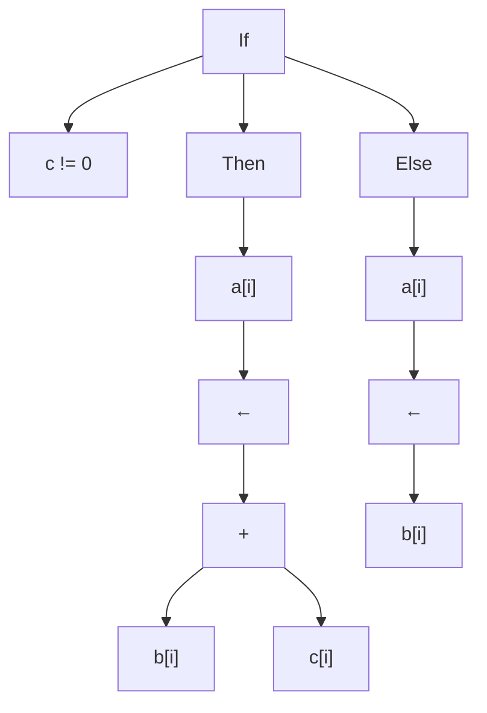
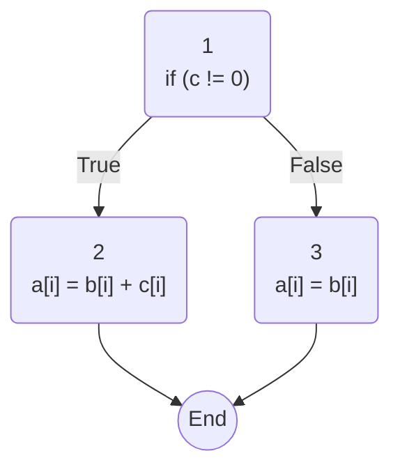

# Chapter 4 Questions

## Question 3

### AST Tree




### Control Flow Graph




### Three Address Code

```pseudocode
t1 = c != 0
if t1 goto L1
goto L2

L1:
t2 = b[i]
t3 = c[i]
t4 = t2 + t3
a[i] = t4
goto L3

L2:
t5 = b[i]
a[i] = t5

L3:
END
```


The advantage of **AST** makes it easier to break down the syntax of a language.

The advantage of **Control Flow** is this shows in a very simple representation how the program starts and the different paths this can take based on whats previously.

The advantage of **Three Address Code** connverts instructions into more simple representations about what is going on in the program.

## Question 5

### Part A

| Scope | Variable Name | Type      |
| ----- | ------------- | --------- |
| main  | a             | integer   |
| main  | b             | integer   |
| main  | c             | integer   |
| main  | f1            | procedure |
| main  | f2            | procedure |
| f2    | a             | integer   |
| f2    | y             | parameter |
| f2    | z             | parameter |
| f2    | f3            | procedure |
| f3    | m             | parameter |
| f3    | n             | parameter |
| f3    | b             | integer   |

### Part B

- This will use the variable *c* from the <u>main</u> declaration
- This will use the variable *a* from the <u>f2</u> declaration
- This will use the variable *b* from the <u>f3</u> declaration
- This will use the parameter *m* and *n* from the <u>f3</u> declaration

# Chapter 5 Questions

## Review Question 2 --> 226

Assume that the compiler builds a disticent symbol table and search path for each scope. For a simple PASCAL like language, what actions should the parser take on entry to and exit from each scope.

## Review Question 1 --> 239

When entering into a new scope, a separate but linked symbol table will need to be created. This will be linked to the original outer symbol table so it can go up the parent symbol to check for references if one does not exist in the current local symbol table. After this symbol table can store references to what exist in that local scope.

When leaving the symbol table scope, the parent symbol table will no longer reference that child symbol table and the pointer will no longer point to the child, but the current parent symbol table. The child symbol table will now no longer exist if it is not needed or it will be kept around if needing to be used later by something else.

## Question 8 --> 272

$$
\{ \text{target} = \text{ResultType}(Term_1.type, Factor.type); $<br>$ r1 = \text{Coerce}(Term_1.reg, Term_1.type, \text{target}); $<br>$ r3 = \text{Coerce}(Factor.reg, Factor.type, \text{target}); $<br>$ \$
$$

