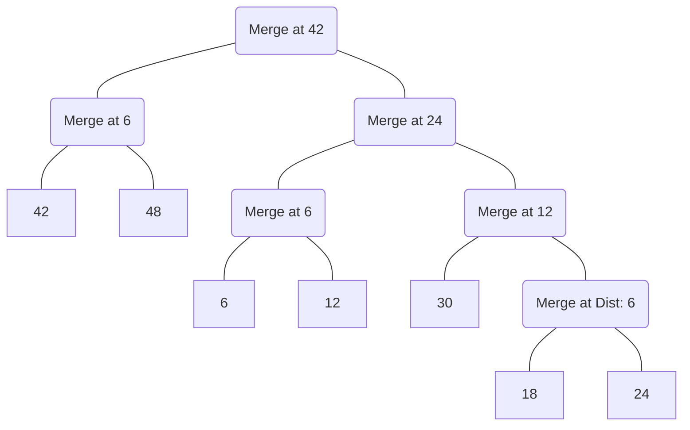

# Question A

Reference --> $\{6,12,18,24,30,42,48\}$

## Part One

|      | 6    | 12   | 18   | 24   | 30   | 42   | 48   |
| ---- | ---- | ---- | ---- | ---- | ---- | ---- | ---- |
| 6    | 0    | 6    | 12   | 18   | 24   | 36   | 42   |
| 12   | 6    | 0    | 6    | 12   | 18   | 30   | 36   |
| 18   | 12   | 6    | 0    | 6    | 12   | 24   | 30   |
| 24   | 18   | 12   | 6    | 0    | 6    | 18   | 24   |
| 30   | 24   | 18   | 12   | 6    | 0    | 12   | 18   |
| 42   | 36   | 30   | 24   | 18   | 12   | 0    | 6    |
| 48   | 42   | 36   | 30   | 24   | 18   | 6    | 0    |

This table shows the distance between each point in this chart

|          | {6, 12} | {18, 24} | 30   | {42, 48} |
| -------- | ------- | -------- | ---- | -------- |
| {6, 12}  | 0       | 18       | 24   | 42       |
| {18, 24} | 18      | 0        | 12   | 30       |
| 30       | 24      | 12       | 0    | 18       |
| {42, 48} | 42      | 30       | 18   | 0        |

This is used to show how the pairs now differ from each other after they have been combined to form a cluster of the smallest distances.

However, once this second step is completed, combining happens again and the following is made:

- The smallest distance now is 12 which is between $\{18, 24\}$ and 30. These merge to form $\{18, 24, 30\}$.
- The smallest distance is 24 which is between $\{6, 12\}$ and $\{18, 24, 30\}$. These merge to form $\{6, 12, 18, 24, 30\}$.

## Part Two

I used a flowchart to try to minic a dendrogram. I tried to be as descriptive as possible for this!

## Part Three

The two clusters formed are:

1. $\{6,12,18,24,30\}$
2. $\{42,48\}$

# Question B

Reference --> $\{6,12,18,24,30,42,48\}$

## Case 1: $\{18,45\}$

| Data Point | Distance to 18 | Distance to 45 | Closest | Cluster Group |
| ---------- | -------------- | -------------- | ------- | ------------- |
| 6          | 18 - 6 = 12    | 45 - 6 = 39    | 18      | Cluster 1     |
| 12         | 12 - 6 = 6     | 45 - 12 = 33   | 18      | Cluster 1     |
| 18         | 18 - 18 = 0    | 45 - 18 = 27   | 18      | Cluster 1     |
| 24         | 24 - 18 = 6    | 45 - 24 = 21   | 18      | Cluster 1     |
| 30         | 30 - 18= 12    | 45 - 30 = 15   | 18      | Cluster 1     |
| 42         | 42 - 18 = 24   | 45 - 42= 3     | 45      | Cluster 2     |
| 48         | 48 - 18 = 30   | 48 - 45 = 3    | 45      | Cluster 2     |

This means:

- Cluster 1: $\{6,12,18,24,30\}$
- Cluster 2: $\{42,48\}$

$$
\text{(1) }Cluster_1=(6−18)^2+(12−18)^2+(18−18)^2+(24−18)^2+(30−18)^2 \\
\text{(2) }Cluster_1=(−12)^2+(−6)^2+0^2+6^2+12^2\\
\text{(3) }144+36+0+36+144=360\\
$$

$$
\text{(1) }Cluster_2=(42−45)^2+(48−45)^2\\
\text{(2) }Cluster_2=(−3)^2+3^2\\
\text{(3) }9+9=18
$$

Test case for total square error is $360+18$ which is **378**

## Case 2: $\{15,40\}$

| Data Point | Distance to 15 | Distance to 40 | Closest | Cluster Group |
| ---------- | -------------- | -------------- | ------- | ------------- |
| 6          | 9              | 34             | 15      | Cluster 1     |
| 12         | 3              | 28             | 15      | Cluster 1     |
| 18         | 3              | 22             | 15      | Cluster 1     |
| 24         | 9              | 16             | 15      | Cluster 1     |
| 30         | 15             | 10             | 40      | Cluster 2     |
| 42         | 27             | 2              | 40      | Cluster 2     |
| 48         | 33             | 8              | 40      | Cluster 2     |

1. $(6 - 15)^2$ = (-9) * (-9) = 81
2. $(12 - 15)^2$ = (-3) * (-3) = 9
3. $(18 - 15)^2$ = (3) * (3) = 9
4. $(24 - 15)^2$ = (9) * (9) = 81
5. Cluster 1: $81 + 9 + 9 + 81 = 180$

1. $(30 - 40)^2$ = (-10) * (-10) = 100
2. $(42 - 40)^2$ = (2) * (2) = 4
3. $(48 - 40)^2$ = (8) * (8) = 64
4. Cluster 2: $100 + 4 + 64 = 168$

$$
Cluster 1 + Cluster 2 = 348\\
\text{Where:}\\
\text{Cluster 1 = 180}\\
\text{Cluster 2 = 168}
$$
From the result, it can be concluded that case 2 is better since it has a smaller total square error. Meaning the points are more tightly clustered.

# Question C

Reference --> $\{6,12,18,24,30,42,48\}$

## Case 1

For this case, when the average is calculated $\frac{(6 + 12 + 18 + 24 + 30)}{5} = \frac{90}{5} = 18$ for cluster 1 and $\frac{42+48}{2}=\frac{90}{2}=45$ for cluster 2. The result are the same two exact values of the original centroids. Thie means the result is a **stable solution**.

## Case 2

For this case, when the average is calculated $\frac{(6 + 12 + 18 + 24)}{4} = \frac{60}{4} = 15$ for cluster 1 and $\frac{(30+42+48)}{3}=\frac{120}{3}=40$. for cluster 2. he result are the same two exact values of the original centroids. Thie means the result is a **stable solution**.

