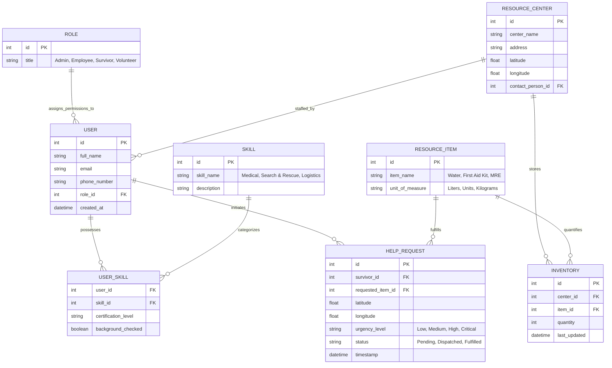

Remove HELP_REQUEST table. Only RESOURCE_CENTER should be able to make request for help. 

RESOURCE_CENTER should also track currentl number of surivors

Try to make the invitory items more dynamic. Like if bottle of water, should be a way to count the amount of 16oz, 32oz, 1 oz, etc.

$$
CPU_\text{time} = (\text{Clock Cycles} * time)\\
\text{OR}\\
CPU_\text{time} = \text{Clock Cycles} * \frac{1}{\text{rate}}
$$
